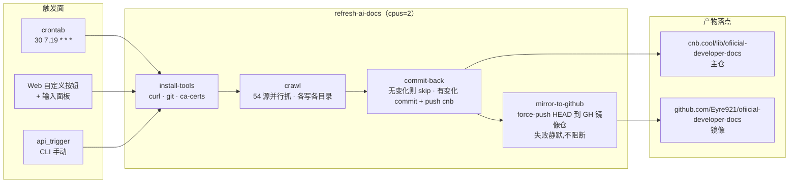
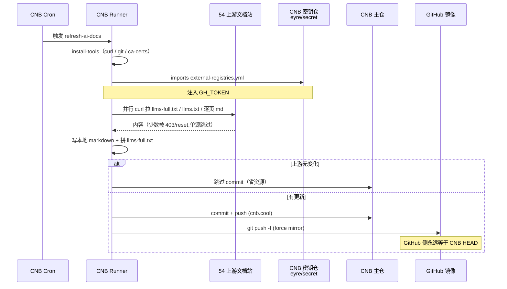
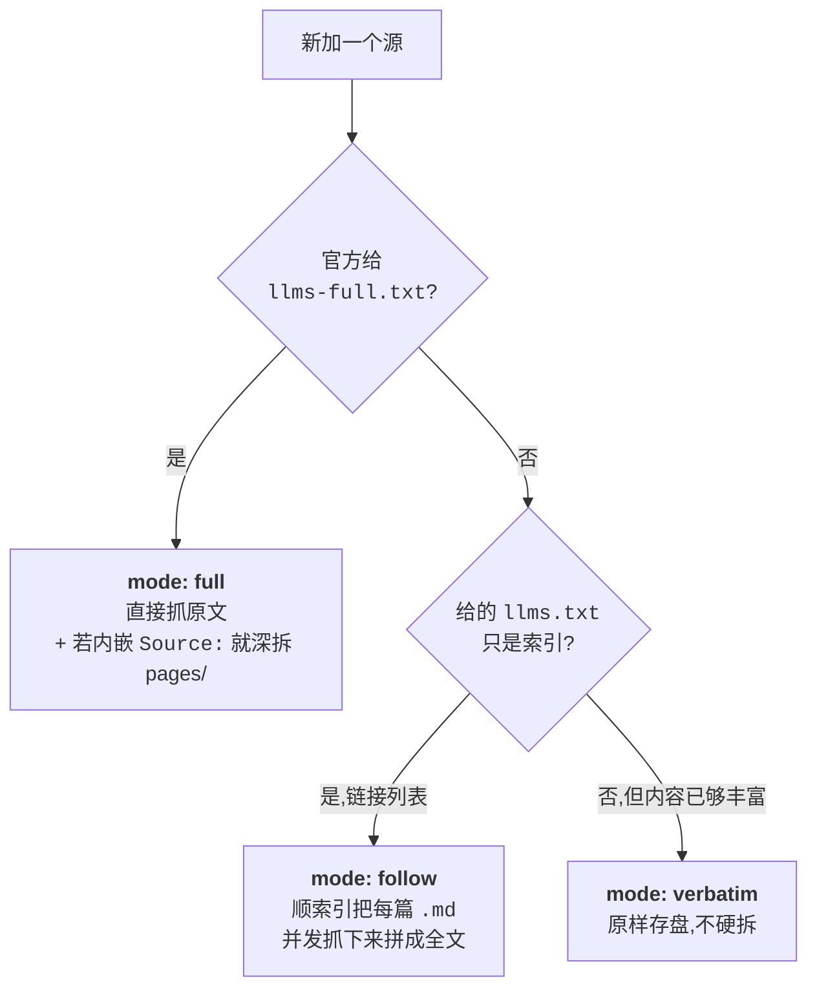

<div align="center">

<h1>ofiicial-developer-docs</h1>

<p><b>AI 与开发平台官方文档的结构化镜像 · 每天早晚同步 · CNB 主仓 + GitHub 镜像双投递</b></p>

<p>A curated, structured mirror of 54 official developer-docs sources (AI models, agent frameworks,
vector DBs, dev platforms, libraries) — full text where the upstream ships <code>llms-full.txt</code>,
crawled-and-stitched where it doesn't, and organized to mirror each source's real URL path down to the leaf.</p>

<p>


</p>
<p>


</p>

</div>

---

一个把 AI 与开发者文档「拉下来、按官方路径切好、每天早晚自动同步」的镜像仓库 —— 给做培训 / 检索 / RAG 的人用。

> 非官方镜像，仅供学习 / 培训 / 内部检索用途。每份文档的版权归其原厂商所有，商业使用请遵循各家官方条款。

## 目录

- [收录范围](#收录范围)
- [快速开始](#快速开始)
- [注意事项](#注意事项)
- [仓库构成](#仓库构成)
- [流水线架构](#流水线架构)
- [一次刷新的完整时序](#一次刷新的完整时序)
- [每种来源怎么处理](#每种来源怎么处理)
- [目录结构](#目录结构)
- [本地跑爬虫](#本地跑爬虫)
- [环境变量与密钥](#环境变量与密钥)
- [触发方式](#触发方式)
- [贡献新来源](#贡献新来源)
- [已知限制](#已知限制)
- [许可](#许可)

---

## 收录范围

54 个官方源、7 大分类，全部经过域名核对。**每格一家** —— 徽章跳**官方文档**，「家」这一列跳**本仓里这家的目录**（`./<分类>/<slug>/`，可直接看下载好的 markdown）。图标来自 [Simple Icons](https://simpleicons.org)，未收录的家用中性灰徽章占位。

> 徽章下方的数量指该分类**注册总数**。近一次刷新有 45 家 ok（连通性问题见「已知限制」）。

### AI 模型 / 推理平台 · [`ai-models/`](./ai-models/) · 13 家

| Logo（官方文档） | 家（本仓目录） | 干什么 |
|---|---|---|
| [](https://code.claude.com/docs) | [Anthropic Claude Code](./ai-models/anthropic-claude-code/) | 官方 CLI 编码 agent 文档 |
| [](https://platform.claude.com/docs/en) | [Anthropic API](./ai-models/anthropic-api/) | Claude 平台 API 参考 |
| [](https://developers.openai.com/api/docs) | [OpenAI](./ai-models/openai/) | GPT 系列 API 文档 |
| [](https://ai.google.dev/gemini-api/docs) | [Google Gemini](./ai-models/google-gemini/) | Gemini API 文档 |
| [](https://docs.x.ai) | [xAI Grok](./ai-models/xai-grok/) | Grok 模型 API 文档 |
| [](https://docs.perplexity.ai) | [Perplexity](./ai-models/perplexity/) | 带联网的对话 API |
| [](https://docs.mistral.ai) | [Mistral](./ai-models/mistral/) | 开源系模型 + API |
| [](https://docs.cohere.com) | [Cohere](./ai-models/cohere/) | 企业向 LLM API + Rerank |
| [](https://console.groq.com/docs) | [Groq](./ai-models/groq/) | LPU 推理加速平台 |
| [](https://docs.together.ai) | [Together](./ai-models/together/) | 开源模型托管 + 推理 |
| [](https://docs.fireworks.ai) | [Fireworks](./ai-models/fireworks/) | 开源模型推理服务 |
| [](https://openrouter.ai/docs) | [OpenRouter](./ai-models/openrouter/) | 统一多模型路由 |
| [](https://replicate.com/docs) | [Replicate](./ai-models/replicate/) | 模型托管 + 推理 API |

### Agent 框架 · [`agent-frameworks/`](./agent-frameworks/) · 4 家

| Logo（官方文档） | 家（本仓目录） | 干什么 |
|---|---|---|
| [](https://modelcontextprotocol.io) | [MCP](./agent-frameworks/mcp/) | Anthropic 主导的开放 agent 协议 |
| [](https://docs.langchain.com) | [LangChain](./agent-frameworks/langchain/) | LLM 应用编排(含 LangGraph) |
| [](https://ai-sdk.dev) | [Vercel AI SDK](./agent-frameworks/vercel-ai-sdk/) | TS 端 AI 应用工具集 |
| [](https://docs.crewai.com) | [CrewAI](./agent-frameworks/crewai/) | 多 agent 协作框架 |

### 语音 / 多模态 · [`voice-multimodal/`](./voice-multimodal/) · 4 家

| Logo（官方文档） | 家（本仓目录） | 干什么 |
|---|---|---|
| [](https://elevenlabs.io/docs) | [ElevenLabs](./voice-multimodal/elevenlabs/) | 高保真 TTS / 声音克隆 |
| [](https://developers.deepgram.com) | [Deepgram](./voice-multimodal/deepgram/) | 低延迟 STT |
| [](https://www.assemblyai.com/docs) | [AssemblyAI](./voice-multimodal/assemblyai/) | STT + 语音理解 |
| [](https://docs.vapi.ai) | [Vapi](./voice-multimodal/vapi/) | 语音 agent 平台 |

### 向量数据库 · [`vector-db/`](./vector-db/) · 4 家

| Logo（官方文档） | 家（本仓目录） | 干什么 |
|---|---|---|
| [](https://docs.pinecone.io) | [Pinecone](./vector-db/pinecone/) | 托管向量库 |
| [](https://qdrant.tech/documentation) | [Qdrant](./vector-db/qdrant/) | 开源向量库(Rust) |
| [](https://weaviate.io/developers) | [Weaviate](./vector-db/weaviate/) | 开源向量库(Go) |
| [](https://docs.trychroma.com) | [Chroma](./vector-db/chroma/) | 轻量本地向量库 |

### 编码 Agent · [`coding-agents/`](./coding-agents/) · 1 家

| Logo（官方文档） | 家（本仓目录） | 干什么 |
|---|---|---|
| [](https://docs.windsurf.com) | [Windsurf](./coding-agents/windsurf/) | AI 编码 IDE / agent |

### 开发 / 基础设施平台 · [`dev-platforms/`](./dev-platforms/) · 23 家

| Logo（官方文档） | 家（本仓目录） | 干什么 |
|---|---|---|
| [](https://developers.cloudflare.com) | [Cloudflare](./dev-platforms/cloudflare/) | CDN / Workers / R2 |
| [](https://vercel.com/docs) | [Vercel](./dev-platforms/vercel/) | 前端 / Serverless 部署 |
| [](https://supabase.com/docs) | [Supabase](./dev-platforms/supabase/) | 开源 Firebase(Postgres 版) |
| [](https://docs.stripe.com) | [Stripe](./dev-platforms/stripe/) | 支付 API |
| [](https://www.prisma.io/docs) | [Prisma](./dev-platforms/prisma/) | TS ORM |
| [](https://orm.drizzle.team) | [Drizzle](./dev-platforms/drizzle/) | 轻量 TS ORM |
| [](https://clerk.com/docs) | [Clerk](./dev-platforms/clerk/) | 身份认证 / 用户管理 |
| [](https://resend.com/docs) | [Resend](./dev-platforms/resend/) | 开发者向邮件 API |
| [](https://docs.sentry.io) | [Sentry](./dev-platforms/sentry/) | 错误监控 / 性能追踪 |
| [](https://docs.convex.dev) | [Convex](./dev-platforms/convex/) | 响应式后端数据库 |
| [](https://neon.com/docs) | [Neon](./dev-platforms/neon/) | Serverless Postgres |
| [](https://docs.turso.tech) | [Turso](./dev-platforms/turso/) | 边缘 SQLite |
| [](https://upstash.com/docs) | [Upstash](./dev-platforms/upstash/) | Serverless Redis / Kafka |
| [](https://docs.netlify.com) | [Netlify](./dev-platforms/netlify/) | 前端部署 / Edge Functions |
| [](https://docs.expo.dev) | [Expo](./dev-platforms/expo/) | React Native 开发平台 |
| [](https://langfuse.com/docs) | [Langfuse](./dev-platforms/langfuse/) | LLM 应用观测 |
| [](https://docs.github.com) | [GitHub](./dev-platforms/github/) | 代码托管 / Actions / API |
| [](https://docs.x.com) | [X 开发者](./dev-platforms/x-developer/) | X(Twitter) 平台 API |
| [](https://docs.n8n.io) | [n8n](./dev-platforms/n8n/) | 开源工作流自动化 |
| [](https://trigger.dev/docs) | [Trigger.dev](./dev-platforms/trigger-dev/) | 背景任务调度 / cron |
| [](https://shopify.dev/docs) | [Shopify](./dev-platforms/shopify/) | 电商平台 API / Admin |
| [](https://developers.notion.com) | [Notion](./dev-platforms/notion/) | Notion API |
| [](https://www.twilio.com/docs) | [Twilio](./dev-platforms/twilio/) | 短信 / 语音 / 通信 API |

### 框架 / 工具库 · [`libraries/`](./libraries/) · 5 家

| Logo（官方文档） | 家（本仓目录） | 干什么 |
|---|---|---|
| [](https://hono.dev/docs) | [Hono](./libraries/hono/) | 轻量 Web 框架(边缘优先) |
| [](https://svelte.dev/docs) | [Svelte](./libraries/svelte/) | 编译时前端框架 |
| [](https://bun.sh/docs) | [Bun](./libraries/bun/) | JS 运行时 / 打包器 |
| [](https://tanstack.com) | [TanStack](./libraries/tanstack/) | Query / Router / Table 全家桶 |
| [](https://zod.dev) | [Zod](./libraries/zod/) | TS 优先 schema 校验 |

具体每家的官方 URL、mode 也见 [`crawl.py`](./crawl.py) 的 `SOURCES` 注册表；每次抓取的成败与页数见 [`crawl-metadata.json`](./crawl-metadata.json)。

## 快速开始

只想拿一家的全文来读、或喂给 RAG：

```bash
# CNB 主仓（推荐，抓取最新一次成功刷新的结果）
git clone --depth 1 https://cnb.cool/lib/ofiicial-developer-docs.git

# GitHub 镜像（等价，只在 CNB 无法访问时用）
git clone --depth 1 https://github.com/Eyre921/ofiicial-developer-docs.git

# 只要某个来源
git clone --depth 1 --filter=blob:none --sparse https://cnb.cool/lib/ofiicial-developer-docs.git
cd ofiicial-developer-docs && git sparse-checkout set ai-models/anthropic-api
```

每家有两种产物：

| 想要什么 | 打开哪个文件 |
|---|---|
| 一份可直接喂给模型的**全文** | `<分类>/<来源>/llms-full.txt` |
| 按官方 URL 路径拆开的**逐页 markdown** | `<分类>/<来源>/pages/…/*.md` |

---

## 注意事项

> - **每天早晚 07:30 / 19:30 (Asia/Shanghai) 自动刷新**；上游无变化时**不产生新提交**，git 历史干净。
> - 只是**镜像**，不是二次创作 —— 每篇 markdown 头部的 frontmatter 里 `source:` 指向真实官方 URL，出错请以官方为准。
> - **两处已知短板**：OpenAI 和 X 官方文档站会屏蔽 CNB runner 的机房 IP（403 / connection reset），所以这两家**不会随定时任务自动更新**；主仓里的版本是初始推送时抓到的完整版，需要新版联系维护者手工刷。

---

## 仓库构成

| 组成 | 是什么 | 怎么维护 |
|---|---|---|
| **`<分类>/<来源>/llms-full.txt`** | 官方原文全量或本仓拼接生成的全文 | 每次刷新覆盖写 |
| **`<分类>/<来源>/pages/…/*.md`** | 按官方 URL 路径深拆到叶子的单篇文档 | 每次刷新覆盖写；无变化不改 |
| **`<分类>/<来源>/index.md`** | 按官方路径分组的导航索引 | 每次刷新覆盖写 |
| **`crawl.py`** | 单文件爬虫（stdlib + 系统 curl，零 pip 依赖） | 代码提交才改 |
| **`crawl-metadata.json`** | 上次抓取的时间戳、各来源状态与页数 | 每次刷新覆盖写 |
| **`.cnb.yml`** | CNB 流水线（4 stage + 定时 + 按钮 + 手动） | 代码提交才改 |
| **`.cnb/web_trigger.yml`** | 网页自定义按钮 + 输入面板配置 | 代码提交才改 |

## 流水线架构

刷新是一条四段流水线，跑在 CNB 云原生构建上，产物**回写自己**（并镜像到 GitHub）。省资源、抗抽风、单源坏了不阻断其它。



**四段的角色分工：**

| Stage | 秒级预算 | 主要工作 |
|---|---:|---|
| `install-tools` | ~15s | 装 curl / git / ca-certs（image 是 `python:3.12-slim`，故意省略 uv） |
| `crawl` | ~10 min | 并行拉 54 源、写本地 markdown，`python -u` 无缓冲输出让 CNB 看门狗不误杀 |
| `commit-back` | ~10–20s | `git diff --cached --quiet` 判断有无变化，有才 push 回主仓 |
| `mirror-to-github` | ~30s | 从密钥仓拿 `GH_TOKEN`，force-push 到 GH，`exit 0` 强制成功 |

---

## 一次刷新的完整时序

一次刷新在时间线上是什么样：CNB 触发 → runner 拉代码和依赖 → 并发抓上游 → 有变化就 commit → 镜像到 GH。所有对外调用都独立，其中一家坏了不影响其它。



---

## 每种来源怎么处理

不是所有源官方都给 `llms-full.txt`。按上游能给什么，本仓有三种处理模式，写在 `crawl.py` 的注册表里：



**三种模式对应实际来源类型：**

| Mode | 何时用 | 数量 |
|---|---|---:|
| **特调解析** | 官方原文格式微妙、每家都得单写 parse | 4（Anthropic Claude Code / Anthropic API / OpenAI / Google Gemini） |
| `full` | 官方发布了真正的 `llms-full.txt`；直接抓原文（若内嵌 `Source:` 还会深拆到 `pages/`） | 36 |
| `follow` | 上游只提供索引；追链接拼全文（无页数上限） | 13 |
| `verbatim` | 内容已够丰富、无独立 full 版；原样存盘 | 1（xAI Grok） |

四种 mode 加起来 **54 个注册源** —— 单次跑通几个取决于目标机器能否访问上游（见下方 *[已知限制](#已知限制)*）。每个 source 的确切 mode 写在 `crawl.py` 的 `SOURCES` 注册表里。

---

## 目录结构

目录严格镜像每个来源的**官方 URL 路径**，一直拆到最深的叶子：

```
platform.claude.com/docs/en/api/python/beta/sessions/threads/events/stream
        ↓
ai-models/anthropic-api/pages/api/python/beta/sessions/threads/events/stream.md
```

顶层布局：

```text
ofiicial-developer-docs/
├─ ai-models/
│  ├─ anthropic-claude-code/    llms-full.txt · index.md · pages/…
│  ├─ anthropic-api/            llms-full.txt · index.md · pages/…（可选 8 语言全量）
│  ├─ openai/                   llms-full.txt · index.md · pages/…
│  ├─ google-gemini/            llms-full.txt · index.md · pages/…（Gemini 无官方 full,本仓拼接）
│  └─ …（xai-grok · perplexity · mistral · cohere · groq · together · fireworks · openrouter · replicate）
├─ agent-frameworks/            mcp · langchain · vercel-ai-sdk · crewai
├─ voice-multimodal/            elevenlabs · deepgram · assemblyai · vapi
├─ vector-db/                   pinecone · qdrant · weaviate · chroma
├─ coding-agents/               windsurf
├─ dev-platforms/               cloudflare · vercel · supabase · stripe · … （24 家）
├─ libraries/                   hono · svelte · bun · tanstack · zod
├─ crawl.py                     单文件爬虫（stdlib + curl）
├─ crawl-metadata.json          最近一次抓取的时间戳、状态、页数
├─ .cnb.yml                     CNB 定时/按钮/api 触发流水线
└─ .cnb/web_trigger.yml         网页自定义按钮 + 输入面板
```

> `pages/` 下同一名字可能既是文件又是目录（如 `api/python.md` 和 `api/python/` 并存）——那代表某个 URL 本身是一篇文档、其下又有子文档，是官方结构的忠实映射，不是 bug。

---

## 本地跑爬虫

爬虫是单文件、零 pip 依赖（`pyproject.toml` 里 `dependencies = []` 是刻意的）。任何装了 Python 3.10+ 和 `curl` 的机器都能跑：

```bash
python crawl.py                          # 抓全部 54 源
python crawl.py ai-models                # 只抓某个分类
python crawl.py dev-platforms/stripe     # 只抓某个来源
python crawl.py ai-models/anthropic-api  # 同上,注意用 / 分隔分类和 slug

# 让 Anthropic API 保留全部 8 种语言 SDK 参考（默认只留 Python,体积 ~14MB → ~87MB）
INCLUDE_ALL_SDK_LANGUAGES=1 python crawl.py ai-models/anthropic-api

# 并发数（默认 8,CNB runner 上够用）
CRAWL_WORKERS=16 python crawl.py

# follow 类源的页数上限（默认 100000 相当于不限；想快跑限一下）
FOLLOW_CAP=200 python crawl.py dev-platforms/github
```

无变化的源不会产生 diff（`write_if_changed`），所以在本地反复跑不会污染工作树。

---

## 环境变量与密钥

流水线里只用到这些：

| Variable | 来源 | 作用 |
|---|---|---|
| `CNB_TOKEN` | CNB 内置 | `commit-back` 阶段推回主仓 |
| `CNB_REPO_SLUG` | CNB 内置 | 拼 push URL |
| `CNB_BRANCH` | CNB 内置 | 目标分支（`main`） |
| `GH_TOKEN` | `eyre/secret:external-registries.yml`（imports） | `mirror-to-github` 阶段推到 GH 镜像仓 |
| `CRAWL_TIMESTAMP` | 流水线里 `date -u` 注入 | 让 metadata 时间戳可复现,脚本本身无时钟 |
| `PROVIDER` | 网页按钮面板可选 | 只刷新某个分类 / 来源 |
| `INCLUDE_ALL_SDK_LANGUAGES` | 同上 | Anthropic API 全量八语言开关 |

`GH_TOKEN` 存在独立密钥仓（`eyre/secret`），并在 `allow_events` 里放行了 `crontab / api_trigger / web_trigger_refresh`、`allow_slugs` 里放行了本仓 —— **本仓从不落地 token 到磁盘**。

---

## 触发方式

三种方式触发刷新，效果等价：

| 方式 | 谁用 | 怎么触发 |
|---|---|---|
| **定时** | 自动 | `crontab: 30 7,19 * * *`（Asia/Shanghai 每天 07:30 / 19:30） |
| **网页按钮** | 人 | 仓库网页右上角「🔄 立即刷新全部」；「🎛️ 自定义刷新」带面板可选分类 / 全量八语言 |
| **API / CLI** | 脚本 | `cnb build start-build --repo lib/ofiicial-developer-docs --branch main --event api_trigger` |

按钮 / 面板配置在 [`.cnb/web_trigger.yml`](./.cnb/web_trigger.yml)；触发到的都是同一个 `refresh-ai-docs` pipeline。

---

## 贡献新来源

用一次 `crawl.py` 的注册表就是唯一改动点 —— 加一行 tuple、按上面 [每种来源怎么处理](#每种来源怎么处理) 的决策图选 mode 即可：

```python
# crawl.py 里的 _GENERIC 注册表
_GENERIC = [
    # …existing entries…
    ("<分类>/<slug>", "<官方 URL>", "<mode>"),  # ← 你加的这行
]
```

**加之前请先核对：**

1. URL 是**该产品自己**的官方域名（`docs.xxx.com` / `xxx.com/docs` 之类，不是 llmstxthub 之类聚合站）
2. 用 `curl -sSL -I` 探一下：先看有没有 `llms-full.txt`；没有再看 `llms.txt` 是不是索引 → 决定 `full` / `follow` / `verbatim`
3. 本地跑 `python crawl.py <你的分类>/<slug>` 验证一次能拿到内容

---

## 已知限制

如实告知，不藏：

- **OpenAI / X 从 CNB runner 的机房 IP 会被封**（403 / Connection reset），所以这两家**不会随定时任务自动更新**，主仓里的版本是初始推送时抓到的全量；需要新版联系维护者手工刷。
- **Cloudflare 独占 54MB**（`llms-full.txt` 用 frontmatter 块格式，不硬拆），是所有来源里最大的一份。
- **索引 `llms.txt` 内容量取决于上游**：比如 Cohere 的索引只有 500 字节几个链接，follow 出来就 2 页；这是上游的选择，不是本仓截断。
- **CNB 的 `get-build-status` API 快照有滞后**，`status: pending` 未必真在跑；诊断以 stage 日志（`get-build-stage`）为准。

---

## 许可

各文档版权归其原厂商所有。本仓库仅是**结构化镜像与索引**，出于学习、培训、检索目的构建，非官方；商业使用请遵循各家原始文档的授权条款。

爬虫脚本、流水线配置、目录规范 —— 即除文档原文以外的**本仓自有代码与配置** —— 遵循 MIT。

---

<div align="center">
<sub>ofiicial-developer-docs · 每天两次 · 54 家 · 全文 · 逐页 · 双仓</sub>
</div>
