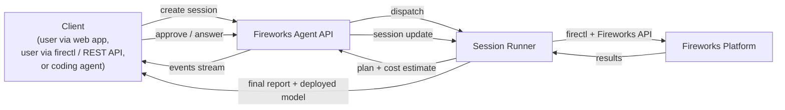

Describe what you want, approve the plan and cost, get a deployed fine-tuned model.

Fireworks Agent is a hosted Fireworks assistant that owns the full fine-tuning loop. You describe what you want — *"fine-tune a model that classifies our support tickets"*, *"improve Llama 3.1 70B on our function-calling data"*, *"train a smaller model that matches GPT-4 on our routing task"* — and Agent picks the base model, prepares the dataset, runs a hyperparameter sweep, submits training, evaluates the result, and deploys the fine-tuned model. You stay in the loop for approvals and final calls; everything else is handled.

Agent is the easiest of the three Fireworks fine-tuning paths, sitting alongside [Managed Fine-Tuning](/fine-tuning/managed-finetuning-intro) and the [Training API](/fine-tuning/training-api/introduction). It's the right starting point when you want a working fine-tuned model without writing config files or Python training loops.

<Note>
  **Naming.** This documentation refers to the product as **Fireworks Agent** (or just **Agent**). You may also see it called `pilot` in internal source code, in CLI permission presets (`--permission-preset=pilot`), in the embedded manifest file (`pilot.yaml`), and in some legacy support contexts — those are all the same product. Use *"Fireworks Agent"* or *"Agent"* in your own prompts and communication.
</Note>

## What Agent does for you

<CardGroup>
  <Card title="Picks the right model" icon="sparkles">
    Agent recommends a base model and tuning method (SFT, DPO, or classification) from your task description and a peek at your data.
  </Card>

  <Card title="Plans the run" icon="list-check">
    Inspects your dataset, proposes hyperparameters, estimates cost, and presents a single plan for approval before any spend.
  </Card>

  <Card title="Runs and evaluates" icon="play">
    Submits the job, streams progress, evaluates checkpoints, and ships a deployed model at the end.
  </Card>
</CardGroup>

Concretely, Agent can:

* Run **SFT, DPO, and classification** jobs from a natural-language prompt
* Inspect your dataset and call out format issues before training starts
* Recommend a base model from a curated panel based on your task shape
* Run a short **hyperparameter sweep** before committing to full training
* Stream a live progress feed with eval loss, cost-so-far, and ETA
* Evaluate the trained model against a held-out set and surface the best checkpoint
* Deploy the fine-tuned model so you can call it from `chat/completions` immediately
* Author task-specific [evaluators](/fine-tuning/agent/evaluators) for use in SFT sweeps, or Eval Protocol evaluators you can then run through [Managed Fine-Tuning's RFT path](/fine-tuning/reinforcement-fine-tuning-models)
* Answer questions about your account, deployments, jobs, and Fireworks models along the way

Agent does **not** run RFT training itself — for that, author the evaluator with Agent and then submit the RFT job through [Managed Fine-Tuning](/fine-tuning/reinforcement-fine-tuning-models). Agent also cannot run an arbitrary Python training loop, use a custom loss function, or sample mid-training from your own evaluator — for those, use the [Training API](/fine-tuning/training-api/introduction) directly.

## Architecture



The runner is an ephemeral, sandboxed environment with its own filesystem. It executes Agent's plan against your Fireworks account using your API key. Sessions can pause for hours or days waiting on user input without consuming compute.

## Two ways to use Agent

<Tabs>
  <Tab title="In the Fireworks dashboard">
    The default — and recommended — surface for most users. Open **Agent** in the left nav of [app.fireworks.ai](https://app.fireworks.ai) for a chat interface that streams Agent's plan, progress, and final report. Best for:

    * Most fine-tuning workflows, end to end
    * Teams that want a visual plan, cost, and approval UX
    * Watching a long training run with a live progress feed
    * Skipping `firectl` installation and service-account setup

    ### Dashboard quickstart

    <Steps>
      <Step title="Open Agent">
        Click **Agent** in the left navigation at [app.fireworks.ai](https://app.fireworks.ai).
      </Step>

      <Step title="Describe the job">
        A good first prompt is specific about *what* you're training for, *what data* to use, and *what success looks like*:

        ```text theme={null}
        Fine-tune a model on accounts/your-account/datasets/support-tickets.
        Classify each ticket into one of 12 categories.
        Target: better than GPT-4 mini on accuracy. Budget: under $5.
        ```

        Agent will inspect the dataset, propose a plan, and stop for your approval.
      </Step>

      <Step title="Approve the plan">
        Agent presents one structured plan with a cost estimate. Approve, request a change (*"use Qwen3 32B instead"*, *"skip HP tuning"*), or cancel. No spend happens before this gate.
      </Step>

      <Step title="Watch it run">
        Agent streams phase-anchored updates every few minutes through the final report, which includes the deployed model ID and inference endpoint.
      </Step>
    </Steps>
  </Tab>

  <Tab title="From the CLI or your coding agent">
    The advanced path, for power users and anyone already living in a coding-agent harness. Use it two ways:

    * **Drive Agent directly from `firectl session`** — script it, run it from CI, or call the REST API.
    * **Let Claude Code, Cursor, Codex, Aider, Goose, or another coding agent drive it for you** by installing the [Fireworks Agent skill file](/fine-tuning/agent/use-with-coding-agents). The coding agent shells out to `firectl session` using a scoped service-account key.

    Best for:

    * Fine-tuning as a step in a larger coding workflow
    * Reproducing a training run with code-checked-in instructions
    * Power users who already orchestrate everything from their coding agent or terminal
    * Scripting and automation against the `firectl session` / REST API

    ### CLI quickstart

    <Steps>
      <Step title="Create a service account and API key">
        Create a service account scoped to Agent's capabilities (the `pilot` permission preset — see the [security section below](#security-service-accounts-and-the-agent-manifest) for the rationale) and mint an API key:

        ```bash theme={null}
        firectl -a <account> user create \
          --service-account \
          --user-id=fireworks-agent \
          --permission-preset=pilot

        firectl -a <account> api-key create --service-account=fireworks-agent
        ```

        Save the returned key in a `.env` file in your project root:

        ```bash .env theme={null}
        FIREWORKS_AGENT_API_KEY=fw-...
        ```

        The Fireworks Agent skill sources `.env` automatically. See [Service Accounts](/accounts/service-accounts) for the full setup.
      </Step>

      <Step title="Create a session">
        ```bash theme={null}
        source .env && firectl session create \
          --api-key $FIREWORKS_AGENT_API_KEY \
          --instruction "Run SFT on Qwen3 32B using accounts/myacct/datasets/mydata"
        ```

        The command returns a session ID, for example `abc123`.
      </Step>

      <Step title="Stream events">
        ```bash theme={null}
        source .env && firectl session events abc123 --api-key $FIREWORKS_AGENT_API_KEY --wait
        ```

        The `--wait` flag keeps streaming until the session reaches `waiting`, `succeeded`, `failed`, or `cancelled`. Without it, the command dumps existing events and exits.
      </Step>

      <Step title="Answer waiting-state questions">
        When the stream stops at `waiting`, read Agent's question, then send your answer back to the same session:

        ```bash theme={null}
        source .env && firectl session update abc123 \
          --api-key $FIREWORKS_AGENT_API_KEY \
          --instruction "Approved, proceed."
        ```

        Re-run `firectl session events abc123 --wait` to resume. Repeat until the session reports `succeeded`.
      </Step>
    </Steps>
  </Tab>
</Tabs>

## How Agent runs a training job

Every Agent session moves through the same seven phases. Coding agents should expect this sequence; humans can use it as a mental model for what to expect next.

| # | Phase                   | What happens                                                                                                                                                                                                |
| - | ----------------------- | ----------------------------------------------------------------------------------------------------------------------------------------------------------------------------------------------------------- |
| 1 | **Data inspection**     | Agent reads your dataset, reports format, sample count, token count, and any issues.                                                                                                                        |
| 2 | **Planning & approval** | Agent proposes base model, tuning method, hyperparameters, eval path, and a cost estimate. You approve, edit, or cancel.                                                                                    |
| 3 | **HP tuning**           | A short parallel sweep (typically 3 configs) over LoRA rank and learning rate, capped at 6 active jobs by default.                                                                                          |
| 4 | **Full training**       | The best config from phase 3 runs to completion on the full dataset, with per-epoch eval loss.                                                                                                              |
| 5 | **Evaluation**          | The trained model is evaluated against a held-out set using one of three strategies you pick in phase 2: validation loss only (default), an evaluator you provide, or an evaluator Agent generates for you. |
| 6 | **Deployment**          | The model is deployed and a `fireworks-ai` SDK snippet is ready for inference.                                                                                                                              |
| 7 | **Final report**        | Deployed model ID, key metrics, total cost, and per-phase summary in one message.                                                                                                                           |

DPO uses the same shape with phase 3 replaced by a preference sweep (or pair generation followed by a preference sweep when the dataset is prompts-only). Classification uses the same shape with phase 3 expanded into a base-model benchmark plus a fine-tuning sweep, and phase 5 reports per-label and overall accuracy. The promotion gate between phase 3 and phase 4 is one of the two user-facing pauses (the other is plan approval in phase 2).

### The approval and cost contract

Agent never spends without an explicit approval. This is structural, not a setting.

<Warning>
  At the end of **Phase 2 (Planning)** — and again before any new spend-incurring step — Agent surfaces a structured cost preview and waits for approval. In the dashboard this is a yes/no prompt. From a coding agent, the skill holds the session in a `waiting` state, surfaces Agent's exact question, and only proceeds after you respond via `firectl session update`. Reject and the session ends with no charges.
</Warning>

The preview always includes:

* Total estimated cost (in USD, with a confidence range)
* Estimated wall time
* Per-phase cost breakdown (HP tuning / full training / evaluation / deployment)
* Cost-so-far in the session (for re-approvals on long runs)

### Out-of-coverage behavior

If you ask Agent to use a model or method outside its supported set, it refuses rather than silently approximating. For example, asking for full-parameter tuning on a model with no Agent recipe returns a clear *"not supported in Agent — use Managed Fine-Tuning or the Training API"* message with a pointer to the right surface. See [When not to use Agent](#when-not-to-use-agent).

## What Agent can do today

<CardGroup>
  <Card title="Supervised Fine-Tuning" icon="message" href="/fine-tuning/agent/sft">
    End-to-end SFT with dataset inspection, hyperparameter sweep, evaluator-guided model selection, and a deployed winner.
  </Card>

  <Card title="Preference Learning (DPO/ORPO)" icon="arrows-left-right" href="/fine-tuning/agent/dpo">
    Run DPO or ORPO on pre-paired preferences or generate pairs automatically with delta learning, with an optional base-model sweep.
  </Card>

  <Card title="Classification" icon="tags" href="/fine-tuning/agent/classification">
    Benchmark base models, fine-tune on labeled data, and compare base vs fine-tuned classification accuracy on a held-out split.
  </Card>

  <Card title="Evaluator authoring" icon="check-circle" href="/fine-tuning/agent/evaluators">
    Generate a reusable Python evaluator Agent uses to score candidates during an SFT sweep, or an Eval Protocol evaluator you can take to a Managed RFT job — directly from your dataset.
  </Card>

  <Card title="Use with coding agents" icon="robot" href="/fine-tuning/agent/use-with-coding-agents">
    Copy-paste skill files for Claude Code, Cursor, Codex, Aider, and Goose so they can drive Agent for you.
  </Card>
</CardGroup>

## Agent vs Managed Fine-Tuning vs Training API

All three sit on the same training infrastructure, GPU shapes, and tuning methods. The difference is how much you drive.

|                                 | **Fireworks Agent**                                                       | **Managed Fine-Tuning**           | **Training API**                   |
| ------------------------------- | ------------------------------------------------------------------------- | --------------------------------- | ---------------------------------- |
| **Interface**                   | Natural language (dashboard chat, `firectl session`, or via coding agent) | UI, `firectl`, REST               | Python script                      |
| **Who picks the model**         | Agent recommends                                                          | You                               | You                                |
| **Who tunes hyperparameters**   | Agent runs a sweep                                                        | You set them                      | You set them                       |
| **Cost approval**               | Built-in gate                                                             | None — you submit jobs directly   | None                               |
| **Custom loss / training loop** | Not supported                                                             | Not supported                     | Supported                          |
| **Inference-in-the-loop eval**  | Not supported                                                             | Not supported                     | Supported (hotload)                |
| **Best for**                    | Getting a working fine-tuned model fast, without ML expertise             | Production runs with known config | Research, custom RL, hybrid losses |

### When not to use Agent

Reach for a more direct surface when:

* You need a **custom loss function** or hybrid objective → [Training API](/fine-tuning/training-api/introduction)
* You need to **hotload checkpoints** for mid-training inference evaluation → [Training API](/fine-tuning/training-api/introduction)
* You already know your config and just want to **submit a job** → [Managed Fine-Tuning](/fine-tuning/managed-finetuning-intro)
* You need **full-parameter tuning** on a model Agent doesn't cover → [Managed Fine-Tuning](/fine-tuning/managed-finetuning-intro)
* You're training in a **fully automated CI pipeline** with no human approval → Agent's approval gate is interactive by design; [Managed Fine-Tuning](/fine-tuning/managed-finetuning-intro) is the better fit today

## Security: service accounts and the Agent manifest

When a coding agent drives Fireworks Agent on your behalf, it should authenticate as a **service account** with the `pilot` permission preset, not your personal user key. This enforces a layered permissions model:

> Effective permissions = User role ∩ Agent capability manifest

### The manifest is a real artifact

The Agent capability manifest is a versioned YAML file (`pilot.yaml`, kept under its original internal name) embedded into the Fireworks control-plane binary at build time. It enumerates the exact set of RPC methods the `pilot` preset is allowed to call — roughly 80 methods grouped by capability surface:

* **Account & billing** — `GetAccountUsage`, `GetQuota`, `ListQuotas`, `ListCosts`
* **Models** — `GetModel`, `ListModels`, `CreateModelVersion`, `PrepareModel`, `ValidateModelUpload`
* **Deployments** — `GetDeployment`, `CreateDeployment`, `DeployModelVersion`, `GetDeploymentMetrics`
* **Datasets** — `CreateDataset`, `GetDataset`, `ListDatasets`, `PreviewDataset`, `SplitDataset`
* **Evaluators and evaluations** — `CreateEvaluator`, `GetEvaluator`, `CreateEvaluation`, `TestEvaluation`
* **Fine-tuning jobs** — `CreateSupervisedFineTuningJob`, `CreateDpoJob`, `CreateReinforcementFineTuningJob`, `CreateRlorTrainerJob` <sup>*(the RFT and RLOR-trainer RPCs are granted by the manifest but Agent's current workflows don't use them — see [What Agent does for you](#what-agent-does-for-you))*</sup>
* **Training shapes** — `GetTrainingShape`, `ListTrainingShapes`
* **Batch inference and inference logs** — `CreateBatchInferenceJob`, `ListInferenceLogs`

The control plane enforces the manifest as a **hard ceiling** before checking the underlying user's role: even if the user has broader permissions, the preset cannot exceed what the manifest allows. Any RPC outside the manifest returns `PERMISSION_DENIED` at the API gateway, regardless of how the request was constructed.

### Non-destructive guarantee, structurally enforced

Agent's promise to never delete, cancel, or destroy your existing resources is enforced by the manifest itself, not by skill-level politeness. The manifest **does not include any `Delete*`, `Cancel*`, or destructive RPC methods**. Even a malicious or hallucinated tool call targeting `DeleteModel`, `CancelReinforcementFineTuningJob`, or `DeleteDeployment` is rejected at the control plane before it reaches the resource layer.

### Cross-account reads, never cross-account writes

The `pilot` preset is granted **read-only** access across accounts. This is what lets Agent reach Fireworks-owned public resources — base models at `accounts/fireworks/models/...`, public deployment shapes, public datasets — using only your account's API key. Agent cannot write into any other account; mutating operations are scoped to your account.

### Auto-update on control-plane releases

Because the manifest is compiled into the control-plane binary, expanded Agent capabilities ship automatically with every control-plane deploy. Your service account stores only the preset *name* (`pilot`), not the list of allowed methods — so new capabilities are picked up without rotating keys or re-provisioning the service account. See [Service Accounts](/accounts/service-accounts) for setup details.

## Session lifecycle reference

| Command                                                | What it does                                  | Confirmation required           |
| ------------------------------------------------------ | --------------------------------------------- | ------------------------------- |
| `firectl session create --instruction "<instruction>"` | Start a new session                           | No                              |
| `firectl session events <id> --wait`                   | Stream events until terminal or waiting state | No                              |
| `firectl session get <id>`                             | Get current status and details                | No                              |
| `firectl session list`                                 | List sessions for your account                | No                              |
| `firectl session update <id> --instruction "<answer>"` | Send a response to a waiting session          | **Yes** — confirm with the user |
| `firectl session cancel <id>`                          | Stop a running session (keeps the record)     | **Yes** — confirm with the user |
| `firectl session delete <id>`                          | Remove the session record (irreversible)      | **Yes** — confirm with the user |

All commands accept `--api-key $FIREWORKS_AGENT_API_KEY` for non-interactive auth and `--scope optimize` (the default scope).

## Troubleshooting

<AccordionGroup>
  <Accordion title="My job is stuck in pending">
    Agent shares the on-demand pool with the Training API. If GPU capacity is tight, jobs queue. If you need guaranteed capacity, [request a reservation](https://fireworks.ai/contact).
  </Accordion>

  <Accordion title="Agent refused my model or method choice">
    Agent only runs methods it has curated recipes for. For anything outside that set, use [Managed Fine-Tuning](/fine-tuning/managed-finetuning-intro) or the [Training API](/fine-tuning/training-api/introduction).
  </Accordion>

  <Accordion title="My coding agent dumps the event history and exits immediately">
    You're missing the `--wait` flag. Without it, `firectl session events` prints existing events and returns. The Fireworks Agent skill always passes `--wait`, which keeps the stream open until the session reaches `waiting`, `succeeded`, `failed`, or `cancelled`. If you're driving `firectl` directly, add `-w / --wait`.
  </Accordion>

  <Accordion title="The cost preview looks higher than I expected">
    Agent's preview includes HP tuning, full training, evaluation, and the first hour of deployment. Reject the plan and ask Agent to skip HP tuning or use a smaller base model — the next preview will reflect the lower scope.
  </Accordion>
</AccordionGroup>

## Next steps

<CardGroup>
  <Card title="Try Agent in the dashboard" icon="rocket" href="https://app.fireworks.ai">
    Open Agent in the left nav at app.fireworks.ai.
  </Card>

  <Card title="Drive Agent from a coding agent" icon="file-code" href="/fine-tuning/agent/use-with-coding-agents">
    Install the skill file in Claude Code, Cursor, Codex, Aider, or Goose.
  </Card>

  <Card title="Managed Fine-Tuning" icon="sliders" href="/fine-tuning/managed-finetuning-intro">
    Drive the same training infra directly when you know your config.
  </Card>

  <Card title="Training API" icon="code" href="/fine-tuning/training-api/introduction">
    Write your own Python training loop on Fireworks GPUs.
  </Card>
</CardGroup>

<Note>
  **Agent crib notes**

  * Auth: set `FIREWORKS_AGENT_API_KEY` in a project-local `.env` (the key is from a service account with the `pilot` permission preset). Source it via `source .env && ...` and pass on every command as `--api-key $FIREWORKS_AGENT_API_KEY`.
  * Use the **same session ID** for follow-ups. Never create a new session to continue an existing conversation.
  * Always pass `--wait` to `session events`, or the command exits immediately after dumping history.
  * `create`, `get`, `events`, and `list` are safe to run without user confirmation. **Always confirm with the user before `update`, `cancel`, or `delete`.**
  * On `waiting`, surface Agent's exact question to the user verbatim; do not paraphrase.
  * See [Use with coding agents](/fine-tuning/agent/use-with-coding-agents) for a complete copy-paste skill for Claude Code, Cursor, Codex, Aider, and Goose.
</Note>
