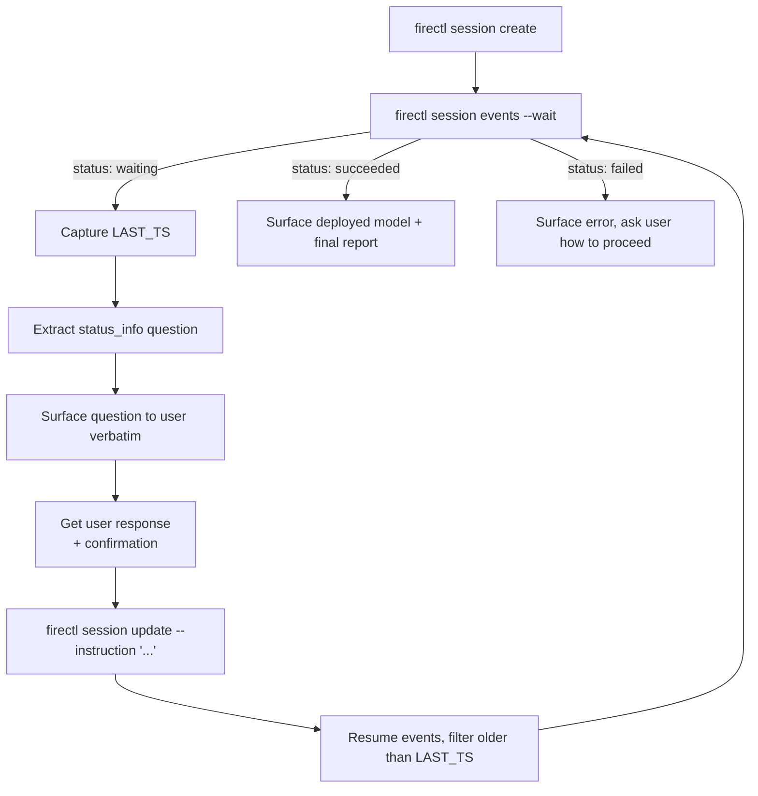

Install the Fireworks Agent skill file once and drive end-to-end fine-tuning from your coding agent.

Fireworks Agent is a great fit for coding-assistant workflows: long-running training jobs that benefit from a conversational driver, multi-turn approvals that benefit from a human-in-the-loop, and natural-language instructions that benefit from a model that already knows your project context.

This page gives you everything you need to plug Agent into Claude Code, Cursor, Codex, Aider, Goose, or any other coding agent — a single canonical skill file you can `curl`, the right install path for each runtime, and the agent-side patterns that handle Agent's plan-and-cost approval and waiting-state Q\&A loops correctly.

## TL;DR for agents

```text theme={null}
Fireworks Agent (firectl session) is a hosted Fireworks fine-tuning agent.
Use it whenever the user asks to fine-tune, train, or improve a model on
Fireworks (SFT, DPO/ORPO, or classification workflows).

Authenticate with FIREWORKS_AGENT_API_KEY in a project-local .env, sourced via
`source .env`. The key is a Fireworks API key from a service account with
the `pilot` permission preset (internal name kept for historical reasons —
it's the manifest that scopes Fireworks Agent's capabilities).

Lifecycle:
  - firectl session create --instruction "<plain English instruction>"
  - firectl session events <id> --wait                  # stream until terminal or waiting
  - firectl session update <id> --instruction "<answer>" # respond to a waiting state
  - firectl session get  <id>                            # status
  - firectl session list                                 # browse sessions

Safety:
  - Always confirm with the user before `update`, `cancel`, or `delete`.
  - `create`, `get`, `events`, `list` are safe to run autonomously.
  - Never create a new session for a follow-up — always reuse the same session id.
  - Always pass `--wait` to `events`; without it the command exits immediately.
```

## Prerequisites

<Steps>
  <Step title="Install firectl">
    See the [firectl reference](/tools-sdks/firectl/firectl) for installation. On Linux:

    ```bash theme={null}
    curl -sL -o /tmp/firectl.gz https://storage.googleapis.com/fireworks-public/firectl/stable/linux-amd64.gz
    gunzip -f /tmp/firectl.gz
    sudo install -m 0755 /tmp/firectl /usr/local/bin/firectl
    ```
  </Step>

  <Step title="Create a service account">
    Create a service account scoped to Agent's capabilities. The CLI preset is named `pilot` for historical reasons — it's the [Agent capability manifest](/fine-tuning/agent/introduction#security-service-accounts-and-the-agent-manifest):

    ```bash theme={null}
    firectl -a <account> user create \
      --service-account \
      --user-id=fireworks-agent \
      --permission-preset=pilot
    firectl -a <account> api-key create --service-account=fireworks-agent
    ```
  </Step>

  <Step title="Save the API key in a .env file">
    Drop the returned key into your project root:

    ```bash .env theme={null}
    FIREWORKS_AGENT_API_KEY=fw-...
    ```

    The skill sources `.env` automatically. See [Service Accounts](/accounts/service-accounts) for the full setup.
  </Step>
</Steps>

## Install the skill file

The Fireworks Agent skill is a single Markdown document that teaches your coding agent how to drive Agent: when to invoke it, how to authenticate, how to handle waiting states and approval gates, which `firectl session` flags are confirmed working, and the common questions Agent asks mid-session. It auto-attaches based on the `description` frontmatter — no slash commands required.

<Card title="fireworks-agent SKILL.md (canonical)" icon="file-code" href="https://github.com/fw-ai/cookbook/blob/main/skills/fireworks-agent/SKILL.md">
  Canonical source in the public [`fw-ai/cookbook`](https://github.com/fw-ai/cookbook) repo. `curl` the raw URL into your coding agent (see below); re-fetch at the start of a fine-tuning session to pick up the latest confirmed flags.
</Card>

<CodeGroup>
  ```bash Claude Code theme={null}
  # Project-scoped (recommended)
  mkdir -p .claude/skills/fireworks-agent
  curl -L https://raw.githubusercontent.com/fw-ai/cookbook/main/skills/fireworks-agent/SKILL.md \
    -o .claude/skills/fireworks-agent/SKILL.md

  # Or user-scoped (available in every project)
  mkdir -p ~/.claude/skills/fireworks-agent
  curl -L https://raw.githubusercontent.com/fw-ai/cookbook/main/skills/fireworks-agent/SKILL.md \
    -o ~/.claude/skills/fireworks-agent/SKILL.md
  ```

  ```bash Cursor theme={null}
  mkdir -p .cursor/skills/fireworks-agent
  curl -L https://raw.githubusercontent.com/fw-ai/cookbook/main/skills/fireworks-agent/SKILL.md \
    -o .cursor/skills/fireworks-agent/SKILL.md
  ```

  ```bash Codex / Aider / Goose theme={null}
  # These runtimes read AGENTS.md as ambient context at session start.
  curl -L https://raw.githubusercontent.com/fw-ai/cookbook/main/skills/fireworks-agent/SKILL.md >> AGENTS.md
  ```
</CodeGroup>

<Tip>
  Once the skill is installed, prompts like *"Fine-tune Qwen3 32B on my customer-support dataset"* will trigger Fireworks Agent automatically. The coding agent will create a session, stream events, surface Agent's questions to you, and wait for your approval before sending responses back.
</Tip>

## How the agent should drive Fireworks Agent

Every Agent workflow pauses at least once (plan + cost approval) and may pause again at the promotion gate or whenever the planner needs missing information. Your coding agent must handle the loop correctly.



Key invariants:

1. **`--wait` is required.** `session events` without `--wait` exits immediately after dumping history.
2. **Use the same session ID for follow-ups.** Never create a new session to continue a conversation. The runner reads state from the previous session's workspace.
3. **Pause for confirmation on `update`, `cancel`, `delete`.** Read-only commands (`create`, `get`, `events`, `list`) are safe to run autonomously.
4. **Surface Agent's questions verbatim.** Agent's exact question contains the information the user needs to answer correctly. Don't paraphrase.
5. **Filter history on resume.** After a `session update`, the next `events --wait` re-dumps history. Filter on the timestamp captured before the update so the user only sees new traces.

### Fallback when the stream drops

If the events stream drops unexpectedly (network error, client timeout), fall back to polling `session get` until the status is terminal or waiting:

```bash theme={null}
source .env && until firectl session get <session-id> --api-key $FIREWORKS_AGENT_API_KEY 2>/dev/null \
  | grep -E "waiting|succeeded|failed|cancelled"; do sleep 10; done \
  && firectl session get <session-id> --api-key $FIREWORKS_AGENT_API_KEY
```

Then resume `events --wait` from the captured timestamp once you know the session is alive.

### Common waiting-state prompts and good responses

| Agent asks about                 | Reasonable default response                                                                  |
| -------------------------------- | -------------------------------------------------------------------------------------------- |
| Which evaluation strategy to use | `"validation loss is fine"` (no task-level evaluator)                                        |
| Plan and cost approval           | `"Approved, proceed."`                                                                       |
| Promotion gate / winning config  | `"Proceed with the winning config."`                                                         |
| Missing base model               | `"Use Qwen3 32B."` (or whatever model the user picked)                                       |
| Missing dataset                  | (Agent won't reach `waiting` without a dataset — surface this back to the user and ask them) |
| Plan revisions                   | Forward the user's revision request verbatim                                                 |

## Pitfalls

* **Forgetting `--wait`.** The most common failure mode. Always pass it on `events`.
* **Creating a new session for a follow-up.** Agent loses all prior context. Use `session update` on the existing ID.
* **Running `update` / `cancel` / `delete` autonomously.** These are user-confirmation gates. Always ask first.
* **Treating Agent's safety refusals as failures.** Agent won't delete, cancel, or destroy your existing resources. If your instruction contains a destructive intent, rephrase it as a non-destructive action (list, inspect, create, monitor).
* **Streaming through a TTY-truncating wrapper.** Piping `firectl session events` through `tail` or `head` can hide the `[done] session status:` footer and break the loop. Stream directly.

## Reference: session commands

| Command                                                                                   | Description                | Confirmation required |
| ----------------------------------------------------------------------------------------- | -------------------------- | --------------------- |
| `firectl session create --api-key $FIREWORKS_AGENT_API_KEY --instruction "<instruction>"` | Start a session            | No                    |
| `firectl session events <id> --api-key $FIREWORKS_AGENT_API_KEY --wait`                   | Stream events              | No                    |
| `firectl session get <id> --api-key $FIREWORKS_AGENT_API_KEY`                             | Get status                 | No                    |
| `firectl session list --api-key $FIREWORKS_AGENT_API_KEY`                                 | List sessions              | No                    |
| `firectl session update <id> --api-key $FIREWORKS_AGENT_API_KEY --instruction "<answer>"` | Reply to a waiting session | **Yes**               |
| `firectl session cancel <id> --api-key $FIREWORKS_AGENT_API_KEY`                          | Cancel a running session   | **Yes**               |
| `firectl session delete <id> --api-key $FIREWORKS_AGENT_API_KEY`                          | Delete the session record  | **Yes**               |

`session create` and `session update` accept the long-form `--instruction` flag (short form: `-n`). All session commands accept `--scope optimize` (the default scope).

<Note>
  **Agent crib notes**

  * `curl` the canonical [`fireworks-agent SKILL.md`](https://github.com/fw-ai/cookbook/blob/main/skills/fireworks-agent/SKILL.md) from the public `fw-ai/cookbook` repo into `.claude/skills/fireworks-agent/SKILL.md`, `.cursor/skills/fireworks-agent/SKILL.md`, or append it to `AGENTS.md` for Codex/Aider/Goose.
  * Authenticate via `FIREWORKS_AGENT_API_KEY` in a project-local `.env`, sourced with `source .env`. The key is a Fireworks service-account API key with the `pilot` permission preset (the underlying capability manifest is kept under that internal name).
  * Always reuse the same session ID for follow-ups. Always pass `--wait` to `events`. Always confirm before `update / cancel / delete`.
</Note>
