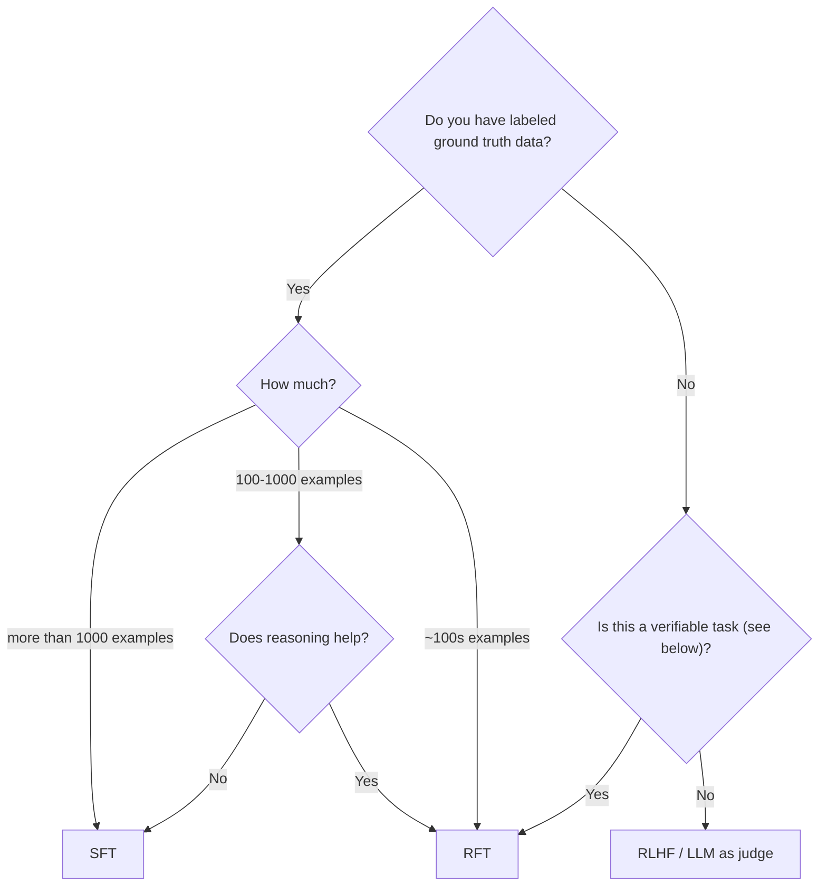

Fireworks helps you fine-tune models to improve quality and performance for your product use cases, without the burden of building & maintaining your own training infrastructure.

<Info>
  **Coming from OpenAI?** Fireworks uses the same [OpenAI-compatible chat completion format](/fine-tuning/fine-tuning-models#prepare-a-dataset) for training data — the same `messages` array with `role`, `content`, `tool_calls`, and `weight` fields. You can use your existing SFT datasets with no conversion required. See our [OpenAI compatibility guide](/tools-sdks/openai-compatibility) for more details.
</Info>

## Before you start: account tier and GPU quota

Fine-tuning needs training GPU quota, granted automatically by [spending tier](/guides/quotas_usage/account-quotas#training-gpu-quota):

| Tier              | How to reach it                          | B200 / B300 (Blackwell) | H200 | H100 / A100 |
| ----------------- | ---------------------------------------- | :---------------------: | :--: | :---------: |
| No payment method | —                                        |            0            |   0  |      0      |
| Tier 1            | Valid payment method and billing profile |            0            |  16  |      8      |
| Tier 2            | Spend or add \$50 in credits             |            16           |  16  |      16     |
| Tier 3            | Spend or add \$500 in credits            |            24           |  24  |      24     |
| Tier 4            | Spend or add \$5,000 in credits          |            32           |  32  |      32     |

Check your quota with `firectl quota list`. A job rejected with HTTP 429 `quota_exceeded` (sometimes a `403` on the job poll) is a tier issue, not a dataset/config problem.

<Note>
  Need more training quota than your tier allows? [Reach out for enterprise support](https://fireworks.ai/contact-training) and we'll help size the right allocation for your workload.
</Note>

## Three ways to fine-tune

Fireworks offers three approaches to fine-tuning, from fully autonomous to fully custom. Pick the one that fits how much control you want:

<CardGroup>
  <Card title="Fireworks Agent" icon="robot" href="/fine-tuning/agent/introduction">
    **Describe what you want in plain English.** Agent picks the base model, prepares the data, sweeps hyperparameters, evaluates, trains, and deploys. You approve a single plan and cost up front.

    Best for the fastest path from dataset to deployed fine-tuned model — from the Fireworks dashboard or from inside Claude Code, Cursor, Codex, Aider, or Goose.
  </Card>

  <Card title="Managed Fine-Tuning" icon="wand-magic-sparkles" href="/fine-tuning/managed-finetuning-intro">
    **Give Fireworks your data and configuration.** The platform handles scheduling, training, checkpointing, and model output. No custom code required.

    Best for teams that want managed SFT, DPO, or RFT with LoRA or full-parameter tuning.
  </Card>

  <Card title="Training API (Tinker compatible)" icon="code" href="/fine-tuning/training-api/introduction">
    **Write custom Python training loops.** You control the loss function, optimizer step, checkpointing, and weight sync. Fireworks handles the distributed GPU infrastructure.

    Best for research teams needing custom loops, custom rollout orchestration, or inference-in-the-loop evaluation.
  </Card>
</CardGroup>

|                                 | **Fireworks Agent**                                                       | **Managed Fine-Tuning**                      | **Training API**                   |
| ------------------------------- | ------------------------------------------------------------------------- | -------------------------------------------- | ---------------------------------- |
| **Interface**                   | Natural language (dashboard chat, `firectl session`, or via coding agent) | UI, `firectl`, REST API                      | Python script                      |
| **Who picks the model**         | Agent recommends                                                          | You                                          | You                                |
| **Who tunes hyperparameters**   | Agent runs a sweep                                                        | You set them                                 | You set them                       |
| **Cost approval**               | Built-in gate before any spend                                            | None — you submit jobs directly              | None                               |
| **Tuning method**               | Full-parameter or LoRA                                                    | Full-parameter or LoRA                       | Full-parameter or LoRA             |
| **Custom loss / training loop** | Not supported                                                             | Not supported                                | Supported                          |
| **Inference-in-the-loop eval**  | Not supported                                                             | Not supported                                | Supported (hotload)                |
| **Best for**                    | Getting a working fine-tuned model fast, without ML expertise             | Production fine-tuning with standard methods | Research, custom RL, hybrid losses |

## When to use SFT vs. RFT

In supervised fine-tuning, you provide a dataset with labeled examples of "good" outputs. In reinforcement fine-tuning, you provide a grader function that can be used to score the model's outputs. The model is iteratively trained to produce outputs that maximize this score.

Supervised fine-tuning (SFT) works well for many common scenarios, especially when:

* You have a sizable dataset (\~1000+ examples) with high-quality, ground-truth labels.
* The dataset covers most possible input scenarios.
* Tasks are relatively straightforward, such as:
  * Classification
  * Content extraction

However, SFT may struggle in situations where:

* Your dataset is small.
* You lack ground-truth outputs (a.k.a. "golden generations").
* The task requires multi-step reasoning.

Here is a simple decision tree:

<Tip>
  `Verifiable` refers to whether it is relatively easy to make a judgement on the quality of the model generation.
</Tip>

## When to use the Training API instead

Move from managed fine-tuning to the [Training API](/fine-tuning/training-api/introduction) when you need:

* **Custom training logic** — hybrid objectives, custom reward shaping, or a non-standard algorithm beyond managed settings
* **Inference-in-the-loop evaluation** — hotload checkpoints onto a serving deployment and sample mid-training
* **Per-step control** — custom gradient accumulation, dynamic learning rate schedules, or algorithm research

### Detailed capability comparison

| Capability              | Managed RFT                                                  | Training API                                                 |
| ----------------------- | ------------------------------------------------------------ | ------------------------------------------------------------ |
| Launch training         | CLI or UI                                                    | Python script                                                |
| Loss functions          | `grpo`, `dapo`, `gspo-token` (built-in)                      | Any custom loss via `forward_backward_custom`                |
| Tuning modes            | Full-parameter or LoRA                                       | Full-parameter or LoRA                                       |
| Context length          | Full context length supported by the selected training shape | Full context length supported by the selected training shape |
| Training loop           | Fully managed                                                | You write the loop                                           |
| Per-step diagnostics    | Dashboard (reward, loss, rollouts)                           | Full Python access to all metrics                            |
| Zero-variance filtering | Automatic                                                    | You implement                                                |
| Checkpoint management   | Automatic                                                    | You control via `save_weights_for_sampler_ext`               |

### Migrating from managed flow to Training API

If you've been using managed RFT and want more control — custom loss functions, richer diagnostics, or algorithm experimentation — the Training API lets you implement your own training loop while keeping the same GPU infrastructure. Managed jobs and cookbook recipes now use the same core tuning capabilities, including LoRA or full-parameter tuning and the full context length supported by the selected training shape.

### MoE models and Routing Replay

For Mixture-of-Experts (MoE) models like Kimi K2 (384 experts), training stability benefits from **Routing Replay** — caching the expert routing assignments from the reference policy's forward pass and replaying them during the training forward pass. This ensures that the same experts process the same tokens in both the reference and policy models, reducing gradient noise from routing changes.

Routing Replay is available in the Training API via the `loss_fn_inputs` mechanism — you can pass routing matrices from the reference forward pass into the training datum. Use the Training API when you need to inspect or customize those forward-pass inputs directly.
