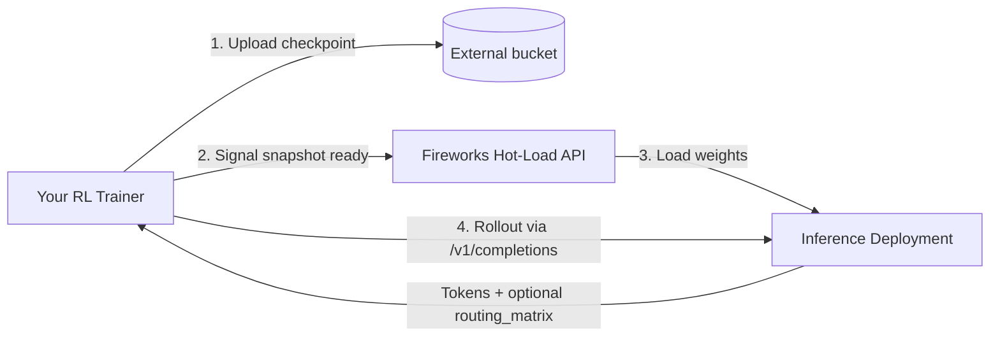

Integrate an external RL trainer with Fireworks inference: hot-load new checkpoints from your bucket and run rollouts via the OpenAI-compatible API.

<Warning>
  **Early Access Feature.** External-bucket hot-load for RL rollouts is a
  private preview. [Contact Fireworks](https://fireworks.ai/contact) to enable
  this path on your account before you use `S3`, `MINIO`, `NEBIUS`, or similar
  non-`FW_HOSTED` storage.
</Warning>

<Tip>
  **Using a code agent?** Follow sections in order: [Prerequisites](#prerequisites)
  → [Quickstart checklist](#quickstart-checklist) → [Hot-load API](#hot-load-api).
  Required env: `FIREWORKS_API_KEY`. After your first full snapshot is serving,
  read [Incremental snapshots (skill)](https://github.com/fw-ai/cookbook/blob/main/skills/fireworks-training/references/rl-hotload.md#incremental-snapshots-arc2) before
  production training loops. For active stream, session ID, and `reset_prompt_cache`
  semantics, see [KV cache behavior for RL rollouts](/guides/rollout-inference#kv-cache-behavior-for-rl-rollouts).
  For ledger and hot-load status debugging, see [Ledger & debugging (skill)](https://github.com/fw-ai/cookbook/blob/main/skills/fireworks-training/references/rl-hotload.md).
</Tip>

This guide is for teams already running their own RL trainer (Megatron, TorchTitan, Slime, Verl, etc) who want Fireworks purely for inference during rollouts. It also covers the raw hot-load API, which Training API users can call directly when they need rollout behaviors beyond what `WeightSyncer` and `DeploymentManager` expose.

Fireworks offers three paths for reinforcement learning, along a spectrum that trades convenience for control:

* **BYOT rollouts** — the most hands-on, for teams already running their own trainer who want Fireworks purely for high-scale rollout inference.
* **Training API** — the middle ground, for teams who want to own their training logic without managing infrastructure.
* **Managed RFT** — the turnkey path, for teams who just want a tuned model without running the loop themselves.

## Where this guide fits

| Path                                                         | You own                                                  | Fireworks owns                                                                    | Use this guide?                                               |
| ------------------------------------------------------------ | -------------------------------------------------------- | --------------------------------------------------------------------------------- | ------------------------------------------------------------- |
| **This guide (BYOT rollouts)**                               | Trainer, rewards, environment, checkpoint upload cadence | Hot-load deployment, distributed weight swap, inference, KV cache across rollouts | Yes                                                           |
| [Training API](/fine-tuning/training-api/introduction)       | Training logic (recipes or SDK)                          | GPUs, trainer lifecycle, often `FW_HOSTED` bucket                                 | Only if you need rollout behavior beyond what the SDK exposes |
| [Managed RFT](/fine-tuning/reinforcement-fine-tuning-models) | Dataset and evaluator                                    | End-to-end hosted RL                                                              | No                                                            |

**Why BYOT rollout inference?**

* **Disaggregated:** Your trainer and rollout cluster can run in different regions or clouds; deployments can span multiple regions to pool capacity.
* **Full-parameter or LoRA:** Hot-load full-parameter checkpoints for large models, or hot-load a LoRA adapter on top of a frozen base model—both run on Fireworks inference shapes. See [LoRA rollouts](#lora-rollouts).
* **Fast checkpoint transfer:** Lossless compressed incremental snapshots (`arc_v2`, typically 20×+ compression) over standard object storage—no special RDMA networking between trainer and inference.
* **Async / off-policy friendly:** Background download during rollouts; configurable swap semantics similar in spirit to [PipelineRL](https://arxiv.org/pdf/2509.19128)—see [checkpoint-swap behavior](/fine-tuning/rl-rollout-integration#checkpoint-swap-behavior).

For **Online RL** (live user traffic as rollouts with rolling per-replica updates), the same hot-load infrastructure applies; contact Fireworks for production Online RL setup.

## Supported models

BYOT rollout hot-load is enabled for a curated set of base models from our full [model library](https://fireworks.ai/models). The following are supported today:

| Model         | Base model ID                 |
| ------------- | ----------------------------- |
| Kimi K2.5     | `kimi-k2p5`                   |
| Kimi K2.6     | `kimi-k2p6`                   |
| Kimi K2.7     | `kimi-k2p7-code`              |
| GLM 5.2       | `glm-5p2`                     |
| Qwen3 30B-A3B | `qwen3-30b-a3b-instruct-2507` |

Both full-parameter checkpoints and [LoRA adapters](#lora-rollouts) can be hot-loaded for these models.

<Note>
  **Currently, reach out to the [Fireworks RL team](https://fireworks.ai/contact) to get set up.** We will help provision the deployment shape (GPU, precision, quantization) for your base model and confirm the snapshot format it expects.
</Note>

## Placeholders

Reuse these values in every command below:

| Placeholder                            | Example                                                           |
| -------------------------------------- | ----------------------------------------------------------------- |
| `<account_id>`                         | `my-team`                                                         |
| `<model_id>`                           | `qwen3-30b-a3b`                                                   |
| `<deployment_id>`                      | `rl-rollout-prod`                                                 |
| `<fireworks_api_key>`                  | From [API keys](https://app.fireworks.ai/settings/users/api-keys) |
| `<your_bucket>` / `<your_upload_path>` | Parent prefix configured on the deployment (no trailing slash)    |
| `<checkpoint_id>`                      | Snapshot directory name, e.g. `version_001` (no slashes)          |

## Prerequisites

Complete this checklist before creating a deployment:

1. **Fireworks account** and **API key** — [create a key](https://app.fireworks.ai/settings/users/api-keys) and set `export FIREWORKS_API_KEY="<key>"`.
2. **Account ID** — In the [dashboard](https://app.fireworks.ai/), open your account settings or any resource URL; the account slug is the segment after `/accounts/` (for example `accounts/<account_id>/...`).
3. **Feature enablement** — Request **external-bucket hot-load for RL rollouts** on account `<account_id>`, including your bucket provider (`S3`, `GCS`/`gs://`, or `NEBIUS`).
4. **Object storage read access for Fireworks** — Fireworks needs read-only access to the bucket prefix you will pass as `--hot-load-bucket-url`. At enablement, Fireworks shares the IAM principal to grant access. Typical setup:
   * **Amazon S3:** Grant the Fireworks principal `s3:GetObject` (and `s3:ListBucket` on the prefix) on `s3://<your_bucket>/<your_upload_path>/*`.
   * **Google Cloud Storage:** Grant `roles/storage.objectViewer` on the bucket or prefix to the Fireworks service account provided at onboarding.
   * **Nebius / MinIO:** Equivalent read-only credentials or access key scoped to the upload prefix.
5. **`firectl` installed** — See [firectl](/tools-sdks/firectl/firectl).
6. **Base model and deployment shape** — An RL-capable shape for your model (GPU count, precision). If you omit `--deployment-shape`, `firectl` prompts you to pick one interactively.

## Architecture



**You own:** trainer, reward shaping, checkpoint cadence, rollout orchestration.

**Fireworks owns:** hot-load logistics, distributed weight swap, inference serving, KV cache across rollouts.

## End-to-end loop

1. Create a hot-load deployment.
2. Upload and hot-load an initial **full** snapshot.
3. Run rollouts against that snapshot.
4. For each training step: upload and hot-load the next **incremental** snapshot (see [Incremental snapshots](https://github.com/fw-ai/cookbook/blob/main/skills/fireworks-training/references/rl-hotload.md)).
5. Run rollouts again.
6. Every 20th or 30th step, publish a **full** snapshot instead of an incremental one. If the incremental chain fails, fall back to a full snapshot.

## Quickstart checklist

Use this table for your **first** rollout end-to-end:

| Step | Action                                                                     | Done when                                                                                   |
| ---- | -------------------------------------------------------------------------- | ------------------------------------------------------------------------------------------- |
| 1    | [Create hot-load deployment](#1-create-a-hot-load-deployment)              | `firectl deployment get <deployment_id>` shows a healthy deployment                         |
| 2    | [Upload full HF snapshot](#2-upload-and-hot-load-an-initial-full-snapshot) | All files exist under `.../<checkpoint_id>/` in object storage                              |
| 3    | `POST` [signal snapshot](#hot-load-api)                                    | HTTP 200                                                                                    |
| 4    | `GET` [poll status](#hot-load-api)                                         | Every replica has `readiness: true` and `current_snapshot_identity` matches your `identity` |
| 5    | [Run rollouts](#3-run-rollouts)                                            | Chat/completions returns tokens                                                             |

## 1. Create a hot-load deployment

Create the deployment that will serve rollouts. During preview, `--enable-hot-load` flags may be hidden from CLI help but can still be passed explicitly.

```bash theme={null}
firectl create deployment accounts/<account_id>/models/<model_id> \
  --deployment-shape <shape_name> \
  --deployment-id <deployment_id> \
  --enable-hot-load \
  --hot-load-bucket-type S3 \
  --hot-load-bucket-url s3://<your_bucket>/<your_upload_path> \
  --hot-load-transition-type ASYNC \
  --region US_OHIO_1
```

<Note>
  **Flags**

  * `--deployment-shape` — Optional. If omitted, `firectl` prompts you to pick one.
  * `--hot-load-bucket-type` — `MINIO`, `S3`, `NEBIUS`, or `FW_HOSTED`. This guide focuses on external buckets (`S3`, `gs://`, etc.). `FW_HOSTED` is for Fireworks-managed trainers.
  * `--hot-load-bucket-url` — Required when `--enable-hot-load` is set. Examples: `s3://mybucket/path`, `gs://mybucket/path`. **No trailing slash.** This is the **parent prefix**; each snapshot is a subdirectory named by `identity` (see [snapshot layout](#snapshot-layout)).
  * `--hot-load-transition-type` — `ASYNC` (recommended for RL) or `SYNC`. Defaults to `ASYNC` when hot load is enabled. See [checkpoint-swap behavior](/fine-tuning/rl-rollout-integration#checkpoint-swap-behavior).
  * `--region` — Where the deployment runs (for example `US_OHIO_1`, `US_VIRGINIA_1`). Keep the trainer upload path geographically close to the bucket and deployment.
</Note>

Save the **account ID**, **deployment ID**, and **model ID** from the output for hot-load and rollout calls.

If you do not set a shape, the CLI shows a shape picker:

<Frame>
  
</Frame>

## 2. Upload and hot-load an initial full snapshot

Upload a full HuggingFace-format checkpoint, then signal Fireworks to load it.

### Snapshot layout

Place each snapshot under its own subdirectory. The `identity` you signal in the API must match the directory name (a single path segment—no slashes):

```
s3://<your_bucket>/<your_upload_path>/<checkpoint_id>/
├── config.json                   # HF model config (must match the base model)
├── tokenizer.json                # tokenizer files (same as the base model)
├── tokenizer_config.json
├── model.safetensors.index.json  # weight name → shard file map
├── model.weight.spec.json        # weight name → {shape, dtype} for every tensor
├── model-00000.safetensors       # weights, one layer per file
├── model-00001.safetensors
└── ...
```

Example with the recommended path pattern:

```
s3://<your_bucket>/<account_id>/<account_id>-<deployment_id>/version_001/
```

* **`identity` / `<checkpoint_id>`** — Any opaque string (for example `version_001` or `step_00100`).
* **Format** — Same layout as the base model on HuggingFace, plus the two manifest files described below. **No tensor-parallel sharding** in uploaded files.
* **File size** — Split weights into multiple `.safetensors` files, each under about 5 GB. **One layer per file** is required (a single shard must not mix weights from more than one layer) and also minimizes load time.

#### Required files (full snapshot)

A full (non-LoRA) snapshot is validated at POST time; it must contain all of:

| File                           | Purpose                                                                | Validation                                                                                                                                                                                                                               |
| ------------------------------ | ---------------------------------------------------------------------- | ---------------------------------------------------------------------------------------------------------------------------------------------------------------------------------------------------------------------------------------- |
| `config.json`                  | HuggingFace model config.                                              | Must be loadable as an `AutoConfig` and **equivalent to the base model's** config (`hidden_size`, `num_hidden_layers`, `rope_parameters`, etc.). A `quantization_config` key is allowed for [quantized snapshots](#quantized-snapshots). |
| `model.safetensors.index.json` | Maps each tensor name to the shard file that stores it (`weight_map`). | Must be a JSON object with a `weight_map`; every shard file may contain weights from only **one** layer.                                                                                                                                 |
| `model.weight.spec.json`       | Describes each tensor's `shape` and `dtype` (`tensor_map`).            | Must be a JSON object with a `tensor_map` that covers **every** weight named in `weight_map`.                                                                                                                                            |
| `model-*.safetensors`          | The weights themselves.                                                | Tensor coverage must match the index/spec; tensors must cover the base model.                                                                                                                                                            |
| tokenizer files                | `tokenizer.json`, `tokenizer_config.json`, etc.                        | Carried over from the base model.                                                                                                                                                                                                        |

`model.safetensors.index.json` (HuggingFace-standard) maps tensors to shards:

```json theme={null}
{
  "weight_map": {
    "model.layers.0.self_attn.q_proj.weight": "model-00001.safetensors",
    "model.layers.0.self_attn.k_proj.weight": "model-00001.safetensors"
  }
}
```

`model.weight.spec.json` gives each tensor's metadata (used to validate transitions and dequantization):

```json theme={null}
{
  "tensor_map": {
    "model.layers.0.self_attn.q_proj.weight": {
      "shape": [2048, 2048],
      "dtype": "float16"
    }
  }
}
```

#### Incremental snapshots and ARC2

An [incremental snapshot](https://github.com/fw-ai/cookbook/blob/main/skills/fireworks-training/references/rl-hotload.md) is an ARC2-compressed **delta** of the safetensors against a `previous_snapshot_identity` already on the deployment. It keeps the **same `model.safetensors.index.json`** as its parent — the `weight_map`, the file count, and the per-file weight set must be **identical** (only the tensor contents change). Tensor `dtype`s must also match across the transition. Upload only the diff `.safetensors` (plus the unchanged manifests/config) under the new `identity`; signal it with `incremental_snapshot_metadata`. See [Incremental snapshots](https://github.com/fw-ai/cookbook/blob/main/skills/fireworks-training/references/rl-hotload.md) for the full body and the delta-build utilities.

Optional: call the [per-file hint API](/fine-tuning/rl-rollout-integration#per-file-hints-optional) as each file lands to speed up loading on large models.

### Quantized snapshots

Snapshot **precision must be in a format the shape's loader accepts**, so the exact target format is **shape-dependent** — confirm it with the Fireworks RL team during shape provisioning (see [Supported models](#supported-models)). You can upload weights in the base precision (BF16) and let the shape convert them at load time, or **pre-quantize** in the snapshot to cut upload size and weight-swap time.

For large MoE models such as **GLM** and **Kimi**, the routed MoE expert weights can be **pre-quantized to FP8** in the uploaded snapshot. When you pre-quantize:

* Add the matching `quantization_config` block to `config.json`.
* Make sure `model.weight.spec.json` (`tensor_map`) describes the quantized tensors (`shape` + `dtype`); the snapshot is rejected if a `quantization_config` is present but the spec has no dequantizable tensors or is missing the metadata needed to dequantize them.
* Keep the quantization recipe consistent across every snapshot in a run so the [incremental chain](https://github.com/fw-ai/cookbook/blob/main/skills/fireworks-training/references/rl-hotload.md) stays valid (dtypes must not change between a snapshot and its parent).

### Signal and poll

Use the [Hot-load API](#hot-load-api) below with `{ "identity": "<checkpoint_id>" }` and poll until all replicas are ready.

## Hot-load API

All hot-load requests use these headers:

| Header                 | Value                                               |
| ---------------------- | --------------------------------------------------- |
| `Authorization`        | `Bearer <fireworks_api_key>`                        |
| `fireworks-model`      | `accounts/<account_id>/models/<model_id>`           |
| `fireworks-deployment` | `accounts/<account_id>/deployments/<deployment_id>` |
| `Content-Type`         | `application/json`                                  |

| Operation                | Method | URL                                                         |
| ------------------------ | ------ | ----------------------------------------------------------- |
| Signal snapshot ready    | `POST` | `https://api.fireworks.ai/hot_load/v1/models/hot_load`      |
| Poll load status         | `GET`  | `https://api.fireworks.ai/hot_load/v1/models/hot_load`      |
| Per-file hint (optional) | `POST` | `https://api.fireworks.ai/hot_load/v1/models/hot_load/hint` |

### Per-file hints (optional)

For large full-parameter snapshots, notify the hint endpoint as each shard finishes uploading. Hints let replicas begin validating and staging available files before the final snapshot-ready signal. They do not replace the final signal or readiness poll.

### Signal snapshot ready

**Full snapshot** body:

```json theme={null}
{ "identity": "version_001" }
```

**Incremental snapshot** bodies, compression, hints, and `checksum_format` are documented in [Incremental snapshots](https://github.com/fw-ai/cookbook/blob/main/skills/fireworks-training/references/rl-hotload.md).

<ParamField type="string">
  Snapshot directory name under the configured bucket prefix. Must not contain `/`.
</ParamField>

<ParamField type="object">
  Required for incremental snapshots. Includes `previous_snapshot_identity`, `compression_format` (`arc_v2`), and `checksum_format` (`alder32`). See the incremental snapshots guide.
</ParamField>

<ParamField type="string">
  Prompt-cache policy after the swap: `all` (default), `none`, or `new_session`. See [KV cache behavior for RL rollouts](/guides/rollout-inference#kv-cache-behavior-for-rl-rollouts) for active stream, session ID, and reset-option semantics.
</ParamField>

<ParamField type="string[]">
  Top-level `config.json` fields to ignore during snapshot validation. Only use for known-safe metadata fields.
</ParamField>

```bash theme={null}
curl -X POST https://api.fireworks.ai/hot_load/v1/models/hot_load \
  -H "Authorization: Bearer <fireworks_api_key>" \
  -H "fireworks-model: accounts/<account_id>/models/<model_id>" \
  -H "fireworks-deployment: accounts/<account_id>/deployments/<deployment_id>" \
  -H "Content-Type: application/json" \
  -d '{ "identity": "version_001" }'
```

```python theme={null}
import os
import requests

API_KEY = os.environ["FIREWORKS_API_KEY"]
ACCOUNT = "<account_id>"
MODEL = f"accounts/{ACCOUNT}/models/<model_id>"
DEPLOYMENT = f"accounts/{ACCOUNT}/deployments/<deployment_id>"
HEADERS = {
    "Authorization": f"Bearer {API_KEY}",
    "fireworks-model": MODEL,
    "fireworks-deployment": DEPLOYMENT,
    "Content-Type": "application/json",
}

resp = requests.post(
    "https://api.fireworks.ai/hot_load/v1/models/hot_load",
    headers=HEADERS,
    json={"identity": "version_001"},
    timeout=60,
)
resp.raise_for_status()
```

### Poll load status

Poll until **every** replica has `readiness: true` and `current_snapshot_identity` equals the `identity` you signaled.

```bash theme={null}
curl https://api.fireworks.ai/hot_load/v1/models/hot_load \
  -H "Authorization: Bearer <fireworks_api_key>" \
  -H "fireworks-model: accounts/<account_id>/models/<model_id>" \
  -H "fireworks-deployment: accounts/<account_id>/deployments/<deployment_id>"
```

```python theme={null}
status = requests.get(
    "https://api.fireworks.ai/hot_load/v1/models/hot_load",
    headers=HEADERS,
    timeout=30,
).json()

replicas = status.get("replicas", [])
ready = (
    replicas
    and all(r.get("readiness") for r in replicas)
    and all(r.get("current_snapshot_identity") == "version_001" for r in replicas)
)
```

### Checkpoint swap behavior

A swap changes which policy serves new rollout work. Wait for every replica to report the requested identity for strict on-policy collection. For bounded off-policy collection, record the policy version returned by inference and apply the reviewed admission rule before training on that rollout.

#### Async transition (recommended default for RL)

Async transition keeps rollout capacity available while replicas adopt the new snapshot. Existing generations may finish across the transition, so preserve policy-version metadata and validate trainer/inference numerics. Use a synchronized transition only when the workflow requires every in-flight generation to finish on one policy version.

### When to start rollouts

* **Default (on-policy):** Wait until all replicas report readiness on the new `identity`.
* **Off-policy / higher utilization:** You may start sending rollouts when a **subset** of replicas is ready—inspect each entry in `replicas` in the `GET` response. Stale-policy rollouts are expected; use async transition mode and monitor policy version in streaming responses (see [Policy version in responses](/guides/rollout-inference#policy-version-in-responses)).

Per-file hints are optional but recommended for large checkpoints—see [Incremental snapshots](/fine-tuning/rl-rollout-integration#per-file-hints-optional).

## 3. Run rollouts

Call the OpenAI-compatible inference API. For multi-turn RL, set session headers so KV cache stays on one replica:

```bash theme={null}
curl https://api.fireworks.ai/inference/v1/chat/completions \
  -H "Authorization: Bearer <fireworks_api_key>" \
  -H "fireworks-model: accounts/<account_id>/models/<model_id>" \
  -H "fireworks-deployment: accounts/<account_id>/deployments/<deployment_id>" \
  -H "x-multi-turn-session-id: <trajectory_id>" \
  -H "x-session-affinity: <trajectory_id>" \
  -H "Content-Type: application/json" \
  -d '{
    "model": "accounts/<account_id>/models/<model_id>",
    "messages": [{"role": "user", "content": "..."}]
  }'
```

See [Inference for RL rollouts](/guides/rollout-inference) for session affinity, weight-swap behavior, MoE Router Replay (R3), and policy-version fields.

## Steady-state training loop

After the first full snapshot:

1. **Intermediate steps** — Build and upload an [incremental snapshot](https://github.com/fw-ai/cookbook/blob/main/skills/fireworks-training/references/rl-hotload.md) (`arc_v2`), signal with `incremental_snapshot_metadata`, poll until ready, then run rollouts.
2. **Every 20th or 30th step** — Publish a new **full** snapshot for faster recovery and chain reset.
3. **On failure** — Fall back to a full snapshot; see [Ledger and debugging](#ledger-debugging).

Brief incremental signal example (full details on the incremental page):

```bash theme={null}
curl -X POST https://api.fireworks.ai/hot_load/v1/models/hot_load \
  -H "Authorization: Bearer <fireworks_api_key>" \
  -H "fireworks-model: accounts/<account_id>/models/<model_id>" \
  -H "fireworks-deployment: accounts/<account_id>/deployments/<deployment_id>" \
  -H "Content-Type: application/json" \
  -d '{
    "identity": "version_002",
    "incremental_snapshot_metadata": {
      "previous_snapshot_identity": "version_001",
      "compression_format": "arc_v2",
      "checksum_format": "alder32"
    }
  }'
```

## LoRA rollouts

Rollouts work with both **full-parameter** and **LoRA** checkpoints. With LoRA you hot-load only the adapter on top of a frozen base model: snapshots are tiny (tens of MB instead of tens of GB), weight swaps are near-instant, and the deployment applies the adapter at request time. This is a good fit for rapid RL iteration and for serving several adapter variants from one base deployment.

The flow is the same as the [end-to-end loop](#end-to-end-loop) above—create a hot-load deployment, upload a snapshot, signal it, poll, and run rollouts—with the differences below.

<Note>
  LoRA rollouts run on a LoRA-capable RL/hot-load shape (adapter serving enabled on the base-model deployment). Confirm the shape for your base model with Fireworks during [feature enablement](#prerequisites).
</Note>

### Auto-detection

You do **not** set a flag to choose LoRA vs full-parameter. Fireworks classifies each snapshot from its contents: a directory containing `adapter_config.json` is loaded as a LoRA adapter; anything else is treated as a full-parameter snapshot. The [Hot-load API](#hot-load-api) is identical for both.

### LoRA snapshot layout

Upload a HuggingFace / PEFT-format adapter under the snapshot `identity` directory (same bucket parent as the [full snapshot layout](#snapshot-layout)):

```
s3://<your_bucket>/<your_upload_path>/<checkpoint_id>/
├── adapter_config.json
└── adapter_model.safetensors
```

* **`adapter_config.json`** — PEFT adapter config. Its presence is what marks the snapshot as LoRA; it must reference the same base model the deployment serves.
* **`adapter_model.safetensors`** — adapter weights. Sharded `adapter_model-*.safetensors` and the legacy `adapter_model.bin` are also accepted.

### Signal and poll

Signal exactly like a full snapshot—just the `identity`:

```bash theme={null}
curl -X POST https://api.fireworks.ai/hot_load/v1/models/hot_load \
  -H "Authorization: Bearer <fireworks_api_key>" \
  -H "fireworks-model: accounts/<account_id>/models/<model_id>" \
  -H "fireworks-deployment: accounts/<account_id>/deployments/<deployment_id>" \
  -H "Content-Type: application/json" \
  -d '{ "identity": "adapter_step_001" }'
```

When [polling load status](#poll-load-status), LoRA deployments report progress per adapter in a `loaded_adapters` array (each entry has an `identity` and a `status`) in addition to the single `current_snapshot_identity` used for full-parameter snapshots. Treat the snapshot as ready when your `identity` appears with `status: "loaded"` on **every** replica.

### No incremental chain

LoRA adapters are small, so there is **no ARC2 incremental/delta chain** for LoRA. Upload the full adapter every step—each LoRA snapshot is complete and self-contained. The [incremental snapshot](https://github.com/fw-ai/cookbook/blob/main/skills/fireworks-training/references/rl-hotload.md) workflow (and the "every 20th–30th step, publish a full snapshot" cadence) applies only to full-parameter checkpoints.

## Numerics alignment

For best training–inference alignment:

* Match **quantization / precision** between trainer checkpoints and the deployment shape (work with Fireworks if you need a custom shape).
* Measure **logprob divergence** between trainer forward passes and rollout inference on the same tokens.
* For MoE models, use **Router Replay (R3)** during rollouts—see [MoE Router Replay](/guides/rollout-inference#moe-router-replay).

## Ledger and debugging

The control-plane checkpoint list is the source of truth for snapshot identity, type, creation time, and promotability. When a hot-load stalls:

1. Confirm the deployment is attached to the trainer or bucket scope that produced the snapshot.
2. Compare the requested identity with every replica's reported current identity.
3. For full-parameter chains, retry with a full base snapshot if a delta parent is missing.
4. For LoRA, fix a stale deployment attachment; LoRA snapshots are complete adapters and do not use a delta chain.

Detailed scope mismatch, checkpoint retention, promotion, and recovery procedures live in the [hot-load skill reference](https://github.com/fw-ai/cookbook/blob/main/skills/fireworks-training/references/rl-hotload.md).

## Next steps

<CardGroup>
  <Card title="Incremental snapshots & ARC2" icon="layer-group" href="https://github.com/fw-ai/cookbook/blob/main/skills/fireworks-training/references/rl-hotload.md">
    Delta builds, per-file hints, and incremental signal bodies
  </Card>

  <Card title="Ledger & debugging" icon="bug" href="https://github.com/fw-ai/cookbook/blob/main/skills/fireworks-training/references/rl-hotload.md">
    Snapshot history, stuck swaps, and recovery playbooks
  </Card>

  <Card title="Inference for RL rollouts" icon="bolt" href="/guides/rollout-inference">
    Session affinity, policy version, MoE Router Replay (R3)
  </Card>

  <Card title="Training API" icon="flask" href="/fine-tuning/training-api/introduction">
    Fireworks-hosted trainer alternative
  </Card>
</CardGroup>

<Note>
  **Operational depth** (ledger, ARC2 chains, hot-load errors) lives in the [Fireworks training skill — rl-hotload](https://github.com/fw-ai/cookbook/blob/main/skills/fireworks-training/references/rl-hotload.md). This page is the BYOT happy path.
</Note>
