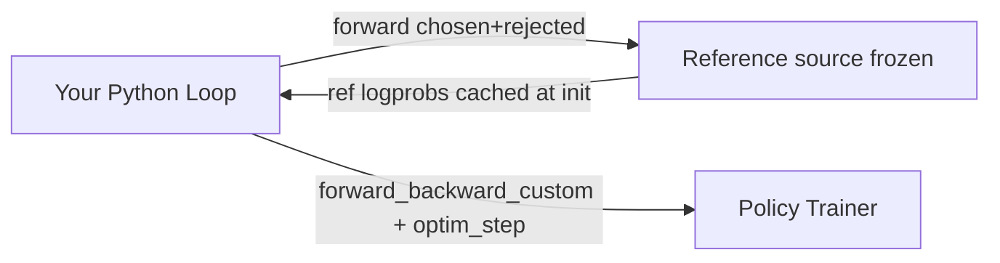

Direct Preference Optimization with pairwise data using the cookbook recipe.

## What this is

This guide walks through DPO (Direct Preference Optimization) training using the cookbook. DPO learns from preference pairs (chosen vs. rejected responses) without a separate reward model.

## How DPO differs from GRPO

|                        | DPO                                                          | GRPO                                                                    |
| ---------------------- | ------------------------------------------------------------ | ----------------------------------------------------------------------- |
| **Trainer jobs**       | 1 for LoRA, 2 for full-parameter (policy + frozen reference) | 1-2 trainers plus an inference deployment, depending on reference needs |
| **Data**               | Preference pairs (chosen/rejected)                           | Prompts + reward function                                               |
| **Reference logprobs** | Cached once at initialization                                | Computed every step                                                     |
| **Loss**               | `-log(sigmoid(beta * margin))`                               | Advantage-weighted policy gradient + KL                                 |

## Architecture



## Using the recipe

```python theme={null}
from training.recipes.dpo_loop import Config, main
from training.utils import TrainerConfig, WandBConfig

cfg = Config(
    log_path="./dpo_logs",
    base_model="accounts/fireworks/models/qwen3-8b",
    dataset="/path/to/preference_data.jsonl",
    tokenizer_model="Qwen/Qwen3-8B",
    beta=0.1,
    epochs=1,
    batch_size=4,
    max_seq_len=4096,
    trainer=TrainerConfig(
        training_shape_id="accounts/fireworks/trainingShapes/qwen3-8b-128k",
        reference_training_shape_id="accounts/fireworks/trainingShapes/qwen3-8b-128k-h200-forward",
    ),
    wandb=WandBConfig(entity="my-team", project="dpo-experiment"),
)

main(cfg)
```

## Dataset format

DPO expects preference pairs. Supported formats:

**Format 1 — chosen/rejected messages:**

```json theme={null}
{
  "chosen": {"messages": [{"role": "user", "content": "..."}, {"role": "assistant", "content": "good response"}]},
  "rejected": {"messages": [{"role": "user", "content": "..."}, {"role": "assistant", "content": "bad response"}]}
}
```

**Format 2 — input/output split:**

```json theme={null}
{
  "input": {"messages": [{"role": "user", "content": "..."}]},
  "preferred_output": [{"role": "assistant", "content": "good"}],
  "non_preferred_output": [{"role": "assistant", "content": "bad"}]
}
```

## Step-by-step (API-level)

### Provision trainers with `build_service_client`

DPO always needs reference logprobs. Full-parameter DPO uses a policy trainer plus a separate reference trainer backed by the model's LoRA shape with the adapter disabled; LoRA DPO uses one policy trainer and the policy session's shared base reference. Provisioning is owned by the SDK-managed service client — `build_service_client` resolves shapes, attaches or creates the trainer(s), and decides the reference strategy for you:

* **LoRA** (`lora_rank > 0`) with no `reference_training_shape_id` → `create_reference_client` reuses the policy session (no second trainer).
* **Full-parameter**, or an explicit `reference_training_shape_id` → a separate reference trainer is provisioned from the model's LoRA shape (adapter disabled) and its lifecycle is owned by the service client.

```python theme={null}
import os
from training.utils import TrainerConfig, build_service_client

api_key = os.environ["FIREWORKS_API_KEY"]
base_url = os.environ.get("FIREWORKS_BASE_URL", "https://api.fireworks.ai")
base_model = "accounts/fireworks/models/qwen3-8b"

service = build_service_client(
    api_key=api_key,
    base_url=base_url,
    additional_headers=None,
    base_model=base_model,
    tokenizer_model="Qwen/Qwen3-8B",
    lora_rank=0,
    max_context_length=None,
    learning_rate=1e-5,
    trainer=TrainerConfig(
        training_shape_id="accounts/fireworks/trainingShapes/qwen3-8b-128k",
        reference_training_shape_id="accounts/fireworks/trainingShapes/qwen3-8b-128k-h200-forward",
    ),
    # deployment=None  → trainer-only provisioning (DPO has no rollouts)
    cleanup_trainer_on_close=True,  # delete SDK-managed trainers on service.close()
)

policy_client = service.create_training_client(base_model, lora_rank=0)
reference_client = service.create_reference_client(base_model, lora_rank=0)

# ... training loop ...
# service.close()  # tears down the trainers it created
```

<Note>
  The cookbook recipes wrap these clients in `ReconnectableClient.from_training_client(...)` for blocking semantics; for a raw API-level loop you can call `policy_client` / `reference_client` directly.
</Note>

### Cache reference logprobs

Reference logprobs are computed once at initialization and reused throughout training:

```python theme={null}
ref_cache = {}
for i, (chosen_tokens, rejected_tokens, prompt_len) in enumerate(dataset):
    chosen_datum, rejected_datum = build_dpo_datums(
        chosen_tokens, rejected_tokens, prompt_len, max_seq_len=4096,
    )
    fwd = reference_client.forward([chosen_datum, rejected_datum], "cross_entropy")
    ref_cache[i] = {
        "ref_chosen": fwd.loss_fn_outputs[0]["logprobs"].data,
        "ref_rejected": fwd.loss_fn_outputs[1]["logprobs"].data,
        "chosen_tokens": chosen_tokens,
        "rejected_tokens": rejected_tokens,
        "prompt_len": prompt_len,
    }
```

### DPO loss function

```python theme={null}
import torch
import torch.nn.functional as F

def make_dpo_loss_fn(ref_chosen_logprobs, ref_rejected_logprobs, beta=0.1):
    ref_chosen_t = torch.tensor(ref_chosen_logprobs, dtype=torch.float32)
    ref_rejected_t = torch.tensor(ref_rejected_logprobs, dtype=torch.float32)

    def loss_fn(data, logprobs_list):
        pi_chosen, pi_rejected = logprobs_list[0], logprobs_list[1]
        chosen_weights = torch.tensor(data[0].loss_fn_inputs["weights"].data, dtype=torch.float32)
        rejected_weights = torch.tensor(data[1].loss_fn_inputs["weights"].data, dtype=torch.float32)

        pi_chosen_sum = torch.dot(pi_chosen.float(), chosen_weights)
        pi_rejected_sum = torch.dot(pi_rejected.float(), rejected_weights)
        ref_chosen_sum = torch.dot(ref_chosen_t.float(), chosen_weights)
        ref_rejected_sum = torch.dot(ref_rejected_t.float(), rejected_weights)

        margin = (pi_chosen_sum - ref_chosen_sum) - (pi_rejected_sum - ref_rejected_sum)
        dpo_loss = -F.logsigmoid(beta * margin)

        with torch.no_grad():
            accuracy = 1.0 if margin.item() > 0 else 0.0

        return dpo_loss, {"dpo_loss": dpo_loss.item(), "margin": margin.item(), "accuracy": accuracy}

    return loss_fn
```

### Training loop

```python theme={null}
step = 0
accum_count = 0
grad_accum = 4

for idx in ref_cache:
    cached = ref_cache[idx]
    chosen_datum, rejected_datum = build_dpo_datums(
        cached["chosen_tokens"], cached["rejected_tokens"],
        cached["prompt_len"], max_seq_len=4096,
    )
    loss_fn = make_dpo_loss_fn(
        ref_chosen_logprobs=cached["ref_chosen"],
        ref_rejected_logprobs=cached["ref_rejected"],
        beta=0.1,
    )
    result = policy_client.forward_backward_custom([chosen_datum, rejected_datum], loss_fn)
    accum_count += 1

    if accum_count >= grad_accum:
        policy_client.optim_step(
            tinker.AdamParams(learning_rate=1e-5, beta1=0.9, beta2=0.999, eps=1e-8, weight_decay=0.01)
        )
        step += 1
        accum_count = 0
        print(f"Step {step}: {result.metrics}")
```

## Operational guidance

* **Set `trainer.training_shape_id` when you need an explicit policy shape** — otherwise supported recipes auto-select a validated policy shape.
* **Leave `trainer.reference_training_shape_id` unset unless you need a specific reference shape** — full-parameter DPO auto-selects the model's validated LoRA shape as the reference; LoRA DPO uses a shared-session reference by default.
* **DPO does not provision a deployment** — there are no rollout samples or deployment weight syncs in the recipe.
* **Keep a versioned reference cache** tied to tokenizer + base model revision. If the base model changes, recompute reference logprobs.
* **Monitor margin statistics**: increasing margins indicate the policy is learning preferences.
* **DCP checkpoints are disabled by default** (`dcp_save_interval=0`). If you need to resume training from a checkpoint, set `dcp_save_interval` directly on `dpo_loop.Config`.

## Common pitfalls

* **Mismatched formatting** between chosen/rejected sequences corrupts preference signals — ensure identical prompt prefixes.
* **Stale reference cache**: If you warm-start from a different model, cached reference logprobs are invalid.

## Related preference methods

* **ORPO** (`training.recipes.orpo_loop`) — Odds Ratio Preference Optimization. Combines an SFT-style negative-log-likelihood term on the chosen response with a margin term on the odds ratio between chosen and rejected. Unlike DPO, ORPO does **not** require a reference trainer (no cached reference logprobs), so the recipe runs with a single trainer + dataset of preference pairs. See `training.recipes.orpo_loop` in the public [cookbook repo](https://github.com/fw-ai/cookbook/tree/main/training/recipes/orpo_loop.py) for the full configuration.

## Related guides

* [Cookbook RL (GRPO)](/fine-tuning/training-api/cookbook/rl) — reinforcement learning recipes
* [Cookbook Reference](/fine-tuning/training-api/cookbook/reference) — all config classes
* [Loss Functions](/fine-tuning/training-api/dedicated#loss-functions) — API-level DPO loss details
