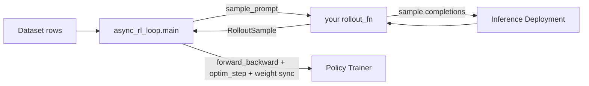

Async RL on Fireworks — write a rollout function, the recipe owns the loop (gate, advantage, weight sync, KL/TIS, PPO, checkpoints). Runs async or fully synchronous.

## What this is

The cookbook's primary RL recipe is **`async_rl_loop`**. It runs rollout sampling and training as concurrent tasks, so the trainer doesn't sit idle waiting for a full batch of rollouts. **The only thing you write is a rollout function** — the recipe owns everything else: the off-policy gate, advantage computation, reference-model forwards, weight sync, KL/TIS metrics, the PPO inner loop, and checkpointing.

It is a strict superset of synchronous, on-policy GRPO: set one flag and it drains rollouts before every step (see [Sync vs. async](#sync-vs-async)). Start here for new RL work.

<Warning>
  `async_rl_loop` is **experimental** and under active development. Config fields and the rollout protocol may change without backward-compatibility shims; the recipe emits a runtime warning at startup. Pin to a specific cookbook commit if you depend on the current shape.
</Warning>

## Core design: two files

You write two small files; the recipe is the third moving part you configure but don't edit.

| File                          | What it holds                                                                                                                                                                    |
| ----------------------------- | -------------------------------------------------------------------------------------------------------------------------------------------------------------------------------- |
| `rollout.py`                  | The **rollout function** — one trajectory per call: sample from the deployment, (optionally) score it, return a `RolloutSample`. Exposes `make_rollout_fn(setup) -> rollout_fn`. |
| `train.py`                    | **Config + wiring** — base model, training/deployment shapes, the policy loss variant, reward function, and the call to `main(cfg, rollout_fn_factory=..., rows=...)`.           |
| `async_rl_loop.main` (recipe) | Everything else: fan-out, off-policy gate, advantage, reference forwards, weight sync, KL/TIS, PPO inner loop, checkpoints, promotion.                                           |



### `rollout.py` — the rollout function

The recipe hands your factory a `RolloutSetup` (sampler dependencies, tokenizer, sampling kwargs, custom `extras`) once at startup. Your `rollout_fn` is then invoked once per sample and returns a `RolloutSample` (or `None` to drop it):

```python theme={null}
from training.examples.rl.vanilla_sampler import build_deployment_sampler
from training.utils.rl.rollout import RolloutSample

def make_rollout_fn(setup):
    sampler = build_deployment_sampler(setup)
    sample_kwargs = dict(setup.sample_kwargs)

    async def rollout_fn(sample_prompt: dict) -> RolloutSample | None:
        completions = await sampler.sample_with_prompt_tokens(
            sample_prompt["prompt_token_ids"], n=1, **sample_kwargs,
        )
        if not completions:
            return None
        c = completions[0]
        output = list(c.full_tokens)[c.prompt_len:]
        return RolloutSample(
            tokens=list(c.full_tokens),
            logprobs=[0.0] * c.prompt_len + list(c.inference_logprobs),
            loss_mask=[0] * c.prompt_len + [1] * len(output),
            reward=score(c),                       # your reward function
            finish_reason=c.finish_reason,
            text=c.text,
        )

    return rollout_fn
```

`RolloutSample` is three parallel per-token lists plus a scalar reward:

```python theme={null}
@dataclass
class RolloutSample:
    tokens: list[int]
    logprobs: list[float]   # 0.0 on non-generated positions
    loss_mask: list[int]    # 1 on assistant tokens, 0 elsewhere
    reward: float
    finish_reason: str = "stop"
    text: str = ""
```

Multi-turn rollouts flatten into the same shape — turn boundaries are implicit in `loss_mask` transitions (0 on prompt/user/tool, 1 on assistant). The per-token mask alignment is the contract the trainer relies on.

### `train.py` — config, reward, and loss

`train.py` builds the `Config`, picks the policy loss, wires the reward (computed inside the rollout), and starts the loop:

```python theme={null}
from training.recipes.async_rl_loop import Config, main
from training.utils import DeployConfig, TrainerConfig, WandBConfig
from my_rollout import make_rollout_fn  # your rollout.py

cfg = Config(
    log_path="./gsm8k_logs",
    base_model="accounts/fireworks/models/qwen3-8b",
    learning_rate=1.7e-5,
    completions_per_prompt=8,
    prompt_groups_per_step=8,
    policy_loss="grpo",                 # the "custom loss" knob
    max_head_offpolicy_versions=4,      # off-policy staleness budget (0 = on-policy)
    trainer=TrainerConfig(training_shape_id="accounts/fireworks/trainingShapes/qwen3-8b-128k-h200"),
    deployment=DeployConfig(tokenizer_model="Qwen/Qwen3-8B"),
    wandb=WandBConfig(entity="my-team", project="gsm8k-rl"),
)

rows = [...]  # dataset rows; each becomes a sample_prompt
main(cfg, rollout_fn_factory=make_rollout_fn, rows=rows)
```

Provisioning (policy trainer, reference trainer when `kl_beta > 0`, and the inference deployment) is handled internally from `trainer` / `deployment` — you never construct managers yourself.

## Sync vs. async

The same recipe covers the full spectrum from strict on-policy to overlapped off-policy:

| Setting                                   | Behavior                                                                                                                                                            |
| ----------------------------------------- | ------------------------------------------------------------------------------------------------------------------------------------------------------------------- |
| `synchronous_training=True`               | **Fully synchronous** — drains all in-flight rollouts before each train step. No overlap; useful as an on-policy baseline or to measure async savings.              |
| `max_head_offpolicy_versions=0` (default) | **Strict on-policy** — samples that would arrive after the next weight sync are held until the sync. No drift; rollouts and training serialize at batch boundaries. |
| `max_head_offpolicy_versions=O` (`O > 0`) | **Off-policy with bounded staleness** — samples may land up to `O` weight-sync versions past their submit version, letting sampling overlap with training.          |

Raising `O` later is a single-knob change. For the off-policy gate math, GPU split, and the `perf/*` tuning metrics, see the cookbook skill: [`skills/dev/references/rl/async-rl.md`](https://github.com/fw-ai/cookbook/blob/main/skills/dev/references/rl/async-rl.md).

### Policy loss variants

Set `policy_loss` on the `Config`:

| `policy_loss`           | Description                                       |
| ----------------------- | ------------------------------------------------- |
| `"grpo"`                | REINFORCE + KL penalty (default)                  |
| `"importance_sampling"` | Off-policy ratio weighting with optional clipping |
| `"reinforce"`           | Vanilla REINFORCE                                 |
| `"dapo"`                | Dynamic advantage with asymmetric PPO clipping    |
| `"dro"`                 | Distributionally robust off-policy objective      |
| `"gspo"`                | Sequence-level clipped PPO                        |
| `"cispo"`               | Clipped importance sampling policy optimization   |

## Examples

Two minimal runnable examples ship under [`training/examples/rl/`](https://github.com/fw-ai/cookbook/tree/main/training/examples/rl), each as a `rollout.py` + `train.py` pair:

* **`single_turn_token_in/`** — pre-tokenized rows; the rollout makes one `/v1/completions` token-in/token-out call per invocation.
* **`multi_turn_message_in/`** — OpenAI-style messages; the rollout runs a retry loop (ports AReaL's multi-turn math example), with the reward in a separate `reward.py`.

### Black-box multi-turn agents

The ProRL SWE-Gym-style coding-agent path uses the same `async_rl_loop` contract
without modifying the agent. Run the agent in its sandbox, point its
Anthropic-compatible model endpoint at a local shim, and let the shim translate
each model call into a Fireworks deployment request while recording token ids and
logprobs. This mirrors the public slime
[`examples/coding_agent_rl`](https://github.com/THUDM/slime/tree/main/examples/coding_agent_rl)
example, which turns one agent run into `subagent`, `wipe`, and `final`
training segments.

The important part is to keep one stable trajectory session id for the whole
episode. Forward that id on every turn with the `user` request field or, for RL
rollout traffic, with `x-multi-turn-session-id` and `x-session-affinity`.
See [KV cache behavior for RL rollouts](/guides/rollout-inference#kv-cache-behavior-for-rl-rollouts)
for how that session id interacts with sticky routing, prompt-prefix KV reuse,
active streams, and `reset_prompt_cache` during weight sync.

For the training datum, separate turn routing from token stitching. The shim uses
`training.utils.rl.rollout.turn_matching` to classify each incoming request as
`NEW`, `APPEND`, or `WIPE`. The default strategy matches structured message
hashes, which is useful for black-box agents that re-render the full
conversation each turn; a stricter token-prefix strategy is also available. An
`APPEND` continues the active chain, while a `WIPE` freezes the current chain as
its own segment and starts a fresh one. That is how compaction or sub-agent
excursions become multiple training segments without losing the rest of the
run.

Token stitching then happens in the coding-agent trajectory merge. Each recorded
turn stores the exact prompt token ids seen by the deployment, output token ids,
and per-token output logprobs. The first prompt becomes the segment prompt.
Later prompts are matched against the segment's `prompt_ids + response_ids`; any
new prompt suffix is non-trainable context, and generated output tokens are the
trainable span.

```python theme={null}
sample = RolloutSample(
    tokens=segment.prompt_ids + segment.response_ids,
    logprobs=[0.0] * len(segment.prompt_ids) + segment.rollout_log_probs,
    loss_mask=[0] * len(segment.prompt_ids) + segment.loss_mask,
    reward=run_reward,
)
```

Inside `segment.loss_mask`, prompt suffixes from user/tool/rendering turns stay
`0`, assistant output tokens stay `1`, and non-trainable logprobs are zeroed.
If a later rendered prompt no longer token-matches part of a previous model
output, the merge masks or drops the unstitched tail instead of training on
shifted masks. The rollout returns all surviving segments in one `RolloutRun`
with the final sandbox/grader reward, and the recipe handles advantage
computation, PPO/GRPO loss, and weight sync.

## Operational guidance

* **`deployment.tokenizer_model` is required** — the recipe tokenizes client-side.
* **Set `trainer.training_shape_id`** for an explicit shape; otherwise the recipe auto-selects a validated one.
* **Reward lives in the rollout** — set `RolloutSample.reward`; return `None` to drop a sample.
* **Skip uniform-reward groups** with `dynamic_filter_fn=lambda pg: len(set(pg.rewards)) > 1` — GRPO advantage is zero when all rewards in a group match.
* **DCP checkpoints are off by default** (`dcp_save_interval=0`); set a positive value to enable resume, and `output_model_id` to promote the final checkpoint.

## The simpler `rl_loop` recipe

If you don't need rollout/train overlap, the cookbook also ships **`rl_loop`** — a synchronous, strictly on-policy GRPO scaffold. It samples a batch, scores it, takes a step, syncs weights, and repeats. Configure it the same way (`trainer=TrainerConfig(...)`, `deployment=DeployConfig(...)`, `weight_sync_interval`, `policy_loss`) and call `main(cfg)`:

```python theme={null}
from training.recipes.rl_loop import Config, main
from training.utils import DeployConfig, TrainerConfig

cfg = Config(
    log_path="./grpo_logs",
    base_model="accounts/fireworks/models/qwen3-8b",
    dataset="/path/to/gsm8k.jsonl",
    max_rows=200,
    completions_per_prompt=4,
    policy_loss="grpo",
    trainer=TrainerConfig(training_shape_id="accounts/fireworks/trainingShapes/qwen3-8b-128k-h200"),
    deployment=DeployConfig(deployment_id="grpo-serving", tokenizer_model="Qwen/Qwen3-8B"),
    weight_sync_interval=1,
)
main(cfg)
```

`async_rl_loop` with `max_head_offpolicy_versions=0` is equivalent to `rl_loop`, so prefer the async recipe for new work and reach for `rl_loop` only when you specifically want the server-side fast loss path (which forbids `kl_beta>0` and pipeline parallelism). The reward function and `build_grpo_datums` / `make_grpo_loss_fn` internals are documented in [Loss Functions](/fine-tuning/training-api/loss-functions).

## Related guides

* [`skills/dev/references/rl/async-rl.md`](https://github.com/fw-ai/cookbook/blob/main/skills/dev/references/rl/async-rl.md) — full async contract: off-policy gate, `perf/*` metrics, GPU split tuning
* [Weight sync](/fine-tuning/training-api/cookbook/weight-sync) — how updated weights reach the deployment
* [Cookbook Reference](/fine-tuning/training-api/cookbook/reference) — all config classes
* [Loss Functions](/fine-tuning/training-api/loss-functions) — policy-loss and datum internals
