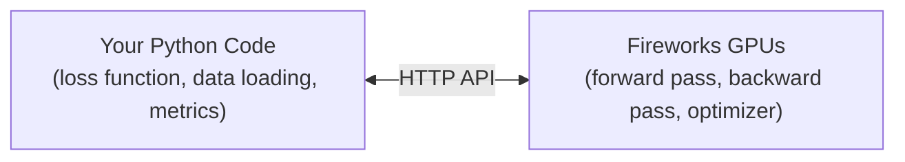
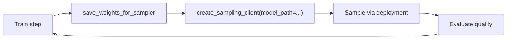

Fireworks Training API — custom training loops with full Python control over objectives, while Fireworks handles distributed GPU infrastructure.

<Info>
  The Training API is currently in **private preview**. [Request early access](https://fireworks.ai/contact-training) to get started.
</Info>

<Tip>
  **Using a code agent?** Clone [fw-ai/cookbook](https://github.com/fw-ai/cookbook). The cookbook includes the [`skills/dev/`](https://github.com/fw-ai/cookbook/tree/main/skills/dev) skill, which gives agents repo-specific guidance for setup, debugging, weight sync, RL recipe internals, and checkpoint promotion.
</Tip>

## What is the Training API?

Fireworks Training API lets you write training logic in plain Python on your local machine while model computation runs on remote GPUs managed by Fireworks.

Most users should start from [cookbook recipes](/fine-tuning/training-api/cookbook/overview), the recommended entry point for standard SFT, DPO, GRPO-style training, and async RL loops for agentic RL. Fork a recipe when you want to adapt an existing loop with your own loss, reward, rollout function, data loading, or checkpointing behavior.

Use the Direct Training SDK when you need full control over training behavior.

| Mode                    | Best for                                                                                                  | Infrastructure                                                                            |
| ----------------------- | --------------------------------------------------------------------------------------------------------- | ----------------------------------------------------------------------------------------- |
| **Cookbook recipes**    | Recommended entry point for adapting existing SFT/DPO/GRPO-style loops, including async RL for agentic RL | You configure and implement simple loss, reward, or rollout functions; platform runs GPUs |
| **Direct Training SDK** | Full control over training behavior                                                                       | You drive the training flow; platform runs GPUs                                           |

## Who does what

| Fireworks handles                                                        | Cookbook recipes handle                                                    | Direct Training SDK users implement                                            |
| ------------------------------------------------------------------------ | -------------------------------------------------------------------------- | ------------------------------------------------------------------------------ |
| GPU provisioning and cluster management                                  | Training loop structure for supported recipes                              | Training loop logic (`forward_backward_custom` + `optim_step`)                 |
| Service-mode trainer lifecycle (create, health-check, reconnect, delete) | Resource setup, health checks, reconnect, and cleanup                      | Managed service setup with `FiretitanServiceClient.from_firetitan_config(...)` |
| Distributed forward pass, backward pass, optimizer execution             | Common losses and reward/evaluation plumbing                               | Loss function and batch construction                                           |
| Checkpoint storage and export                                            | Checkpoint save, resume, promotion, and sampler refresh                    | Checkpoint calls (`save_weights_for_sampler`, DCP snapshots)                   |
| Inference deployments and weight sync                                    | Deployment sampling and serving-integrated evaluation for RL recipes       | Custom rollout, sampling, and evaluation logic through the managed service     |
| Preemption recovery and job resume                                       | Resume logic for supported recipe checkpoints                              | Resume policy and state restoration calls                                      |
| Distributed training (multi-node, sharding, FSDP)                        | Config surfaces for learning rate, grad accumulation, context length, W\&B | Hyperparameter schedules, data pipeline, and experiment tracking               |

## System architecture



## How service-mode training works

<Warning>
  **Most common gotchas**

  * Every API call returns a future. Always call `.result()` or failures can be missed.
  * `token_weights=0` means prompt/no-loss tokens, `token_weights=1` means response/learned tokens.
  * `forward_backward_custom` computes gradients only; you still need `optim_step` to apply updates.
</Warning>

### Minimal training step lifecycle

1. Create an SDK-managed service and connect a training client.
2. Send tokenized datums (with loss weights).
3. Run `forward_backward_custom(...).result()`.
4. Run `optim_step(...).result()`.
5. Save sampler weights and refresh the SDK-managed sampler.

### Datums

A **Datum** is the unit of training data sent to the remote GPU. It wraps tokenized input and per-token weights that your loss function needs.

Token weights tell the loss function which tokens to train on:

* **`0.0`** = prompt token (don't train on this)
* **`1.0`** = response token (train on this)

```python theme={null}
import tinker
import torch
from tinker_cookbook.supervised.common import datum_from_model_input_weights

tokens = tokenizer.encode("What is 2+2? The answer is 4.")
prompt_len = len(tokenizer.encode("What is 2+2? "))

weights = torch.zeros(len(tokens), dtype=torch.float32)
weights[prompt_len:] = 1.0  # Train on response tokens only

datum = datum_from_model_input_weights(
    tinker.ModelInput.from_ints(tokens),
    weights,
    max_length=4096,
)
```

### Logprobs and forward\_backward\_custom

When you call `forward_backward_custom`, the GPU runs a forward pass and returns **per-token log-probabilities** as PyTorch tensors with `requires_grad=True`. Your loss function computes a scalar loss, the API calls `loss.backward()`, and gradients are sent back to the GPU for the model backward pass.

```python theme={null}
def my_loss_fn(data, logprobs_list):
    loss = compute_something(logprobs_list)
    return loss, {"loss": loss.item()}

result = training_client.forward_backward_custom(datums, my_loss_fn).result()
```

After accumulating gradients, call `optim_step` to apply the optimizer update:

```python theme={null}
import tinker

training_client.optim_step(
    tinker.AdamParams(learning_rate=1e-5, beta1=0.9, beta2=0.999, eps=1e-8, weight_decay=0.01)
).result()
```

### Futures

All training client API calls return **futures**. Call `.result()` to block until completion. Without `.result()`, errors are silently swallowed.

### Checkpointing and weight sync

After training, you export checkpoints for serving:

* **Base checkpoint**: Full model weights. Use for the first checkpoint.
* **Delta checkpoint**: Only the diff from the previous base (\~10x smaller). Use for subsequent checkpoints.

**Weight sync** pushes a checkpoint onto a running inference deployment without restarting it, enabling evaluation under serving conditions during training. In normal SDK and cookbook code, this is expressed as `training_client.save_weights_for_sampler(...).result()` followed by `service.create_sampling_client(model_path=saved.path)` or `service.create_deployment_sampler(model_path=saved.path)`.

For RL rollouts that continue across weight sync, see [KV cache behavior for RL rollouts](/guides/rollout-inference#kv-cache-behavior-for-rl-rollouts) for how active request streams, session IDs, and `reset_prompt_cache` interact.



## Key APIs

| API                                                                             | Purpose                                                                                                                                       |
| ------------------------------------------------------------------------------- | --------------------------------------------------------------------------------------------------------------------------------------------- |
| [`FiretitanServiceClient`](/fine-tuning/training-api/reference/service-client)  | Recommended direct SDK entry point. Creates or reattaches trainers/deployments and returns training, reference, and sampling clients.         |
| [`FiretitanTrainingClient`](/fine-tuning/training-api/reference/service-client) | Tinker-compatible training client: `forward_backward_custom`, `optim_step`, `save_weights_for_sampler`, `save_state`, and load methods.       |
| [`DeploymentSampler`](/fine-tuning/training-api/reference/deployment-sampler)   | FireTitan-native sampler for tokenized rollout/evaluation from SDK-managed deployments.                                                       |
| [`FireworksClient`](/fine-tuning/training-api/reference/fireworks-client)       | Standalone checkpoint operations such as listing checkpoints or promoting a model without a live training instance.                           |
| [`TrainerJobManager`](/fine-tuning/training-api/reference/trainer-job-manager)  | Legacy/compatibility lifecycle manager. Documented for existing SDK users and advanced debugging; not the recommended user-facing path.       |
| [`DeploymentManager`](/fine-tuning/training-api/reference/deployment-manager)   | Legacy/compatibility deployment manager. Documented for existing SDK users and advanced debugging; normal code uses `FiretitanServiceClient`. |

## Renderers

Chat-template formatting, stop-token handling, and loss-weight masking for SFT/DPO datasets are handled by **renderers** — pluggable per-model classes that turn raw conversations into the trainer's `Datum` shape. Most users never touch a renderer directly; cookbook recipes pick the right one for the `base_model` you set. If you need to author a new one or debug parity against HuggingFace, the implementation depth lives in the cookbook's [`skills/renderer/`](https://github.com/fw-ai/cookbook/tree/main/skills/renderer) skill.

## Comparing Training API pricing vs DIY bare metal

When comparing a managed training platform with a self-managed bare-metal stack,
optimize for **cost per successful iteration**, not just headline `$ / GPU-hour`.

### What to compare

* **Time to first deployed model**: include environment setup, training orchestration, checkpoint handoff, and serving integration.
* **Iteration cycle time** (`train -> eval -> deploy -> repeat`): include all retrain/redeploy plumbing, not just GPU runtime.
* **Infra engineering overhead**: include one-time setup and recurring maintenance for containers, runtimes, deployment workflows, and compatibility fixes.
* **Effective `$ / GPU-hour` at real utilization**: include idle capacity, reservation constraints, and burst/overflow behavior.
* **Train/serve parity risk**: account for potential quality drift when training and inference runtimes diverge.
* **Parallel experiment capacity**: compare fixed-reservation throughput against elastic capacity for sweeps and multi-seed runs.

### Useful formulas

```text theme={null}
iterations_per_month = available_working_days / cycle_time_days
effective_cost_per_gpu_hour = total_monthly_spend / gpu_hours_consumed
multi_turn_success ~= (single_turn_success)^turn_count
```

### Keep assumptions explicit

Document assumptions so readers can adjust them for their own workload:

* team size and fully-loaded engineering cost
* average cycle duration in each setup
* expected utilization and burst profile
* average turn count for production agent workflows
* required concurrent experiment count

## FAQ

### Why is my training run "doing nothing" even though code executed?

Usually because `.result()` was not called on futures, so failures were never surfaced.

### What's the difference between base and delta checkpoints, and when should I use each?

Use a base checkpoint for your first checkpoint. Use delta checkpoints for subsequent checkpoints to speed up sync and reduce storage.

### Do I need to manage distributed training infra?

No. You implement training logic while Fireworks manages GPU provisioning and distributed infrastructure.

### Should I start with Cookbook or Direct SDK?

Start with Cookbook for most SFT/DPO/GRPO adaptations. Use the Direct SDK when you need custom loop semantics and full control.

### Can I evaluate serving behavior during training?

Yes. Save a checkpoint, sync it onto a running deployment, and evaluate under serving conditions.

### How should I compare Training API pricing vs a DIY bare-metal setup?

Use the framework in [Comparing Training API pricing vs DIY bare metal](#comparing-training-api-pricing-vs-diy-bare-metal). Focus on total iteration economics (cycle time, engineering overhead, utilization-adjusted cost, and quality-parity risk), then plug in your own assumptions.

### How can I compare rollout cost vs other providers?

See the [Price comparison vs Tinker](/fine-tuning/multi-turn-cost-comparison) calculator to estimate scenario-based costs on Fireworks Dedicated against Tinker's per-token pricing.

## Next steps

* [Quickstart](/fine-tuning/training-api/quickstart) — get a custom training loop running in minutes
* [Training and Sampling](/fine-tuning/training-api/training-and-sampling) — end-to-end API walkthrough
* [Loss Functions](/fine-tuning/training-api/loss-functions) — built-in and custom loss functions
* [Vision Inputs](/fine-tuning/training-api/vision-inputs) — fine-tune vision-language models with image and text data
* [The Cookbook](/fine-tuning/training-api/cookbook/overview) — ready-to-run recipes for SFT, DPO, ORPO, GRPO/IGPO, and async RL (experimental)
