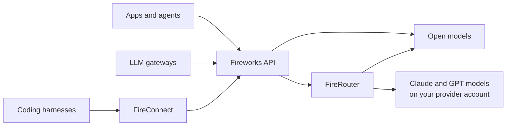

Fireworks Nexus brings frontier open models and model routers to coding harnesses, agents, and gateways, with Fireworks usage visibility and per-user spend caps for supported serverless models.

New to Nexus? Start with the [Quickstart](/nexus/quickstart). For the product overview, see the [Nexus product page](https://fireworks.ai/nexus).

<Columns>
  <Card title="Quickstart" icon="rocket" href="/nexus/quickstart">
    Connect your first harness, app, or gateway.
  </Card>

  <Card title="FireConnect" icon="bolt" href="/nexus/fireconnect">
    One command to route a coding harness through Fireworks.
  </Card>

  <Card title="FireRouter" icon="shuffle" href="/nexus/firerouter">
    One model ID that picks a model for each turn.
  </Card>
</Columns>

## How Nexus fits together

Connection and model choice are independent. Bring a coding tool, application, or LLM gateway. Then call a Fireworks model directly, or let FireRouter choose one for each new user turn.

<Steps>
  <Step title="Connect" icon="plug">
    [FireConnect](/nexus/fireconnect) for coding harnesses, [APIs and SDKs](/nexus/apis-and-sdks) for your own code, or [LLM Gateways](/nexus/llm-gateways) for LiteLLM, Portkey, and others. Prefer not to install FireConnect? Every harness has [manual setup](/nexus/harnesses).
  </Step>

  <Step title="Choose models" icon="sparkles">
    Select [Open Models](/nexus/open-models) directly, or let [FireRouter](/nexus/firerouter) pick one for each user turn.
  </Step>

  <Step title="Add closed models" icon="key">
    FireRouter calls Claude and GPT models on your own Anthropic, OpenAI, or Amazon Bedrock account. Connect [Provider Keys](/nexus/provider-keys) once where available, or send the key with each request.
  </Step>

  <Step title="Operate" icon="chart-line">
    [Usage and Cost](/nexus/metrics) shows Claude Code session estimates and dashboard usage for Fireworks models. [Spend Limits](/nexus/usage-limits) caps supported Fireworks serverless usage.
  </Step>
</Steps>
