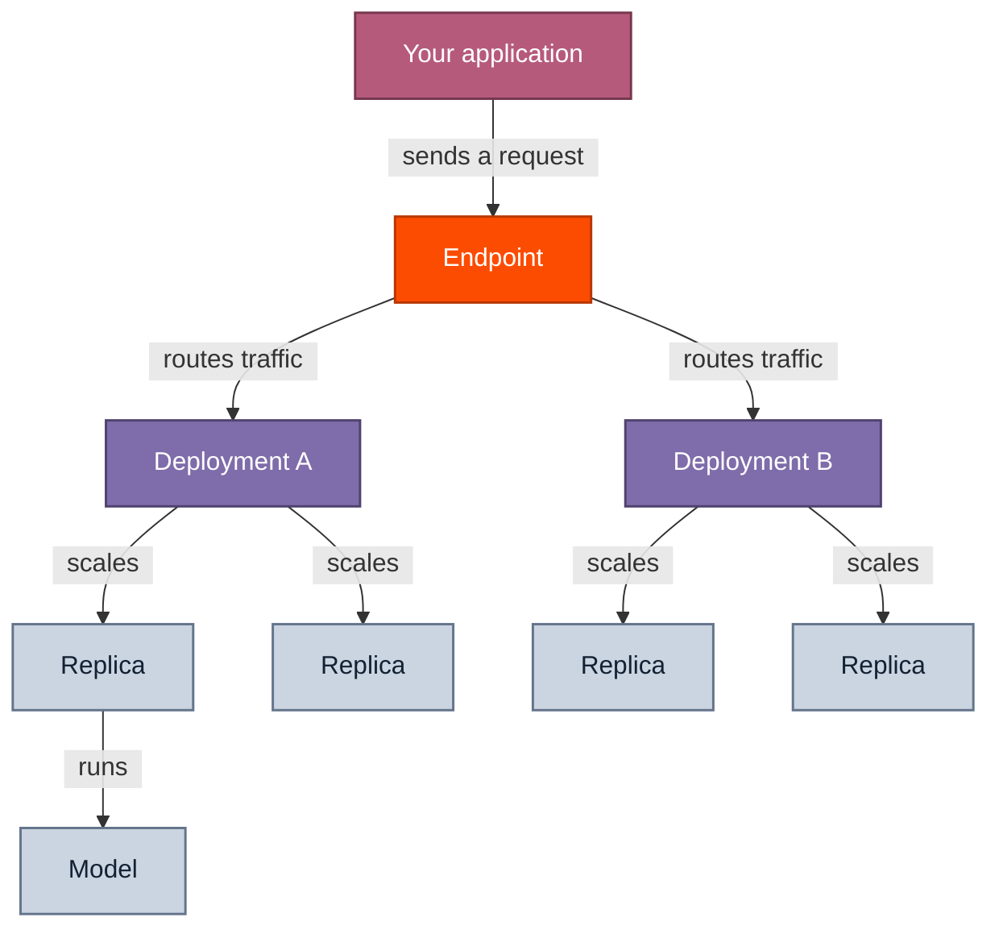

Understand the resource model and development workflow for dedicated model inference.

Dedicated model inference (DMI) is built from a handful of resources: projects, models, configs, endpoints, deployments, and replicas. This page explains what each one is, how a request flows through them, and the workflow for deploying a model.

## Resource model

There are six components involved in configuring dedicated model inference. At request time, the resources line up like this:

### Project

Your organizational boundary. Every API key is scoped to a [project](/docs/projects), and every resource you create lives inside it.

### Model

A concrete set of model weights (`ml_...`). A base model architecture can have several weights, one per quantization (for example, BF16 or FP8), and each is its own model resource. Together's [supported models](/docs/dedicated-endpoints/models) are visible from every project. When you [fine-tune a model](/docs/fine-tuning/overview) or [upload a fine-tuned model](/docs/dedicated-endpoints/custom-models), they are associated with your project.

### Config

A config describes how a particular model weight runs: the inference engine, the parallelism and hardware (GPU type and count), and the optimization profile. It's tied to a specific weight, not to the architecture as a whole, so one weight can have more than one config. Together publishes certified configs, and you reference one by its config revision ID (`cr_...`).

A config does not live inside your project. It's often part of a Together platform project rather than yours, so a config's resource path can name a different project than your deployment. List the configs for a weight with `tg beta models configs <model_id>`.

### Deployment profile

Each supported model on DMI is really a **model architecture** (for example, Llama 3.3 70B Instruct), served through a short hierarchy:

* **Architecture:** The top-level entry in the [supported-models catalog](/docs/dedicated-endpoints/models). It's the model family you pick.
* **Weight:** A concrete build of that architecture at one quantization (for example, BF16 or FP8). An architecture can have several weights, one per quantization.
* **Config:** For a given weight, how it runs (parallelism, GPU type and count, optimization). A weight can have more than one config.

A **deployment profile** is a published, certified combination that pins one weight to one config, so it fixes the quantization, parallelism, and hardware. It's the unit you select when you deploy from the catalog.

Where a config is the low-level serving spec for one weight, a profile is the catalog-level pairing of a weight with a config. Each profile in the [supported-models catalog](/docs/dedicated-endpoints/models) surfaces its `quantization`, `parallelism`, `gpuType`, and `gpuCount`, along with the `config` (`cr_...`), `model` weight, and `modelName` (the model name you pass at deploy time). When an architecture has more than one profile, you pick one at deploy time by its `modelName` or by passing its config ID to `--config`. With a single profile, the CLI selects it automatically.

### Endpoint

A logical grouping of deployments, and a stable inference URL for your application to call. Endpoints always live in your project, regardless of where the model or config came from.

The endpoint string is what you pass as the `model` parameter when you call the [inference API](/docs/inference/overview#shared-inference-api).

### Deployment

A deployment is what actually runs replicas and serves traffic. It binds a single model and a config to an endpoint with an autoscaling policy.

One endpoint can host more than one deployment at the same time, and you split incoming traffic across them with [weights or A/B tests](#routing-traffic).

### Replica

A replica is an instance of a model running on its own dedicated hardware. A replica handles requests in parallel with the other replicas in the same deployment. You can [configure autoscaling](/docs/dedicated-endpoints/scaling) to run more replicas on a deployment based on demand.

### Instance type

An instance type is a deployable unit of GPU hardware, identified by a name like `1xnvidia-h100-80gb`. Each instance type has a per-hour price (see [Pricing](/docs/dedicated-endpoints/pricing)) and a per-region capacity, and it is what you pay for while a replica runs. A deployment profile's hardware maps to an instance type.

Region availability is reported as `headroom`: for each region, the API returns how many more replicas of an instance type currently fit. A headroom value of N with the `RELATION_GTE` relation means at least N units are free in that region, and the true number may be higher. Use it to pick a region with capacity before you deploy. See [Get the instance type for a config](/docs/dedicated-endpoints/configs#instance-types-and-capacity).

## Routing traffic

After you create a deployment, you must [route traffic to it](/docs/dedicated-endpoints/route-traffic) before it can receive requests. The simplest routing method is to [assign weights](/docs/dedicated-endpoints/split-traffic) to each deployment. Each deployment's share of traffic is proportional to its capacity (its weight times its number of ready replicas), so traffic follows both the weights you assign and how each deployment is scaled.

For more complex traffic routing patterns, you can:

* [Run an A/B test](/docs/dedicated-endpoints/ab-tests): Set up a managed control/variant split with multiple candidates to compare deployments on live traffic.
* [Run a shadow experiment](/docs/dedicated-endpoints/shadow-experiments): Copy a fraction of live traffic to a new deployment, comparing how responses differ while leaving the original deployment unaffected.

No matter how you route traffic, your application always calls the same endpoint string. The endpoint routes each request to a deployment according to how you've configured the traffic split, and each deployment spreads its share of requests across its replicas. See [Route traffic](/docs/dedicated-endpoints/route-traffic#how-routing-works) for how the endpoint resolves each request through its routing stages and keeps routing sticky.

## Autoscaling

Each deployment scales its replica count independently of other deployments, between a floor (`minReplicas`) and a ceiling (`maxReplicas`) that you set. The floor is how many replicas stay running at all times; the ceiling caps how far the deployment can scale up under load. See [replica bounds](/docs/dedicated-endpoints/scaling#replica-bounds) for how to set them. Running more replicas raises the requests-per-second a deployment can serve, lowering latency under high traffic and adding resiliency (if one replica fails, the others keep serving).

The platform continuously adjusts the replica count to match load. It compares a [scaling metric](/docs/dedicated-endpoints/scaling#scaling-metrics) you choose against your target and computes how many replicas that implies. Timing windows let it scale up quickly and down slowly, and the result is clamped to your [replica bounds](/docs/dedicated-endpoints/scaling#replica-bounds). Each new observation feeds the next adjustment.

<Frame>
  
</Frame>

Scaling down slowly is deliberate. On bursty traffic, tearing replicas down the moment load dips means the next burst pays for a fresh [cold start](#cold-starts); holding them a little longer lets the deployment ride through the troughs.

<Frame>
  
</Frame>

## Cold starts

A cold start is the delay before a newly started replica can serve its first request, while it loads the model weights, initializes the inference engine, and warms its cache. It scales with model size, so larger models take longer. A cold start happens whenever a stopped or scaled-to-zero deployment restarts, autoscaling adds a replica, or an unhealthy replica is replaced.

To keep cold starts off latency-sensitive traffic, hold `minReplicas` at `1` or higher so at least one replica stays warm, and raise it ahead of a known spike (then lower it afterward). Stopping an idle deployment minimizes cost, but the first request afterward pays for a cold start. See [replica bounds](/docs/dedicated-endpoints/scaling#replica-bounds) for how to set these.

## Resource IDs

Each resource has an ID and, in some cases, a human-readable name. You pass IDs to the management API, and the endpoint string (in the format `<project_slug>/<endpoint_name>`) as the `model` parameter when you call the [inference API](/docs/inference/overview#shared-inference-api).

| Resource   | ID format  | Notes                                                                                                                                                                             |
| ---------- | ---------- | --------------------------------------------------------------------------------------------------------------------------------------------------------------------------------- |
| Project    | `proj_...` | Scoped to your API key. Retrieve it from the [settings page](https://api.together.ai/settings/organization/~current/projects) or with the [`whoami` endpoint](/reference/whoami). |
| Model      | `ml_...`   | Supported models and your uploaded models both use this format.                                                                                                                   |
| Config     | `cr_...`   | A config revision for a model. Configs are immutable; each revision has a new ID.                                                                                                 |
| Endpoint   | `ep_...`   | The endpoint string used for inference requests is `<project_slug>/<endpoint_name>`.                                                                                              |
| Deployment | `dep_...`  | The deployment name used for management API requests is `<project_slug>/<endpoint_name>/<deployment_name>`.                                                                       |

The server prepends your project slug to names you choose. If you create an endpoint named `my-endpoint` in a project with slug `acme`, its endpoint string is `acme/my-endpoint`. That endpoint string is the value you send as `model` on inference requests.

## Typical workflow

1. [Select a model](/docs/dedicated-endpoints/models), and optionally [select a config](/docs/dedicated-endpoints/configs) for it.
2. Deploy it with `tg beta endpoints deploy`, which creates the endpoint, attaches a deployment, and routes traffic in one step.
3. [Send inference requests](/docs/dedicated-endpoints/quickstart#step-2-send-a-request), passing the endpoint string as the `model` parameter.

To run the endpoint, deployment, and traffic-routing steps individually (from the CLI or the SDKs), see [Manage deployments](/docs/dedicated-endpoints/manage).

[Follow the quickstart](/docs/dedicated-endpoints/quickstart) to walk through these steps end-to-end.

## Next steps

<CardGroup>
  <Card title="Quickstart" icon="rocket" href="/docs/dedicated-endpoints/quickstart">
    Deploy your first endpoint and send a request.
  </Card>

  <Card title="Choose a deployment profile" icon="adjustments-horizontal" href="/docs/dedicated-endpoints/configs">
    Find and select a published config for a model.
  </Card>

  <Card title="Create a deployment" icon="layers-intersect" href="/docs/dedicated-endpoints/manage#create-a-deployment">
    Bind a model and config to an endpoint and split traffic.
  </Card>

  <Card title="Configure autoscaling" icon="arrows-maximize" href="/docs/dedicated-endpoints/scaling">
    Autoscale a deployment between replica bounds.
  </Card>
</CardGroup>
