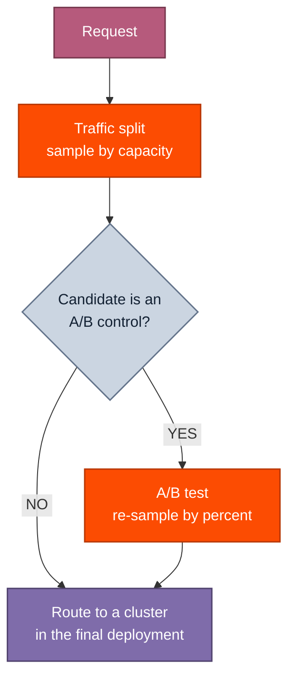

Learn how to route traffic to a deployment, and explore advanced strategies to change how traffic moves over time.

After you create a deployment, you still need to route traffic to it before it can receive requests (even if it's marked `READY`).

## Basic routing

The simplest routing method is to assign each deployment a weight in the endpoint's traffic split. Each deployment's share of traffic is proportional to its capacity (its weight times its number of ready replicas), so traffic follows both the weights you assign and how each deployment is scaled.

When the CLI's `deploy` creates a deployment, it routes 100% of traffic to it automatically. To change an existing split, set a deployment's weight with `endpoints update --traffic-weight`. Pass the deployment ID (`dep_...`), and the CLI resolves its parent endpoint and preserves the weights of the other deployments. For a single deployment, any non-zero weight routes all traffic to it:

```bash Shell theme={null}
tg beta endpoints update dep_abc123 --traffic-weight 1
```

Each weight must be non-negative and finite.

## Remove a deployment from the traffic split

To stop routing traffic to a deployment without rebalancing the rest of the split, set its weight to `0`. A zero weight unsets the deployment and removes it from the split entirely, while preserving the weights of the other deployments. The deployment keeps running, so you can scale it or bring it back into rotation later by setting a non-zero weight again.

<Tabs>
  <Tab title="CLI">
    For example, to remove `dep_def456` while leaving the other deployments untouched:

    ```bash Shell theme={null}
    tg beta endpoints update dep_def456 --traffic-weight 0
    ```
  </Tab>

  <Tab title="Console">
    Open the deployment, select **Edit** on the **Deployment configuration** card, set **Traffic weight** to `0`, and select **Save changes**.
  </Tab>
</Tabs>

## Routing strategies

To run several deployments behind one endpoint, or to change how traffic moves between them over time, use one of these strategies:

<CardGroup>
  <Card title="Split traffic" icon="arrows-split" href="/docs/dedicated-endpoints/split-traffic">
    Run multiple deployments on one endpoint and divide requests between them by weight.
  </Card>

  <Card title="A/B tests" icon="test-pipe" href="/docs/dedicated-endpoints/ab-tests">
    Hold a fixed control/variant split and compare candidates on live traffic.
  </Card>

  <Card title="Shadow experiments" icon="copy" href="/docs/dedicated-endpoints/shadow-experiments">
    Mirror a sampled fraction of traffic to a target without affecting responses.
  </Card>
</CardGroup>

## How routing works

The endpoint directs each request to a single deployment through a series of sampling decisions:

1. **Traffic split.** Among the deployments in the endpoint's traffic split, the endpoint samples a candidate in proportion to its capacity (weight times ready replicas).
2. **A/B test.** If the candidate is the control of an [A/B test](/docs/dedicated-endpoints/ab-tests), the endpoint re-samples from among the control and its variants by the percentages you set for the test.
3. **Route.** The endpoint sends the request to a cluster within the final deployment.



[Shadow experiments](/docs/dedicated-endpoints/shadow-experiments) sit outside this path, copying a sampled fraction of traffic to a target for observation without changing which deployment serves the response.

## Stickiness

Routing is deterministic per request, not randomly drawn each time. The endpoint derives a **sampling key** from each request and always routes requests with the same key to the same deployment. Across many distinct keys, traffic still splits according to each deployment's capacity, but any single key stays pinned to one deployment while the traffic split is stable.

**This is how the endpoint keeps prompt caches warm**. When the follow-up requests in a conversation land on the same replica that served the earlier ones, the cached prompt prefix is reused, lowering latency and cost. Purely random routing would scatter those requests across deployments, discarding the cache.

The endpoint picks the sampling key from the request in this order:

1. The request's `prompt_cache_key` field, if set.
2. Otherwise, the `user` field, if set.
3. Otherwise, a key derived from the request content.

To control stickiness yourself, set `prompt_cache_key` on requests that share a prompt prefix (for example, every turn of one conversation) so they route together.

<Note>
  Stickiness is maintained as long as the traffic split is stable. When the routing changes (you edit weights or add/remove a deployment), some keys are reassigned to a different deployment.
</Note>
