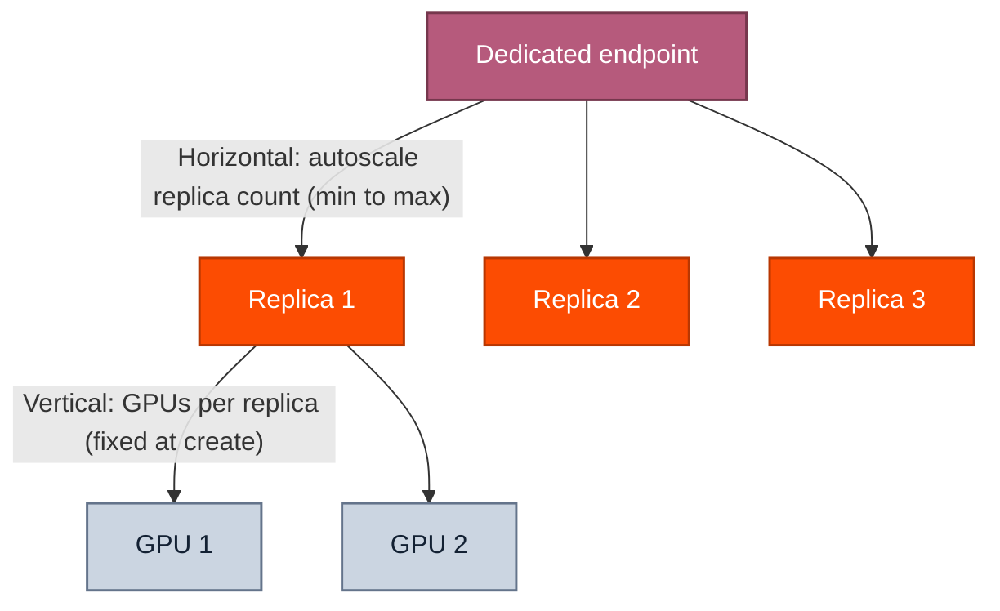

How dedicated endpoints scale, how that affects cost, and when to choose vertical vs. horizontal scaling.

Dedicated endpoints have two scaling axes: how many GPUs go into each replica (vertical) and how many replicas to run (horizontal). Both change throughput, but they're optimized for different workload shapes.

Only horizontal scaling is dynamic. You configure a minimum and maximum replica count when you create the endpoint, and the platform autoscales between those bounds based on demand. Vertical scaling is set at create time by picking a multi-GPU [hardware SKU](/docs/dedicated-endpoints/settings#hardware-and-gpu-count); changing it later requires redeploying the endpoint.



## Vertical vs. horizontal

### When to add GPUs per replica (vertical)

More GPUs per replica increase generation speed, lower time to first token, and raise the maximum requests per second a single replica can handle. Reach for vertical scaling when:

* **Compute-bound:** Your workload is bottlenecked by GPU compute. Adding GPUs to one replica directly speeds up each request.
* **Memory-intensive:** The model or context window is large enough that one GPU can't hold it. Adding GPUs to a replica gives you the memory headroom.
* **Single-node parallelism works:** Your workload benefits from data parallelism or model parallelism within a single node.
* **Low-latency requirements:** Each request needs to complete quickly. Multiple GPUs in one replica process the request faster than one GPU could.

**How to set it:** Pass a multi-GPU hardware SKU on `endpoints create`. List options for your model with `together endpoints hardware --model <model_id>`, then create the endpoint with the SKU you want:

```shell Shell theme={null}
together endpoints create \
  --model Qwen/Qwen3.5-9B-FP8 \
  --hardware 2x_nvidia_h100_80gb_sxm \
  --display-name "My endpoint" \
  --wait
```

Hardware can't be changed on a running endpoint; redeploy if you need a different SKU. See [Hardware and GPU count](/docs/dedicated-endpoints/settings#hardware-and-gpu-count).

### When to add replicas (horizontal)

More replicas raise the maximum requests per second the endpoint can serve in aggregate. Reach for horizontal scaling when:

* **Concurrent requests:** Your application receives a high volume of simultaneous requests. Replicas spread that load.
* **I/O-bound workloads:** Requests spend significant time waiting on data load or write. Replicas let you do more of that waiting in parallel.
* **Fault tolerance:** A second replica means a single hardware failure doesn't take your endpoint offline.
* **Multi-node parallelism works:** Your workload scales well across nodes (data parallelism, distributed inference).

**How to set it:** Set `--min-replicas` and `--max-replicas` at create time, or update them later on a running endpoint:

```shell Shell theme={null}
# At create time
together endpoints create \
  --model Qwen/Qwen3.5-9B-FP8 \
  --hardware 1x_nvidia_h100_80gb_sxm \
  --min-replicas 1 \
  --max-replicas 4 \
  --wait

# On an existing endpoint
together endpoints update --min-replicas 2 --max-replicas 4 <endpoint_id>
```

See [Replica count](/docs/dedicated-endpoints/settings#replica-count).

## How autoscaling affects cost

Billing is proportional to the number of active replicas. Scaling from 1 to 2 replicas doubles your GPU cost while those replicas are running. Set the minimum replica count to the lowest value that meets your steady-state latency target, and the maximum to a ceiling that protects you from runaway spend.

## Will my endpoint always reach the max replica count?

Not always. The platform scales to the largest replica count that hardware availability allows at the time. If capacity is constrained, you may scale to fewer replicas than the configured maximum. This is rare for common GPU types but worth knowing if you set a high ceiling and depend on hitting it during a traffic spike.
