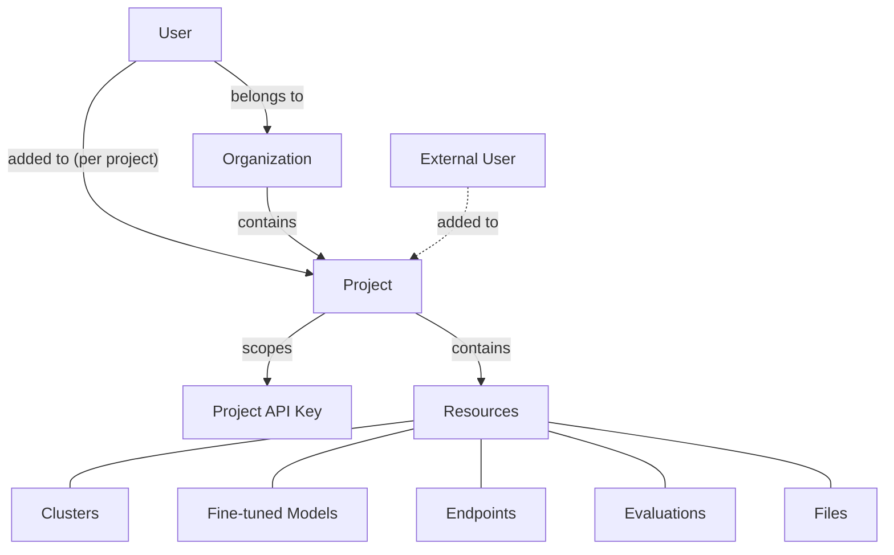

How users, credentials, and resources are organized across the Together platform

Together's Identity and Access Management (IAM) model controls how your team collaborates on the platform, and how your workloads are authenticated. It determines who can access what, how credentials are scoped, and how resources are organized.

## Core Concepts

Together's IAM is built around five concepts that work together:

| Concept                                                         | What it is                                                                                                     |
| --------------------------------------------------------------- | -------------------------------------------------------------------------------------------------------------- |
| [Organization](/docs/organizations)                             | Your company's account on Together. One org = one bill.                                                        |
| [Project](/docs/projects)                                       | An isolated workspace within your Organization. Resources, Collaborators, and API keys are scoped to Projects. |
| [Resource](#resources)                                          | Anything you create: fine-tuned models, dedicated endpoints, clusters, evaluations, files.                     |
| [Member](#organization-members-and-project-collaborators)       | A user with access to your organization.                                                                       |
| [Collaborator](#organization-members-and-project-collaborators) | A user with access to a specific Project (Organization Member or external user).                               |
| [API key](/docs/api-keys-authentication)                        | A Project-scoped credential for authenticating API requests.                                                   |

## How It All Fits Together

**The key principle:** Projects are the collaboration boundary. Collaborators get access to a Project, and that gives them access to everything inside it (Clusters, Models, Endpoints, etc.). Access decisions happen at the Project level, not on individual resources.

## Resources

A resource is anything you create or provision on Together:

* **GPU Clusters**: Clusters for training and inference
* **Fine-tuned Models**: Models you've customized with your data
* **Dedicated model inference**: Always-on inference endpoints
* **Evaluations**: Model evaluation runs
* **Files**: Training data, datasets, and other uploads

Resources belong to a Project. Everyone with access to that Project can see and use those resources, subject to their [role permissions](/docs/roles-permissions).

## Organization Members and Project Collaborators

Together uses different terminology at each level:

* **Organization Members** are users who belong to your Organization. They are [invited via email](https://api.together.ai/settings/organization/~current/members) or provisioned through SSO. Each Member is assigned an Admin or Developer role at the Organization level.
* **Project Collaborators** are users who have been granted access to [a specific Project](https://api.together.ai/settings/projects/~current/collaborators). Collaborators can be Organization Members or [External Collaborators](/docs/roles-permissions#external-collaborators) who participate in a Project without belonging to the parent Organization.

Each Collaborator is assigned an Admin or Editor role at the Project level. For a detailed breakdown of what each role can do, see [Roles & Permissions](/docs/roles-permissions).

## Product-Specific Access Guides

Together's IAM model applies consistently across all products. These guides cover product-specific workflows:

<CardGroup>
  <Card title="GPU Clusters" icon="server" href="/docs/gpu-clusters-management#managing-cluster-access">
    Add and remove Collaborators from GPU Cluster Projects, understand in-cluster Kubernetes permissions
  </Card>
</CardGroup>

<Note>
  Projects and Project-level membership management are in early access. [Contact support](https://portal.usepylon.com/together-ai/forms/support-request) to enable multi-Project support for your Organization.
</Note>

## Next Steps

<CardGroup>
  <Card title="Organizations" icon="building" href="/docs/organizations">
    Set up your Organization and manage membership
  </Card>

  <Card title="Projects" icon="folder" href="/docs/projects">
    Create workspaces and scope resources
  </Card>

  <Card title="Roles & Permissions" icon="shield" href="/docs/roles-permissions">
    Understand role-based capabilities (RBAC)
  </Card>

  <Card title="API Keys" icon="key" href="/docs/api-keys-authentication">
    Create and manage Project-scoped credentials
  </Card>

  <Card title="Single Sign-On" icon="lock" href="/docs/sso">
    Connect your Identity Provider
  </Card>
</CardGroup>
