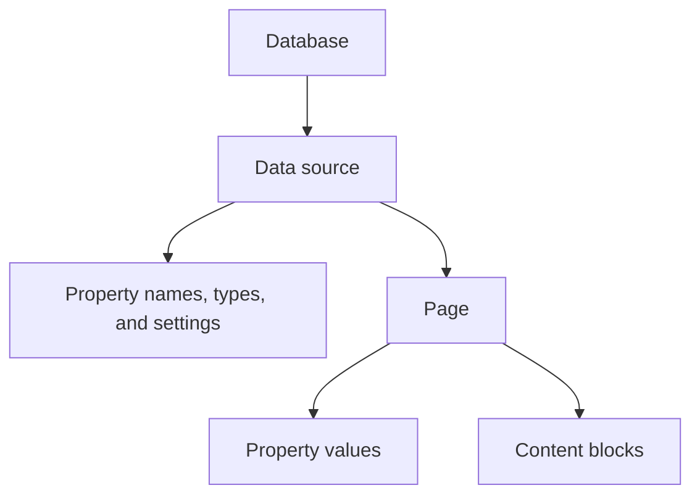

Understand how databases, data sources, and page properties fit together in the API.

## Overview

A Notion database organizes pages. A **data source** defines the properties those pages share. The API treats the database, its data sources, and their pages as separate objects.

This page explains that structure. For steps, see [Create a page in a data source](/guides/data-apis/create-pages-in-a-data-source), [Read page properties](/guides/data-apis/read-page-property-values), or [Update data source properties](/reference/update-data-source-properties).

## Structure

A [database](/reference/database) contains data sources and views. Its `data_sources` array lists each source’s ID and name. A [data source](/reference/data-source) holds the schema and is the parent of its pages. A schema defines property names, types, and settings.

In a table view, a property appears as a column and a page appears as a row. The page’s property values fill the cells. Its [content blocks](/reference/block) form the body of the page.



These JSON excerpts show the fields that connect the objects. Other response fields are omitted.

<CodeGroup>
  ```json Database excerpt theme={null}
  {
    "object": "database",
    "id": "248104cd-477e-80fd-b757-e945d38000bd",
    "data_sources": [
      {
        "id": "248104cd-477e-80af-bc30-000bd28de8f9",
        "name": "Grocery list"
      }
    ]
  }
  ```

  ```json Data source excerpt theme={null}
  {
    "object": "data_source",
    "id": "248104cd-477e-80af-bc30-000bd28de8f9",
    "parent": {
      "type": "database_id",
      "database_id": "248104cd-477e-80fd-b757-e945d38000bd"
    },
    "properties": {
      "Grocery item": {
        "id": "title",
        "name": "Grocery item",
        "description": null,
        "type": "title",
        "title": {}
      },
      "Price": {
        "id": "prce",
        "name": "Price",
        "description": null,
        "type": "number",
        "number": { "format": "dollar" }
      }
    }
  }
  ```

  ```json Page excerpt theme={null}
  {
    "object": "page",
    "id": "dd456007-6c66-4bba-957e-ea501dcda3a6",
    "parent": {
      "type": "data_source_id",
      "data_source_id": "248104cd-477e-80af-bc30-000bd28de8f9",
      "database_id": "248104cd-477e-80fd-b757-e945d38000bd"
    },
    "properties": {
      "Price": {
        "id": "prce",
        "type": "number",
        "number": 1.49
      }
    }
  }
  ```
</CodeGroup>

### Database properties

A property’s schema and its value answer different questions. The schema describes what a property accepts. The value describes what one page contains. A number format such as `dollar` belongs to the schema; an amount such as `1.49` belongs to the page.

Every data source has exactly one Name property, with API type `title`. Its display name can change. For example, a grocery list can call it “Grocery item.” Other properties may hold numbers, dates, people, files, or calculated values.

The tabs compare the same property across API objects. Schema and Page value examples each show one entry in a response’s `properties` object. Page write shows an Update page request body; Create page also needs a parent. Read-only types have no Page write tab.

For `title`, `rich_text`, `people`, and `relation`, the Property item tab shows one entry in a paginated `results` array. For other types, it shows the endpoint response. Replace example names and IDs with values from your workspace.

<Tabs>
  <Tab title="Schema">
    ```json Schema theme={null}
    {
      "Estimate": {
        "id": "estM",
        "name": "Estimate",
        "description": null,
        "type": "number",
        "number": {
          "format": "number"
        }
      }
    }
    ```
  </Tab>

  <Tab title="Page value">
    ```json Page value theme={null}
    {
      "Estimate": {
        "id": "estM",
        "type": "number",
        "number": 8
      }
    }
    ```
  </Tab>

  <Tab title="Page write">
    ```json Page write theme={null}
    {
      "properties": {
        "Estimate": {
          "number": 8
        }
      }
    }
    ```
  </Tab>

  <Tab title="Property item">
    ```json Property item theme={null}
    {
      "object": "property_item",
      "id": "estM",
      "type": "number",
      "number": 8
    }
    ```
  </Tab>
</Tabs>

The [property schema reference](/reference/property-object) defines each type’s settings. The [page value reference](/reference/page-property-values) defines its values and write rules. The [property-item reference](/reference/property-item-object) defines responses when reading one property, including paginated values.

### Iterate over a database object

Current API versions return schemas from [Retrieve a data source](/reference/retrieve-a-data-source). A database response lists data sources; it does not contain a `properties` schema. Code that reads `database.properties` uses the model from before API version `2025-09-03`.

For a current example that reads the schema and checks property types, see [Check the schema](/guides/data-apis/create-pages-in-a-data-source#check-the-schema). For older connections, see [Upgrade to 2025-09-03](/guides/get-started/upgrade-guide-2025-09-03).

## Adding pages to a data source

A new page uses `parent.data_source_id` to identify its data source. Its `properties` keys refer to names or IDs in that source’s schema. This is why a connection needs the data source ID, even when the user selects a database in Notion.

[Create a page in a data source](/guides/data-apis/create-pages-in-a-data-source) shows a complete request. A page can also use a [database template](/guides/data-apis/creating-pages-from-templates). Pages whose parent is another page have only a Name property.

## Finding pages in a data source

[Query a data source](/reference/query-a-data-source) returns pages from a regular data source. A wiki query can also return child data sources. With `result_type: "page"`, a query returns only pages; otherwise, check each result’s `object` field before reading page fields.

[Retrieve a page](/reference/retrieve-a-page) reads a known page ID directly. Query results are paginated, so one response may contain only part of the matching set.

### Filtering data source pages

A filter selects pages by a property’s value. Its condition must match the property’s type. For a Date property named “Last ordered,” this filter matches dates in the past week:

```json Query request body theme={null}
{
  "result_type": "page",
  "filter": {
    "property": "Last ordered",
    "date": { "past_week": {} }
  }
}
```

[Compound filters](/reference/filter-data-source-entries#compound-filter-conditions) combine conditions with `and` or `or`. A query without a filter returns non-archived pages by default. The [filter reference](/reference/filter-data-source-entries) lists the conditions for each property type.

### Sorting data source pages

Sorts order matching pages by a property value or a page timestamp. The request field is `sorts`, an array. For example, this request puts the most recently created pages first:

```json Query request body theme={null}
{
  "result_type": "page",
  "sorts": [
    { "timestamp": "created_time", "direction": "descending" }
  ]
}
```

The page’s `created_time` timestamp exists even when the schema has no Created time property. The [sort reference](/reference/sort-data-source-entries) covers both choices. For a complete query that handles large result sets, see [Query large data sources](/guides/data-apis/query-large-data-sources).

### Additional types of databases

#### Linked databases

A [linked database](https://www.notion.com/help/guides/using-linked-databases) displays an existing data source in another place. It does not create a separate set of pages or property values. API access requires sharing the original database with the connection. Sharing only the page that contains a linked view is not enough.

#### Wiki databases

A [wiki](https://www.notion.com/help/wikis-and-verified-pages) organizes knowledge and supports page verification. Wikis are created in Notion and cannot contain multiple data sources.

The API supports reading and writing the [Verification property](/reference/page-property-values#verification) on wiki pages. Verification describes whether a page’s content has been checked and can include an expiration date. It does not change the page’s other property values.

<span />

### Next steps

The API references define the exact [database fields](/reference/database), [data source fields](/reference/data-source), and [page fields](/reference/page). [Working with page content](/guides/data-apis/working-with-page-content) covers the blocks inside a page.
