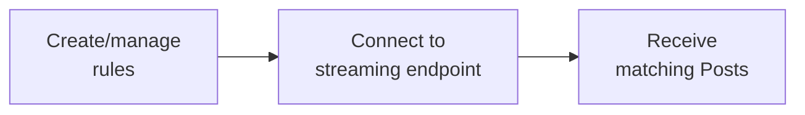

Receive near real-time Posts that match custom rules with X API v2 Filtered Stream, using powerful operators to filter the public Post firehose.

The Filtered Stream endpoints let you receive near real-time Posts that match your filter rules. Create rules using powerful operators, then connect to a persistent stream to receive matching Posts as they're published.

<Note>
  Filtered Stream prioritizes data hydration and delivery, with approximately 4-5 seconds of P99 latency. For lower latency requirements, see [Powerstream](/x-api/powerstream/introduction).
</Note>

## Overview

<CardGroup>
  <Card title="Near real-time delivery" icon="bolt">
    Receive Posts within seconds of publication
  </Card>

  <Card title="Persistent rules" icon="https://mintcdn.com/x-preview/szd6PKNMlRQoyyAo/icons/xds/icon-filter.svg?fit=max&auto=format&n=szd6PKNMlRQoyyAo&q=85&s=5d59aff402c1f2aeae0e9e44bb23400e">
    Add and remove rules without disconnecting
  </Card>

  <Card title="Powerful operators" icon="https://mintcdn.com/x-preview/cfyQtgCdwk8p69aa/icons/xds/icon-search.svg?fit=max&auto=format&n=cfyQtgCdwk8p69aa&q=85&s=8c11ad89387b7c09ced1553d5c232834">
    Match on keywords, hashtags, users, and more
  </Card>

  <Card title="Webhook delivery" icon="webhook">
    Optionally receive Posts via webhooks
  </Card>
</CardGroup>

***

## How it works

1. **Create rules** — Define filter rules using operators
2. **Connect to stream** — Establish a persistent HTTP connection
3. **Receive Posts** — Get matching Posts in near real-time



***

## Endpoints

| Method | Endpoint                                                             | Description           |
| :----- | :------------------------------------------------------------------- | :-------------------- |
| GET    | [`/2/tweets/search/stream`](/x-api/stream/stream-filtered-posts)     | Connect to the stream |
| POST   | [`/2/tweets/search/stream/rules`](/x-api/stream/update-stream-rules) | Add or delete rules   |
| GET    | [`/2/tweets/search/stream/rules`](/x-api/stream/get-stream-rules)    | List current rules    |

***

## Access levels

| Feature                      | Pay-per-use | Enterprise                  |
| :--------------------------- | :---------- | :-------------------------- |
| Rules per project            | 1,000       | 25,000+                     |
| Rule length                  | 1,024 chars | 2,048 chars                 |
| Connections                  | 1           | Multiple                    |
| Core operators               | ✓           | ✓                           |
| Semantic embedding operators | —           | ✓ (requires Embedding tier) |

<Card title="Contact for Enterprise" icon="https://mintcdn.com/x-preview/Vn2KEkZaPF9LiPi3/icons/xds/icon-bank.svg?fit=max&auto=format&n=Vn2KEkZaPF9LiPi3&q=85&s=6dd9ad48fa88936abb112b49e022abff" href="https://developer.x.com/en/products/x-api/enterprise/enterprise-api-interest-form">
  Get higher limits and additional features
</Card>

<Note>
  Some operators require specific tiers. The `embedding:` semantic operator is available **only for Filtered Stream** on Enterprise plans with Embedding tier access. Standard Pay-per-use access includes core operators only.
</Note>

***

## Building rules

Rules use the same operators as search queries:

```
(AI OR "machine learning") lang:en -is:retweet
```

### Example rules

| Rule                                | Matches                                                               |
| :---------------------------------- | :-------------------------------------------------------------------- |
| `#python`                           | Posts with #python hashtag                                            |
| `from:elonmusk`                     | Posts by @elonmusk                                                    |
| `"breaking news" has:images`        | Posts with phrase and images                                          |
| `(@XDevelopers OR @X) -is:retweet`  | Mentions, excluding retweets                                          |
| `embedding:"climate change policy"` | Posts semantically about climate policy (Enterprise + Embedding tier) |

<Card title="Build a rule" icon="https://mintcdn.com/x-preview/szd6PKNMlRQoyyAo/icons/xds/icon-filter.svg?fit=max&auto=format&n=szd6PKNMlRQoyyAo&q=85&s=5d59aff402c1f2aeae0e9e44bb23400e" href="/x-api/posts/filtered-stream/integrate/build-a-rule">
  Learn rule syntax and operators
</Card>

***

## Connecting to the stream

Establish a persistent HTTP connection to receive Posts:

```python theme={null}
import requests

def stream_posts(bearer_token):
    url = "https://api.x.com/2/tweets/search/stream"
    headers = {"Authorization": f"Bearer {bearer_token}"}
    
    response = requests.get(url, headers=headers, stream=True)
    
    for line in response.iter_lines():
        if line:
            print(line.decode("utf-8"))
```

### Keep-alive signals

The stream sends blank lines (`\r\n`) every 20 seconds to maintain the connection. If you don't receive data or a keep-alive for 20 seconds, reconnect.

<CardGroup>
  <Card title="Handling disconnections" icon="plug" href="/x-api/fundamentals/handling-disconnections">
    Reconnect gracefully
  </Card>

  <Card title="Consuming streaming data" icon="stream" href="/x-api/fundamentals/consuming-streaming-data">
    Process Posts efficiently
  </Card>
</CardGroup>

***

## Webhook delivery

Instead of maintaining a persistent connection, you can receive Posts via webhooks:

<Card title="Webhook delivery" icon="webhook" href="/x-api/webhooks/stream/introduction">
  Set up webhook delivery for filtered stream
</Card>

***

## Post edits

The stream delivers edited Posts with their edit history. Each edit creates a new Post ID:

```json theme={null}
{
  "data": {
    "id": "1234567893",
    "text": "Hello world! (edited)",
    "edit_history_tweet_ids": ["1234567890", "1234567891", "1234567893"]
  }
}
```

<Card title="Edit Posts fundamentals" icon="https://mintcdn.com/x-preview/szd6PKNMlRQoyyAo/icons/xds/icon-history.svg?fit=max&auto=format&n=szd6PKNMlRQoyyAo&q=85&s=6afe17587c08ee621e37afde19a07ff1" href="/x-api/fundamentals/edit-posts">
  Learn more about Post edits
</Card>

***

## Getting started

<Note>
  **Prerequisites**

  * An approved [developer account](https://developer.x.com/en/portal/petition/essential/basic-info)
  * A [Project and App](/resources/fundamentals/developer-apps) in the Developer Console
  * Your App's [Bearer Token](/resources/fundamentals/authentication)
</Note>

<CardGroup>
  <Card title="Quickstart" icon="https://mintcdn.com/x-preview/oR-aRNyj1BKPJtxM/icons/xds/icon-rocket.svg?fit=max&auto=format&n=oR-aRNyj1BKPJtxM&q=85&s=b978d7a9225de31709efbbed5b84e92d" href="/x-api/posts/filtered-stream/quickstart">
    Connect to the stream in minutes
  </Card>

  <Card title="Build a rule" icon="https://mintcdn.com/x-preview/szd6PKNMlRQoyyAo/icons/xds/icon-filter.svg?fit=max&auto=format&n=szd6PKNMlRQoyyAo&q=85&s=5d59aff402c1f2aeae0e9e44bb23400e" href="/x-api/posts/filtered-stream/integrate/build-a-rule">
    Learn rule syntax
  </Card>

  <Card title="Operator reference" icon="list-check" href="/x-api/posts/filtered-stream/integrate/operators">
    All available operators
  </Card>

  <Card title="Sample code" icon="github" href="https://github.com/xdevplatform/Twitter-API-v2-sample-code">
    Working code examples
  </Card>
</CardGroup>

***

## Advanced topics

<CardGroup>
  <Card title="Handling disconnections" icon="plug" href="/x-api/fundamentals/handling-disconnections">
    Reconnect gracefully
  </Card>

  <Card title="High volume capacity" icon="gauge-high" href="/x-api/fundamentals/high-volume-capacity">
    Handle high throughput
  </Card>

  <Card title="Recovery and redundancy" icon="https://mintcdn.com/x-preview/cfyQtgCdwk8p69aa/icons/xds/icon-shield-keyhole.svg?fit=max&auto=format&n=cfyQtgCdwk8p69aa&q=85&s=a0e05514090c8a6af232297bfb9c4055" href="/x-api/fundamentals/recovery-and-redundancy">
    Build resilient applications
  </Card>

  <Card title="Matching returned Posts" icon="crosshairs" href="/x-api/posts/filtered-stream/integrate/matching-returned-tweets">
    Identify which rules matched
  </Card>
</CardGroup>
