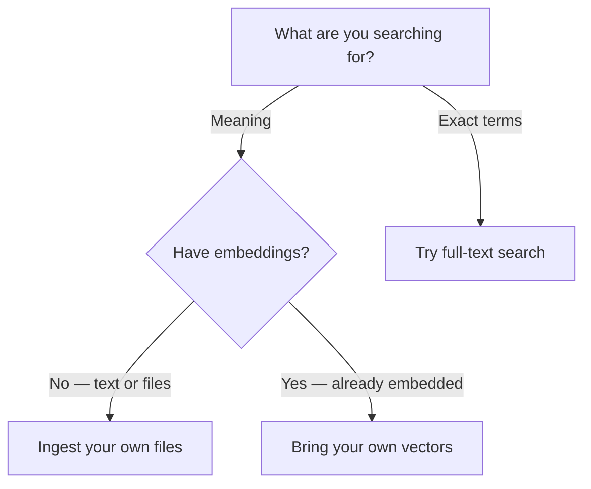

Get started with Pinecone in minutes. Pick the path that matches what you're searching for and run your first search.

Add Pinecone to your app or agent and run your first search. Choose the path that fits what you're searching for.

## Prerequisites

* A Pinecone account and API key ([get one](https://app.pinecone.io) or [view pricing](https://www.pinecone.io/pricing/)).

## Recommended: Let your agent set everything up

If you use an AI coding agent, the quickest path is to let it do the setup: it designs your schema, ingests your data, and runs your first query, all conversationally.

The steps below use Claude Code. Using Cursor, Gemini CLI, or another agent? See [all supported IDEs and CLIs](/integrations/ai-coding-tools) for the equivalent setup.

<Steps>
  <Step title="Set your API key and install the plugin">
    The plugin needs [Node.js](https://nodejs.org/) installed (and [uv](https://docs.astral.sh/uv/getting-started/installation/) for assistant commands).

    ```bash theme={null}
    export PINECONE_API_KEY="YOUR_API_KEY"
    claude plugin install pinecone
    ```

    Restart Claude Code to activate the plugin.
  </Step>

  <Step title="Run the quickstart command">
    ```text theme={null}
    /pinecone:quickstart
    ```
  </Step>
</Steps>

## Manual: Choose your path

Prefer to set it up yourself? Pick the path that matches what you're searching for. Each path page lists its own setup (Python and SDK versions).



* **Meaning** (docs, tickets, knowledge base) — rank by semantic similarity. Then pick based on your embeddings:
  * **I have text or files** → [Ingest your own files](/guides/get-started/quickstart/ingest-files). Extract text, chunk it, embed the chunks with Pinecone Inference, and index them. The page starts from sample records, so you can run it with no files of your own and swap in yours later.
  * **I already have embeddings** → [Bring your own vectors](/guides/get-started/quickstart/bring-your-own-vectors). Upsert your vectors directly and rank by similarity.
* **Exact terms** (SKUs, IDs, phrases, logs) → [Try full-text search](/guides/get-started/quickstart/full-text-search). Create an index, load documents, and run a keyword (BM25) search in about five minutes.
