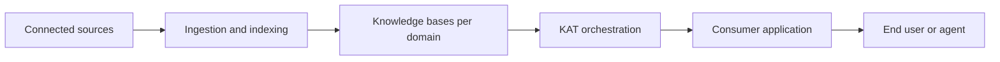

Pinecone Marketplace is a no-code platform for building, publishing, and operating grounded knowledge applications from vertical templates and connectors.

<Note>
  This feature is in [public preview](/release-notes/feature-availability).
</Note>

You start from a vertical template, connect the documents the application should use, and publish a polished consumer experience for your team or customers to ask questions and trust the answers.

<CardGroup>
  <Card title="Marketplace quickstart" icon="rocket" href="/guides/marketplace/quickstart">
    Pick a template, connect a folder of documents, and publish your first knowledge application.
  </Card>

  <Card title="Concepts" icon="book" href="/guides/marketplace/concepts">
    Learn the core concepts: deployments, templates, manifests, KAT, layouts, and components.
  </Card>
</CardGroup>

## What you can do

* Stand up a domain-specific knowledge application without writing application code.
* Ground every answer in your documents, with citations to the exact source.
* Compose multiple knowledge domains into a single application using the Knowledge Agent Toolkit (KAT).
* Publish in versioned releases with staged edits, automatic evaluation, and rollback.
* Control access with deployer authentication and per-deployment consumer authentication.
* Sync from sources you already use, starting with Google Drive.

## Who Marketplace is for

* **Operators** are the people who build, configure, and publish a knowledge application. Operators are usually technical program managers, IT leads, solutions architects, or operations managers. They prefer config-driven workflows over custom code.
* **End users** are the consumers of a published knowledge application. End users do not need a Pinecone account or knowledge of the underlying infrastructure. They sign in to the application and ask questions.

## What makes a knowledge application different

Every answer in Marketplace traces back to a source. The application knows what it knows and is built to say so when a question falls outside its scope. Operators do not have to assemble ingestion, retrieval, evaluation, authentication, or a consumer interface from scratch.

## How it works

1. **Start from a template.** Pick an app designed for a common knowledge application use case (HR Benefits, Customer Support, Sales Enablement, and others). The template ships with a tuned system prompt, recommended layout, and suggested visual components.
2. **Customize behavior.** Add your instructions, connect documents, and choose access settings for your use case.
3. **Deploy and iterate.** Publish quickly, share with your team, test usage, and improve your app over time.

Under the hood, a knowledge application is built from one or more Pinecone assistants. Marketplace orchestrates them through KAT, a routing and disambiguation layer that selects the right knowledge domain, asks for missing context when a question is ambiguous, and applies guardrails. The result is a multi-domain application that behaves like a single, coherent product.

## Learn more

<CardGroup>
  <Card title="Templates" icon="grid" href="/guides/marketplace/templates-overview">
    Browse the bundled vertical templates and their recommended sources.
  </Card>

  <Card title="KAT" icon="route" href="/guides/marketplace/kat-overview">
    Learn how multi-domain routing, disambiguation, slot filling, and guardrails work.
  </Card>

  <Card title="Pricing and limits" icon="tag" href="/guides/marketplace/pricing-and-limits">
    Understand how Marketplace usage is billed and what limits apply.
  </Card>
</CardGroup>
