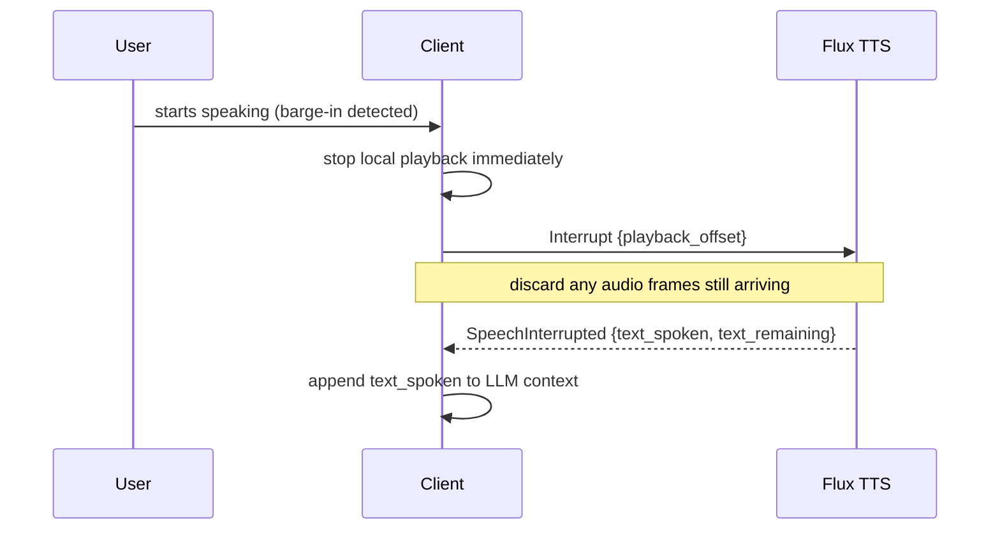

> For clean Markdown of any page, append .md to the page URL.
> For a complete documentation index, see https://developers.deepgram.com/llms.txt.
> For AI client integration (Claude Code, Cursor, etc.), connect to the MCP server at https://developers.deepgram.com/_mcp/server.

# Interruption Handling

When a user speaks over the agent (a *barge-in*), you need to do two things: stop the audio immediately, and tell your LLM what the user actually heard so the conversation stays coherent. Flux TTS handles the second part for you — `Interrupt` returns the exact text that was spoken before the cut. This page covers the full pattern.

For the message references, see [`Interrupt`](/docs/flux-tts/client-messages#interrupt) and [`SpeechInterrupted`](/docs/flux-tts/server-messages#speechinterrupted).

## The pattern



1. **Detect barge-in** — typically from your STT (e.g. Flux STT's `StartOfTurn`) or a VAD.
2. **Stop playback locally, now.** Don't wait for the server. The `Interrupt` round-trip is for *context reconciliation*, not for stopping audio.
3. **Send `Interrupt`** with how far playback got, so the server can compute what was heard precisely.
4. **Discard in-flight audio** — frames that arrive after you send `Interrupt` but before `SpeechInterrupted` were already on the wire. Drop them.
5. **Use `SpeechInterrupted`** — append `text_spoken` to your LLM context so the next turn doesn't repeat what the user already heard.

## Sending Interrupt

Include `playback_offset` whenever you can — it's how the server aligns `text_spoken` to the audio the user actually heard. Without it, the server can't compute the split: `SpeechInterrupted` omits `text_spoken` and `text_remaining`, and `audio_played_ms` falls back to the server's own generated-audio total.

```json
{
  "type": "Interrupt",
  "playback_offset": {"type": "time_ms", "value": 2340}
}
```

`playback_offset` is measured from the start of the **session's** audio, not the current turn, and each interrupt's offset must advance past the position the previous interrupt established. An offset that doesn't advance is rejected with an `INVALID_INTERRUPT_OFFSET` warning and the interrupt is ignored — track one session-wide playback counter rather than resetting per turn. `Interrupt` always cancels the currently-active turn — there is no per-turn targeting.

## The response

```json
{
  "type": "SpeechInterrupted",
  "audio_played_ms": 2340,
  "text_spoken": "Sure, I can help you cancel your subscription.",
  "text_remaining": " Let me pull up your account.",
  "metadata": { "speech_id": "dg_sp_a1b2c3d4e5f6", "audio_duration_ms": 2340, "...": "..." }
}
```

* `text_spoken` — what the user heard. Feed this back into the LLM context. Present only when your `Interrupt` carried a `playback_offset`.
* `text_remaining` — what they didn't hear. Useful if you want to resume or summarize what was cut. Present only when your `Interrupt` carried a `playback_offset`.
* `metadata` — per-turn billing/timing, same shape as [`SpeechMetadata`](/docs/flux-tts/server-messages#speechmetadata).

## Interrupt does not reset the voice

`Interrupt` stops synthesis and clears the buffer, but it does **not** reset the model's conversational state — so the agent's voice stays consistent into the next turn. See [Cross-Turn Context](/docs/flux-tts/context).

## Edge cases

| When you send `Interrupt`…                                          | What happens                                                                                  |
| ------------------------------------------------------------------- | --------------------------------------------------------------------------------------------- |
| While the turn is `Generating` (audio streaming)                    | Synthesis stops; `text_spoken` / `text_remaining` are computed from your `playback_offset`.   |
| Before any audio has been generated this session                    | Ignored. The server emits a `NO_AUDIO_GENERATED` warning; no `SpeechInterrupted` is sent.     |
| While an earlier `Interrupt` is still being processed               | Ignored, with an `INTERRUPT_IN_PROGRESS` warning. At most one interrupt is handled at a time. |
| With a `playback_offset` that doesn't advance past the previous one | Ignored, with an `INVALID_INTERRUPT_OFFSET` warning.                                          |

## In a voice agent loop

```python
async def handle_barge_in(stt_event, speak_conn, playback):
    if stt_event.event == "StartOfTurn":
        playback.stop()  # stop audio locally, immediately
        await speak_conn.send({
            "type": "Interrupt",
            "playback_offset": {"type": "time_ms", "value": playback.session_offset_ms()}
        })
        # On SpeechInterrupted: llm_context.append(assistant=text_spoken)
```

This snippet focuses on message flow. For the concrete SDK calls, see [Getting Started](/docs/flux-tts/quickstart) and the [template apps](/docs/flux-tts/template-apps) — the Python (`deepgram-sdk`) and JavaScript (`@deepgram/sdk`) SDKs expose a `speak.v2` client for `/v2/speak`.

## Related resources

* [Interrupt (client message)](/docs/flux-tts/client-messages#interrupt)
* [SpeechInterrupted (server message)](/docs/flux-tts/server-messages#speechinterrupted)
* [The Speech Lifecycle](/docs/flux-tts/state) — where interrupts sit in the state machine
* [Build a Flux TTS Voice Agent](/docs/flux-tts/voice-agent) — barge-in inside the full loop

---
