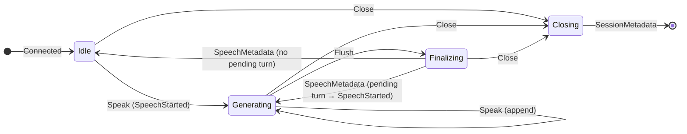

> For clean Markdown of any page, append .md to the page URL.
> For a complete documentation index, see https://developers.deepgram.com/llms.txt.
> For AI client integration (Claude Code, Cursor, etc.), connect to the MCP server at https://developers.deepgram.com/_mcp/server.

# The Speech Lifecycle and State Machine

**Early Access.** Flux TTS and the `/v2/speak` API are in Early Access — the API surface and voice catalog may change before general availability.

Flux TTS reframes synthesis from a text-to-audio pipe into a **turn-based conversation**. You own turn boundaries (`Flush`) and content; the server handles streaming and lifecycle reporting. This page explains the state machine that connects your [Client Messages](/docs/flux-tts/client-messages) to the [Server Messages](/docs/flux-tts/server-messages) you receive.

**Early Access.** This describes the EA lifecycle, where a turn ends with `Flush`. Barge-in (`Interrupt`, which cancels a turn mid-generation and reports what was heard) is planned for GA.

## Vocabulary

Getting the unit right is the key to reasoning about the protocol:

* **Chunk** — the text payload of one `Speak` message. Size is up to you: a single LLM token or a full paragraph. Chunk boundaries do **not** drive synthesis.
* **Turn** — one complete agent response, bounded by `Flush`. The turn is the customer-facing reporting unit: `SpeechStarted` fires once at the start, and `SpeechMetadata` fires once at the end.
* **`speech_id`** — the server-assigned identifier for a turn (`dg_sp_<12 hex>`). Informational; a new one is minted at the start of each turn.

The server holds **one active turn at a time**. If you `Flush` and then send more `Speak` before the active turn finishes, the new turn is **pending** — pending turns queue behind the active one (there's no limit) and become active in order.

You stream **chunks**; the server groups them into a **turn**; the wire reports per **turn**.

## States

| State        | Meaning                                                                                                                   |
| ------------ | ------------------------------------------------------------------------------------------------------------------------- |
| `Idle`       | Connection open, no active turn. The initial state after `Connected`.                                                     |
| `Generating` | A turn is active: the server accepts `Speak` for it and streams its audio as text arrives.                                |
| `Finalizing` | You've sent `Flush`; the server is finishing the active turn's remaining audio. A `Speak` sent now starts a pending turn. |
| `Closing`    | `Close` received; finishing queued audio, emitting `SessionMetadata`, then closing the socket.                            |

<br />



<br />

**Voice consistency carries across turns.** The model keeps conversational state across the turns it generates, so prosody stays consistent from turn to turn — with no API surface to manage. See [Cross-Turn Context](/docs/flux-tts/context).

## Key rules

1. The first `Speak` (from `Idle`) starts a turn. The server assigns a `speech_id` and emits `SpeechStarted`. `speech_id` is **turn-scoped** — it represents one agent turn.
2. Subsequent `Speak` messages append to the active turn. The server streams that turn's audio as text arrives — you don't have to `Flush` to start hearing audio.
3. **`SpeechStarted` and `SpeechMetadata` bookmark a turn's audio.** Every audio frame for a turn arrives between them, and `SpeechMetadata` is the server's signal that no more audio is coming for that turn.
4. Manual `Flush` finalizes the active turn: the server finishes its remaining audio, emits `Flushed` when the buffer has actually been flushed, then `SpeechMetadata`.
5. **One active turn at a time.** A `Speak` sent after you `Flush` (but before that turn's `SpeechMetadata`) starts a **pending** turn; it becomes active once the current turn's `SpeechMetadata` is sent, and gets its own `SpeechStarted`.
6. `SessionMetadata` is sent once before close, with cumulative totals.

## Edge cases

| Event during state                                                   | Behavior                                                                                |
| -------------------------------------------------------------------- | --------------------------------------------------------------------------------------- |
| `Speak` during `Finalizing` (after `Flush`, before `SpeechMetadata`) | Starts a **pending** turn; it becomes active after the current turn's `SpeechMetadata`. |
| `Flush` with no active turn                                          | No-op; the server emits a `NO_ACTIVE_SPEECH` warning and the connection stays open.     |

## A turn, end to end

A single agent turn that completes normally — the agent says "Sure, I can help you cancel your subscription," streamed as LLM tokens and ended with a manual `Flush`. The exchange is shown as alternating client and server steps.

**1. The client streams tokens.** The first `Speak` starts the turn.

```json Client →
{"type": "Speak", "text": "Sure, "}
{"type": "Speak", "text": "I can help you "}
{"type": "Speak", "text": "cancel your subscription."}
```

**2. The server opens the turn and streams audio.**

```json Server ←
{"type": "SpeechStarted", "speech_id": "dg_sp_a1b2c3d4e5f6"}
// binary audio frames stream as generation proceeds
```

**3. The client ends the turn.**

```json Client →
{"type": "Flush"}
```

**4. The server finishes the audio and reports the turn.** All of the turn's audio has arrived between `SpeechStarted` and this `SpeechMetadata`.

```json Server ←
{"type": "Flushed", "speech_id": "dg_sp_a1b2c3d4e5f6"}
// remaining binary audio frames
{
  "type": "SpeechMetadata",
  "speech_id": "dg_sp_a1b2c3d4e5f6",
  "audio_duration_ms": 3200,
  "input_character_count": 47,
  "billable_character_count": 47,
  "controls_applied": {
    "pronunciations_applied": 0,
    "pronunciation_warnings": 0
  }
}
```

The next `Speak` begins a new turn with a new `speech_id`.

## Related resources

* [Client Messages](/docs/flux-tts/client-messages) — the messages that drive these transitions
* [Server Messages](/docs/flux-tts/server-messages) — full reference for each event above
* [Build a Flux TTS Voice Agent](/docs/flux-tts/voice-agent) — the state machine in a real agent loop
* [Cross-Turn Context](/docs/flux-tts/context) — what persists across turns

***
