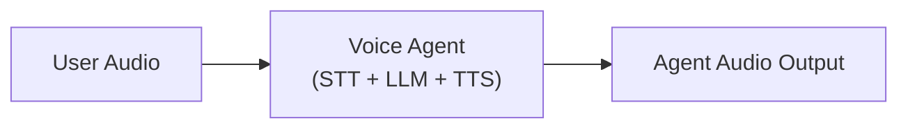
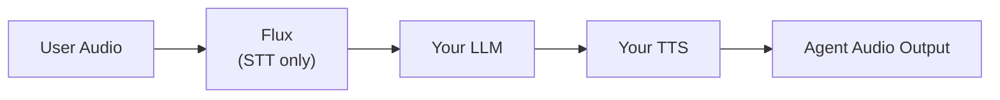

> For clean Markdown of any page, append .md to the page URL.
> For a complete documentation index, see https://developers.deepgram.com/llms.txt.
> For AI client integration (Claude Code, Cursor, etc.), connect to the MCP server at https://developers.deepgram.com/_mcp/server.

# Build a Flux-enabled Voice Agent

Flux tackles the most critical challenges for voice agents today: knowing when to listen, when to think, and when to speak. The model features first-of-its-kind model-integrated end-of-turn detection, configurable turn-taking dynamics, and ultra-low latency optimized for voice agent pipelines, all with Nova-3 level accuracy.

If you'd prefer to skip building, managing, and scaling a voice agent yourself -- explore our [Voice Agent API](/docs/voice-agent).

## Let's Build!

This guide walks you through building a basic voice agent powered by Deepgram Flux, OpenAI, and Deepgram TTS—streaming speech-to-text with advanced turn detection—to create natural, real-time conversations with users.

This walkthrough uses `flux-general-en` and an English Aura voice to keep the example focused. To make the
agent multilingual, switch the STT model to `flux-general-multi` and apply `language_hint` values as shown in
[Flux Multilingual & Language Prompting](/docs/flux/language-prompting). The rest of the pipeline stays the
same.

By the end of this guide, you’ll have:

* A real-time voice agent with sub-second response times
* A voice agent that uses a static audio file for mocking out a conversation
* Natural conversation flow with Flux’s advanced turn detection model
* Voice Activity Detection based interruption handling for responsive interactions
* A complete setup ready for a demo deployment

## Choosing an LLM

Flux supports the use of any LLM you wish to use. So you can use the best LLM for your use case. For this demo we'll be using OpenAI.

## Voice Agent Patterns

For this demo will opt to use `EndOfTurn` only for simplicity.

Flux enables two voice agent patterns. You can decide which one to use based on your latency vs complexity/cost tradeoffs.

### `EndOfTurn` Only

**Considerations:**

| Factor      | Details                                                 |
| ----------- | ------------------------------------------------------- |
| Performance | Higher latency but fewer LLM calls                      |
| Complexity  | Simpler logic to implement                              |
| Experience  | Requires less experience interfacing with LLMs directly |

We recommend starting with a purely `EndOfTurn` driven implementation to get up and running. This means:

* **`Update`/`EagerEndOfTurn`/`TurnResumed`**: Use only for transcript reference
* **`EndOfTurn`**: Send transcript to LLM and trigger agent response
* **`StartOfTurn`**: Interrupt agent if speaking, otherwise wait

If you're experiencing echo (the agent responding to itself) or false barge-ins from background noise, see [Audio Preprocessing & Barge-In](/guides/deep-dives/audio-preprocessing-barge-in) for recommendations on echo cancellation, noise suppression, and using Flux's `StartOfTurn` for reliable barge-in detection.

### EagerEndOfTurn + EndOfTurn

For more information `EagerEndOfTurn` see our guide [Optimize Voice Agent Latency with Eager End of Turn](/docs/flux/voice-agent-eager-eot)

**Considerations:**

| Factor      | Details                                                                      |
| ----------- | ---------------------------------------------------------------------------- |
| Performance | Lower latency but more LLM calls                                             |
| Complexity  | More complex to implement                                                    |
| Experience  | Requires more experience interfacing with LLMs directly                      |
| Accuracy    | `EagerEndOfTurn` may be followed by `TurnResumed` if user continues speaking |

Once comfortable with End of Turn, you can decide if you need to optimize latency using `EagerEndOfTurn`. Eager end of turn processing sends medium-confidence transcripts to your LLM before final `EndOfTurn` certainty, reducing response time. Though consider the LLM trade offs you might need to make.

* **`EagerEndOfTurn`**: Start preparing agent reply (moderate confidence user finished speaking)
* **`TurnResumed`**: Cancel agent reply preparation (user still speaking)
* **`EndOfTurn`**: Proceed with prepared response (user definitely finished)
* **`StartOfTurn`**: Interrupt agent if speaking, otherwise wait

**Tuning Turn Detection**: You can fine-tune the behavior of these events using the `eot_threshold`, `eager_eot_threshold`, and `eot_timeout_ms` parameters. See the [End-of-Turn Configuration](/docs/flux/configuration) for detailed tuning guidance and use-case specific recommendations.

**Dynamic Tuning**: In production voice agents powered by Flux, you can use the [Configure control message](/docs/flux/configure) to adjust these thresholds, or keyterms, mid-stream as desired behavior changes throughout a conversation. Each `keyterms` entry is a plain string with no weights or intensifiers, and a multi-word phrase is a single array element—see [Keyterm Prompting](/docs/keyterm) for the full syntax rules.

**External turn signals**: If you have your own turn-end signal — a push-to-talk release, a DTMF tone, or an existing VAD — you can end the current turn explicitly with the [`ForceEndTurn`](/docs/flux/force-end-turn) control message instead of relying on Flux's detection. Every `EndOfTurn` carries a `trigger` field (`model`, `manual`, or `timeout`) that tells you what ended the turn. To fully own turn detection, see [Bring Your Own Turn Detection](/docs/flux/own-turn-detection).

### Voice Agent vs Flux Agent Pipeline

Using the [Voice Agent API](/reference/auth/tokens/grant), your pipeline will look like this:



If you want to use Flux with the Voice Agent API set your `listen.provider.model` to `flux-general-en`, or `flux-general-multi` for multilingual agents (with optional `language_hint` values). See [Multilingual Voice Agents](/docs/multilingual-voice-agent) for setup details.

If you opt to build your own voice agent from scratch, you can use Flux to handle the speech to text and rely on its turn-taking cues to coordinate the rest of your pipeline.



You’ll now be responsible for:

* Managing audio playback interruptions (barge-in)
* Sending STT output to your LLM
* Cancelling LLM responses if user resumes talking
* Converting LLM output to speech via your chosen TTS provider

## `EndOfTurn` Only Voice Agent Example

Here's a sample voice agent implementation using Flux with the `EndOfTurn` only pattern:

### 1. Install the Deepgram SDK

```Python
 # Install the Deepgram Python SDK
 # https://github.com/deepgram/deepgram-python-sdk
 pip install deepgram-sdk
```

```JavaScript
npm install @deepgram/sdk
```

```csharp C#
// Install the Deepgram .NET SDK (Flux support requires v6.9.0+)
// https://github.com/deepgram/deepgram-dotnet-sdk

// $ dotnet add package Deepgram
```

```Go
COMING SOON!
// Install the Deepgram Go SDK
// https://github.com/deepgram/deepgram-go-sdk

// $ go get github.com/deepgram/deepgram-go-sdk
```

### 2. Add Dependencies

Install the additional dependencies:

```Python
# Install python-dotenv to protect your API key
pip install python-dotenv
```

```javascript JavaScript
npm install dotenv
```

```csharp C#
// No additional NuGet packages are required — HttpClient (used for the OpenAI
// request) ships with .NET. Set DEEPGRAM_API_KEY and OPENAI_API_KEY as
// environment variables.
```

```Go
COMING SOON!
```

### 3. Create a `.env` file

Create a `.env` file in your project root with your Deepgram API key and OpenAI API Key.

```bash
touch .env
```

```bash
DEEPGRAM_API_KEY="your_deepgram_api_key"
OPENAI_API_KEY="your_open_ai_api_key"
```

Replace `your_deepgram_api_key` with your actual Deepgram API key.
Replace `your_open_ai_api_key` with your actual Open API key.

### 4. Set Imports & Audio File

```python
import asyncio
import os
import sys
import json
import urllib.request

from dotenv import load_dotenv

# Load environment variables
load_dotenv()

AUDIO_FILE = "audio/spacewalk_linear16.wav"  # Raw: linear16, linear32, mulaw, alaw, opus, ogg-opus; Containerized: linear16 in WAV, opus in Ogg
```

```javascript JavaScript
import fs from "node:fs/promises";
import { config as loadEnv } from "dotenv";
import { DeepgramClient } from "@deepgram/sdk";

loadEnv();

const AUDIO_FILE = "audio/spacewalk_linear16.wav";
const client = new DeepgramClient();
```

```csharp C#
using System.Net.Http.Headers;
using System.Net.Http.Json;
using System.Text;
using System.Text.Json;
using Deepgram;
using Deepgram.Models.Flux.WebSocket;
using Deepgram.Models.Speak.v2.WebSocket;

Library.Initialize();

// Raw: linear16, linear32, mulaw, alaw, opus, ogg-opus; Containerized: linear16 in WAV, opus in Ogg
const string AudioFile = "audio/spacewalk_linear16.wav";
```

```Go
COMING SOON!
```

### 5. Transcribe with Flux

```python
# Transcribe with Flux
    print("\n🎤 Transcribing with Flux...")
    transcript = ""
    done = asyncio.Event()

    def on_flux_message(message) -> None:
        nonlocal transcript
        if hasattr(message, 'type') and message.type == 'TurnInfo':
            if hasattr(message, 'event') and message.event == 'EndOfTurn':
                if hasattr(message, 'transcript') and message.transcript:
                    transcript = message.transcript.strip()
                    print(f"✓ Transcript: '{transcript}'")
                    done.set()

    with client.listen.v2.connect(model="flux-general-en", encoding="linear16", sample_rate=16000) as connection:
        connection.on(EventType.MESSAGE, on_flux_message)

        import threading
        threading.Thread(target=connection.start_listening, daemon=True).start()

        # Send audio in chunks
        # Note: For optimal Flux performance, use ~80ms audio chunks
        # At 16kHz linear16: 80ms = ~2560 bytes. Using 4096 (~128ms) for simplicity in this demo
        chunk_size = 4096
        for i in range(0, len(audio_data), chunk_size):
            connection.send_media(audio_data[i:i + chunk_size])
            await asyncio.sleep(0.01)

        # Wait for transcript
        await asyncio.wait_for(done.wait(), timeout=30.0)

    if not transcript:
        print("❌ No transcript received")
        return
```

```javascript JavaScript
const audioData = await fs.readFile(AUDIO_FILE);

console.log("\n🎤 Transcribing with Flux...");
let transcript = "";
let resolveTurn;
const done = new Promise((resolve) => {
  resolveTurn = resolve;
});

const fluxConnection = await client.listen.v2.connect({
  model: "flux-general-en",
  encoding: "linear16",
  sample_rate: 16000,
  Authorization: `Token ${process.env.DEEPGRAM_API_KEY}`,
  // For multilingual agents, switch to flux-general-multi and add:
  // queryParams: { language_hint: ["en", "es"] },
});

fluxConnection.on("message", (message) => {
  if (
    message.type === "TurnInfo" &&
    message.event === "EndOfTurn" &&
    message.transcript
  ) {
    transcript = message.transcript.trim();
    console.log(`✓ Transcript: '${transcript}'`);
    resolveTurn();
  }
});

fluxConnection.connect();
await fluxConnection.waitForOpen();

const chunkSize = 4096;
for (let i = 0; i < audioData.length; i += chunkSize) {
  fluxConnection.sendMedia(audioData.subarray(i, i + chunkSize));
  await new Promise((resolve) => setTimeout(resolve, 10));
}

fluxConnection.sendCloseStream({ type: "CloseStream" });
await done;
fluxConnection.close();

if (!transcript) {
  console.log("❌ No transcript received");
  return;
}
```

```csharp C#
Console.WriteLine("\n🎤 Transcribing with Flux...");
var audioData = await File.ReadAllBytesAsync(AudioFile);

var transcript = "";
var turnComplete = new TaskCompletionSource();

var fluxClient = ClientFactory.CreateFluxWebSocketClient();

// Capture the transcript once Flux confirms the speaker's turn has ended.
await fluxClient.Subscribe(new EventHandler<TurnInfoResponse>((_, e) =>
{
    if (e.EventType == TurnEvent.EndOfTurn && !string.IsNullOrEmpty(e.Transcript))
    {
        transcript = e.Transcript.Trim();
        Console.WriteLine($"✓ Transcript: '{transcript}'");
        turnComplete.TrySetResult();
    }
}));

await fluxClient.Connect(new FluxSchema
{
    Model = "flux-general-en",
    Encoding = "linear16",
    SampleRate = 16000,
});

// Send audio in ~80ms chunks (16000 Hz * 2 bytes * 0.080s = 2560 bytes).
const int chunkSize = 2560;
for (var offset = 0; offset < audioData.Length; offset += chunkSize)
{
    var length = Math.Min(chunkSize, audioData.Length - offset);
    fluxClient.Send(audioData[offset..(offset + length)]);
    await Task.Delay(10);
}

// Wait up to 30s for the end-of-turn transcript, then close the stream.
await Task.WhenAny(turnComplete.Task, Task.Delay(TimeSpan.FromSeconds(30)));
await fluxClient.Stop();

if (string.IsNullOrEmpty(transcript))
{
    Console.WriteLine("❌ No transcript received");
    return;
}
```

```Go
COMING SOON!
```

### 6. Generate OpenAI Response

```python
 # Generate OpenAI response
    print("\n🤖 Generating OpenAI response...")

    # Direct HTTP request to OpenAI API
    openai_data = {
        "model": "gpt-4o-mini",
        "messages": [
            {"role": "system", "content": "You are a helpful assistant. Keep responses concise and conversational."},
            {"role": "user", "content": transcript}
        ],
        "temperature": 0.7,
        "max_tokens": 100
    }

    req = urllib.request.Request(
        "https://api.openai.com/v1/chat/completions",
        data=json.dumps(openai_data).encode(),
        headers={
            "Authorization": f"Bearer {os.environ.get('OPENAI_API_KEY')}",
            "Content-Type": "application/json"
        }
    )

    try:
        with urllib.request.urlopen(req) as response_obj:
            openai_response = json.loads(response_obj.read().decode())
            response = openai_response["choices"][0]["message"]["content"]
            print(f"✓ Response: '{response}'")
    except Exception as e:
        print(f"❌ OpenAI API error: {e}")
        response = f"I heard you say: {transcript}"  # Fallback
        print(f"✓ Fallback response: '{response}'")
```

```javascript JavaScript
console.log("\n🤖 Generating OpenAI response...");

let response = "";

try {
  const openAiResponse = await fetch("https://api.openai.com/v1/chat/completions", {
    method: "POST",
    headers: {
      Authorization: `Bearer ${process.env.OPENAI_API_KEY}`,
      "Content-Type": "application/json",
    },
    body: JSON.stringify({
      model: "gpt-4o-mini",
      messages: [
        {
          role: "system",
          content: "You are a helpful assistant. Keep responses concise and conversational.",
        },
        { role: "user", content: transcript },
      ],
      temperature: 0.7,
      max_tokens: 100,
    }),
  });

  if (!openAiResponse.ok) {
    throw new Error(await openAiResponse.text());
  }

  const openAiJson = await openAiResponse.json();
  response = openAiJson.choices[0].message.content;
  console.log(`✓ Response: '${response}'`);
} catch (error) {
  console.log(`❌ OpenAI API error: ${error}`);
  response = `I heard you say: ${transcript}`;
  console.log(`✓ Fallback response: '${response}'`);
}
```

```csharp C#
Console.WriteLine("\n🤖 Generating OpenAI response...");

string response;
using var http = new HttpClient();
http.DefaultRequestHeaders.Authorization = new AuthenticationHeaderValue(
    "Bearer", Environment.GetEnvironmentVariable("OPENAI_API_KEY"));

try
{
    var openAiResponse = await http.PostAsJsonAsync(
        "https://api.openai.com/v1/chat/completions",
        new
        {
            model = "gpt-4o-mini",
            messages = new[]
            {
                new { role = "system", content = "You are a helpful assistant. Keep responses concise and conversational." },
                new { role = "user", content = transcript },
            },
            temperature = 0.7,
            max_tokens = 100,
        });
    openAiResponse.EnsureSuccessStatusCode();

    using var json = JsonDocument.Parse(await openAiResponse.Content.ReadAsStringAsync());
    response = json.RootElement
        .GetProperty("choices")[0].GetProperty("message").GetProperty("content").GetString() ?? "";
    Console.WriteLine($"✓ Response: '{response}'");
}
catch (Exception ex)
{
    Console.WriteLine($"❌ OpenAI API error: {ex.Message}");
    response = $"I heard you say: {transcript}"; // Fallback
    Console.WriteLine($"✓ Fallback response: '{response}'");
}
```

```Go
COMING SOON!
```

### 7. Generate TTS Response

```python
# Generate TTS Response
    print("\n🔊 Generating TTS...")
    tts_audio = []
    tts_done = asyncio.Event()

    def on_tts_message(message) -> None:
        if isinstance(message, bytes):
            tts_audio.append(message)
        elif hasattr(message, 'type') and message.type == 'Flushed':
            tts_done.set()

    with client.speak.v1.connect(model="aura-2-phoebe-en", encoding="linear16", sample_rate=16000) as connection:
        connection.on(EventType.MESSAGE, on_tts_message)

        threading.Thread(target=connection.start_listening, daemon=True).start()

        connection.send_text(SpeakV1Text(text=response))
        connection.send_flush()

        # Wait for TTS completion
        await asyncio.wait_for(tts_done.wait(), timeout=15.0)
```

```javascript JavaScript
console.log("\n🔊 Generating TTS...");
const ttsAudio = [];
let resolveTts;
const ttsDone = new Promise((resolve) => {
  resolveTts = resolve;
});

const ttsConnection = await client.speak.v1.connect({
  model: "aura-2-phoebe-en",
  encoding: "linear16",
  sample_rate: 16000,
  Authorization: `Token ${process.env.DEEPGRAM_API_KEY}`,
});

ttsConnection.on("message", (message) => {
  if (typeof message === "string") {
    ttsAudio.push(Buffer.from(message, "base64"));
  } else if (message.type === "Flushed") {
    resolveTts();
  }
});

ttsConnection.connect();
await ttsConnection.waitForOpen();

ttsConnection.sendText({ type: "Speak", text: response });
ttsConnection.sendFlush({ type: "Flush" });

await ttsDone;
ttsConnection.sendClose({ type: "Close" });
ttsConnection.close();
```

```csharp C#
Console.WriteLine("\n🔊 Generating TTS...");

using var ttsAudio = new MemoryStream();
var ttsComplete = new TaskCompletionSource();

var speakClient = ClientFactory.CreateSpeakWebSocketClient();

// Collect audio chunks as they stream back, and stop when Deepgram flushes.
await speakClient.Subscribe(new EventHandler<AudioResponse>((_, e) => e.Stream?.WriteTo(ttsAudio)));
await speakClient.Subscribe(new EventHandler<FlushedResponse>((_, e) => ttsComplete.TrySetResult()));

await speakClient.Connect(new SpeakSchema
{
    Model = "aura-2-phoebe-en",
    Encoding = "linear16",
    SampleRate = 16000,
});

speakClient.SpeakWithText(response);
speakClient.Flush();

await Task.WhenAny(ttsComplete.Task, Task.Delay(TimeSpan.FromSeconds(15)));
await speakClient.Stop();
```

```Go
COMING SOON!
```

### 8. Save TTS Audio

```python
if tts_audio:
        output_file = "audio/responses/agent_response.wav"
        combined_audio = b''.join(tts_audio)

        # Create simple WAV header
        import struct
        wav_header = struct.pack(
            '<4sI4s4sIHHIIHH4sI',
            b'RIFF', 36 + len(combined_audio), b'WAVE', b'fmt ', 16, 1, 1,
            16000, 32000, 2, 16, b'data', len(combined_audio)
        )

        with open(output_file, 'wb') as f:
            f.write(wav_header + combined_audio)

        print(f"💾 Saved TTS audio: {output_file}")

    print("\n🎉 Demo complete!")
    print(f"📝 User: '{transcript}'")
    print(f"🤖 Agent: '{response}'")

if __name__ == "__main__":
    try:
        asyncio.run(main())
    except KeyboardInterrupt:
        print("\n👋 Demo stopped")
    except Exception as e:
        print(f"❌ Error: {e}")

```

```javascript JavaScript
function createWavHeader(dataLength, sampleRate = 16000) {
  const header = Buffer.alloc(44);
  header.write("RIFF", 0);
  header.writeUInt32LE(36 + dataLength, 4);
  header.write("WAVE", 8);
  header.write("fmt ", 12);
  header.writeUInt32LE(16, 16);
  header.writeUInt16LE(1, 20);
  header.writeUInt16LE(1, 22);
  header.writeUInt32LE(sampleRate, 24);
  header.writeUInt32LE(sampleRate * 2, 28);
  header.writeUInt16LE(2, 32);
  header.writeUInt16LE(16, 34);
  header.write("data", 36);
  header.writeUInt32LE(dataLength, 40);
  return header;
}

if (ttsAudio.length) {
  const outputFile = "audio/responses/agent_response.wav";
  const combinedAudio = Buffer.concat(ttsAudio);
  const wavHeader = createWavHeader(combinedAudio.length);

  await fs.mkdir("audio/responses", { recursive: true });
  await fs.writeFile(outputFile, Buffer.concat([wavHeader, combinedAudio]));

  console.log(`💾 Saved TTS audio: ${outputFile}`);
}

console.log("\n🎉 Demo complete!");
console.log(`📝 User: '${transcript}'`);
console.log(`🤖 Agent: '${response}'`);
```

```csharp C#
if (ttsAudio.Length > 0)
{
    Directory.CreateDirectory("audio/responses");
    const string outputFile = "audio/responses/agent_response.wav";
    var pcm = ttsAudio.ToArray();

    await using var file = File.Create(outputFile);
    file.Write(BuildWavHeader(pcm.Length, sampleRate: 16000));
    file.Write(pcm);

    Console.WriteLine($"💾 Saved TTS audio: {outputFile}");
}

Console.WriteLine("\n🎉 Demo complete!");
Console.WriteLine($"📝 User: '{transcript}'");
Console.WriteLine($"🤖 Agent: '{response}'");

Library.Terminate();

// Builds a minimal 44-byte PCM WAV header for 16-bit mono audio.
static byte[] BuildWavHeader(int dataLength, int sampleRate)
{
    using var header = new MemoryStream();
    using var writer = new BinaryWriter(header);
    writer.Write(Encoding.ASCII.GetBytes("RIFF"));
    writer.Write(36 + dataLength);
    writer.Write(Encoding.ASCII.GetBytes("WAVE"));
    writer.Write(Encoding.ASCII.GetBytes("fmt "));
    writer.Write(16);              // PCM fmt chunk size
    writer.Write((short)1);        // audio format = PCM
    writer.Write((short)1);        // channels = mono
    writer.Write(sampleRate);
    writer.Write(sampleRate * 2);  // byte rate = sampleRate * channels * bytesPerSample
    writer.Write((short)2);        // block align
    writer.Write((short)16);       // bits per sample
    writer.Write(Encoding.ASCII.GetBytes("data"));
    writer.Write(dataLength);
    writer.Flush();
    return header.ToArray();
}
```

```Go
COMING SOON!
```

### 8. Complete Code Example

Here's the complete working example that combines all the steps. You can also find this code on [GitHub](https://github.com/deepgram-devs/deepgram-demos-composite-flux-agent).

```python
import asyncio
import os
import sys
import json
import urllib.request

from dotenv import load_dotenv

# Load environment variables
load_dotenv()

AUDIO_FILE = "audio/spacewalk_linear16.wav"  # Raw: linear16, linear32, mulaw, alaw, opus, ogg-opus; Containerized: linear16 in WAV, opus in Ogg

async def main():
    """Main demo function."""
    print("🚀 Deepgram Flux Agent Demo")
    print("=" * 40)

    # Check for audio file
    if not os.path.exists(AUDIO_FILE):
        print(f"❌ Audio file '{AUDIO_FILE}' not found")
        print("Please add an audio.wav file to this directory")
        return

    # Read audio file
    print(f"📁 Reading {AUDIO_FILE}...")
    with open(AUDIO_FILE, 'rb') as f:
        audio_data = f.read()

    print(f"✓ Read {len(audio_data)} bytes")

    # Import Deepgram
    from deepgram import DeepgramClient
    from deepgram.core.events import EventType
    from deepgram.speak.v1.types import SpeakV1Text

    client = DeepgramClient() # The API key retrieval happens automatically in the constructor

    # Transcribe with Flux
    print("\n🎤 Transcribing with Flux...")
    transcript = ""
    done = asyncio.Event()

    def on_flux_message(message) -> None:
        nonlocal transcript
        if hasattr(message, 'type') and message.type == 'TurnInfo':
            if hasattr(message, 'event') and message.event == 'EndOfTurn':
                if hasattr(message, 'transcript') and message.transcript:
                    transcript = message.transcript.strip()
                    print(f"✓ Transcript: '{transcript}'")
                    done.set()

    with client.listen.v2.connect(model="flux-general-en", encoding="linear16", sample_rate=16000) as connection:
        connection.on(EventType.MESSAGE, on_flux_message)

        import threading
        threading.Thread(target=connection.start_listening, daemon=True).start()

        # Send audio in chunks
        # Note: For optimal Flux performance, use ~80ms audio chunks
        # At 16kHz linear16: 80ms = ~2560 bytes. Using 4096 (~128ms) for simplicity in this demo
        chunk_size = 4096
        for i in range(0, len(audio_data), chunk_size):
            connection.send_media(audio_data[i:i + chunk_size])
            await asyncio.sleep(0.01)

        # Wait for transcript
        await asyncio.wait_for(done.wait(), timeout=30.0)

    if not transcript:
        print("❌ No transcript received")
        return

    # Generate OpenAI response
    print("\n🤖 Generating OpenAI response...")

    # Direct HTTP request to OpenAI API
    openai_data = {
        "model": "gpt-4o-mini",
        "messages": [
            {"role": "system", "content": "You are a helpful assistant. Keep responses concise and conversational."},
            {"role": "user", "content": transcript}
        ],
        "temperature": 0.7,
        "max_tokens": 100
    }

    req = urllib.request.Request(
        "https://api.openai.com/v1/chat/completions",
        data=json.dumps(openai_data).encode(),
        headers={
            "Authorization": f"Bearer {os.environ.get('OPENAI_API_KEY')}",
            "Content-Type": "application/json"
        }
    )

    try:
        with urllib.request.urlopen(req) as response_obj:
            openai_response = json.loads(response_obj.read().decode())
            response = openai_response["choices"][0]["message"]["content"]
            print(f"✓ Response: '{response}'")
    except Exception as e:
        print(f"❌ OpenAI API error: {e}")
        response = f"I heard you say: {transcript}"  # Fallback
        print(f"✓ Fallback response: '{response}'")

    # Generate TTS Response
    print("\n🔊 Generating TTS...")
    tts_audio = []
    tts_done = asyncio.Event()

    def on_tts_message(message) -> None:
        if isinstance(message, bytes):
            tts_audio.append(message)
        elif hasattr(message, 'type') and message.type == 'Flushed':
            tts_done.set()

    with client.speak.v1.connect(model="aura-2-phoebe-en", encoding="linear16", sample_rate=16000) as connection:
        connection.on(EventType.MESSAGE, on_tts_message)

        threading.Thread(target=connection.start_listening, daemon=True).start()

        connection.send_text(SpeakV1Text(text=response))
        connection.send_flush()

        # Wait for TTS completion
        await asyncio.wait_for(tts_done.wait(), timeout=15.0)

    # Save TTS audio
    if tts_audio:
        output_file = "audio/responses/agent_response.wav"
        combined_audio = b''.join(tts_audio)

        # Create simple WAV header
        import struct
        wav_header = struct.pack(
            '<4sI4s4sIHHIIHH4sI',
            b'RIFF', 36 + len(combined_audio), b'WAVE', b'fmt ', 16, 1, 1,
            16000, 32000, 2, 16, b'data', len(combined_audio)
        )

        with open(output_file, 'wb') as f:
            f.write(wav_header + combined_audio)

        print(f"💾 Saved TTS audio: {output_file}")

    print("\n🎉 Demo complete!")
    print(f"📝 User: '{transcript}'")
    print(f"🤖 Agent: '{response}'")

if __name__ == "__main__":
    try:
        asyncio.run(main())
    except KeyboardInterrupt:
        print("\n👋 Demo stopped")
    except Exception as e:
        print(f"❌ Error: {e}")
```

```javascript JavaScript
import fs from "node:fs/promises";
import { config as loadEnv } from "dotenv";
import { DeepgramClient } from "@deepgram/sdk";

loadEnv();

const AUDIO_FILE = "audio/spacewalk_linear16.wav";

function createWavHeader(dataLength, sampleRate = 16000) {
  const header = Buffer.alloc(44);
  header.write("RIFF", 0);
  header.writeUInt32LE(36 + dataLength, 4);
  header.write("WAVE", 8);
  header.write("fmt ", 12);
  header.writeUInt32LE(16, 16);
  header.writeUInt16LE(1, 20);
  header.writeUInt16LE(1, 22);
  header.writeUInt32LE(sampleRate, 24);
  header.writeUInt32LE(sampleRate * 2, 28);
  header.writeUInt16LE(2, 32);
  header.writeUInt16LE(16, 34);
  header.write("data", 36);
  header.writeUInt32LE(dataLength, 40);
  return header;
}

async function main() {
  console.log("🚀 Deepgram Flux Agent Demo");
  console.log("=".repeat(40));

  try {
    await fs.access(AUDIO_FILE);
  } catch {
    console.log(`❌ Audio file '${AUDIO_FILE}' not found`);
    console.log("Please add an audio.wav file to this directory");
    return;
  }

  console.log(`📁 Reading ${AUDIO_FILE}...`);
  const audioData = await fs.readFile(AUDIO_FILE);
  console.log(`✓ Read ${audioData.length} bytes`);

  const client = new DeepgramClient();

  console.log("\n🎤 Transcribing with Flux...");
  let transcript = "";
  let resolveTurn;
  const turnDone = new Promise((resolve) => {
    resolveTurn = resolve;
  });

  const fluxConnection = await client.listen.v2.connect({
    model: "flux-general-en",
    encoding: "linear16",
    sample_rate: 16000,
    Authorization: `Token ${process.env.DEEPGRAM_API_KEY}`,
  });

  fluxConnection.on("message", (message) => {
    if (
      message.type === "TurnInfo" &&
      message.event === "EndOfTurn" &&
      message.transcript
    ) {
      transcript = message.transcript.trim();
      console.log(`✓ Transcript: '${transcript}'`);
      resolveTurn();
    }
  });

  fluxConnection.connect();
  await fluxConnection.waitForOpen();

  const chunkSize = 4096;
  for (let i = 0; i < audioData.length; i += chunkSize) {
    fluxConnection.sendMedia(audioData.subarray(i, i + chunkSize));
    await new Promise((resolve) => setTimeout(resolve, 10));
  }

  fluxConnection.sendCloseStream({ type: "CloseStream" });
  await turnDone;
  fluxConnection.close();

  if (!transcript) {
    console.log("❌ No transcript received");
    return;
  }

  console.log("\n🤖 Generating OpenAI response...");
  let response = "";

  try {
    const openAiResponse = await fetch("https://api.openai.com/v1/chat/completions", {
      method: "POST",
      headers: {
        Authorization: `Bearer ${process.env.OPENAI_API_KEY}`,
        "Content-Type": "application/json",
      },
      body: JSON.stringify({
        model: "gpt-4o-mini",
        messages: [
          {
            role: "system",
            content: "You are a helpful assistant. Keep responses concise and conversational.",
          },
          { role: "user", content: transcript },
        ],
        temperature: 0.7,
        max_tokens: 100,
      }),
    });

    if (!openAiResponse.ok) {
      throw new Error(await openAiResponse.text());
    }

    const openAiJson = await openAiResponse.json();
    response = openAiJson.choices[0].message.content;
    console.log(`✓ Response: '${response}'`);
  } catch (error) {
    console.log(`❌ OpenAI API error: ${error}`);
    response = `I heard you say: ${transcript}`;
    console.log(`✓ Fallback response: '${response}'`);
  }

  console.log("\n🔊 Generating TTS...");
  const ttsAudio = [];
  let resolveTts;
  const ttsDone = new Promise((resolve) => {
    resolveTts = resolve;
  });

  const ttsConnection = await client.speak.v1.connect({
    model: "aura-2-phoebe-en",
    encoding: "linear16",
    sample_rate: 16000,
    Authorization: `Token ${process.env.DEEPGRAM_API_KEY}`,
  });

  ttsConnection.on("message", (message) => {
    if (typeof message === "string") {
      ttsAudio.push(Buffer.from(message, "base64"));
    } else if (message.type === "Flushed") {
      resolveTts();
    }
  });

  ttsConnection.connect();
  await ttsConnection.waitForOpen();

  ttsConnection.sendText({ type: "Speak", text: response });
  ttsConnection.sendFlush({ type: "Flush" });

  await ttsDone;
  ttsConnection.sendClose({ type: "Close" });
  ttsConnection.close();

  if (ttsAudio.length) {
    const outputFile = "audio/responses/agent_response.wav";
    const combinedAudio = Buffer.concat(ttsAudio);
    const wavHeader = createWavHeader(combinedAudio.length);

    await fs.mkdir("audio/responses", { recursive: true });
    await fs.writeFile(outputFile, Buffer.concat([wavHeader, combinedAudio]));

    console.log(`💾 Saved TTS audio: ${outputFile}`);
  }

  console.log("\n🎉 Demo complete!");
  console.log(`📝 User: '${transcript}'`);
  console.log(`🤖 Agent: '${response}'`);
}

main().catch((error) => {
  console.error(`❌ Error: ${error}`);
});
```

```csharp C#
using System.Net.Http.Headers;
using System.Net.Http.Json;
using System.Text;
using System.Text.Json;
using Deepgram;
using Deepgram.Models.Flux.WebSocket;
using Deepgram.Models.Speak.v2.WebSocket;

Console.WriteLine("🚀 Deepgram Flux Agent Demo");
Console.WriteLine(new string('=', 40));

Library.Initialize();

// Raw: linear16, linear32, mulaw, alaw, opus, ogg-opus; Containerized: linear16 in WAV, opus in Ogg
const string audioFile = "audio/spacewalk_linear16.wav";
if (!File.Exists(audioFile))
{
    Console.WriteLine($"❌ Audio file '{audioFile}' not found");
    return;
}

Console.WriteLine($"📁 Reading {audioFile}...");
var audioData = await File.ReadAllBytesAsync(audioFile);
Console.WriteLine($"✓ Read {audioData.Length} bytes");

// 1. Transcribe with Flux
Console.WriteLine("\n🎤 Transcribing with Flux...");
var transcript = "";
var turnComplete = new TaskCompletionSource();

var fluxClient = ClientFactory.CreateFluxWebSocketClient();
await fluxClient.Subscribe(new EventHandler<TurnInfoResponse>((_, e) =>
{
    if (e.EventType == TurnEvent.EndOfTurn && !string.IsNullOrEmpty(e.Transcript))
    {
        transcript = e.Transcript.Trim();
        Console.WriteLine($"✓ Transcript: '{transcript}'");
        turnComplete.TrySetResult();
    }
}));

await fluxClient.Connect(new FluxSchema
{
    Model = "flux-general-en",
    Encoding = "linear16",
    SampleRate = 16000,
});

const int chunkSize = 2560; // ~80ms at 16kHz linear16
for (var offset = 0; offset < audioData.Length; offset += chunkSize)
{
    var length = Math.Min(chunkSize, audioData.Length - offset);
    fluxClient.Send(audioData[offset..(offset + length)]);
    await Task.Delay(10);
}

await Task.WhenAny(turnComplete.Task, Task.Delay(TimeSpan.FromSeconds(30)));
await fluxClient.Stop();

if (string.IsNullOrEmpty(transcript))
{
    Console.WriteLine("❌ No transcript received");
    return;
}

// 2. Generate an OpenAI response
Console.WriteLine("\n🤖 Generating OpenAI response...");
string response;
using (var http = new HttpClient())
{
    http.DefaultRequestHeaders.Authorization = new AuthenticationHeaderValue(
        "Bearer", Environment.GetEnvironmentVariable("OPENAI_API_KEY"));
    try
    {
        var openAiResponse = await http.PostAsJsonAsync(
            "https://api.openai.com/v1/chat/completions",
            new
            {
                model = "gpt-4o-mini",
                messages = new[]
                {
                    new { role = "system", content = "You are a helpful assistant. Keep responses concise and conversational." },
                    new { role = "user", content = transcript },
                },
                temperature = 0.7,
                max_tokens = 100,
            });
        openAiResponse.EnsureSuccessStatusCode();

        using var json = JsonDocument.Parse(await openAiResponse.Content.ReadAsStringAsync());
        response = json.RootElement
            .GetProperty("choices")[0].GetProperty("message").GetProperty("content").GetString() ?? "";
        Console.WriteLine($"✓ Response: '{response}'");
    }
    catch (Exception ex)
    {
        Console.WriteLine($"❌ OpenAI API error: {ex.Message}");
        response = $"I heard you say: {transcript}"; // Fallback
        Console.WriteLine($"✓ Fallback response: '{response}'");
    }
}

// 3. Synthesize the response with Aura TTS
Console.WriteLine("\n🔊 Generating TTS...");
using var ttsAudio = new MemoryStream();
var ttsComplete = new TaskCompletionSource();

var speakClient = ClientFactory.CreateSpeakWebSocketClient();
await speakClient.Subscribe(new EventHandler<AudioResponse>((_, e) => e.Stream?.WriteTo(ttsAudio)));
await speakClient.Subscribe(new EventHandler<FlushedResponse>((_, e) => ttsComplete.TrySetResult()));

await speakClient.Connect(new SpeakSchema
{
    Model = "aura-2-phoebe-en",
    Encoding = "linear16",
    SampleRate = 16000,
});

speakClient.SpeakWithText(response);
speakClient.Flush();

await Task.WhenAny(ttsComplete.Task, Task.Delay(TimeSpan.FromSeconds(15)));
await speakClient.Stop();

// 4. Save the synthesized audio to a WAV file
if (ttsAudio.Length > 0)
{
    Directory.CreateDirectory("audio/responses");
    const string outputFile = "audio/responses/agent_response.wav";
    var pcm = ttsAudio.ToArray();

    await using var file = File.Create(outputFile);
    file.Write(BuildWavHeader(pcm.Length, sampleRate: 16000));
    file.Write(pcm);

    Console.WriteLine($"💾 Saved TTS audio: {outputFile}");
}

Console.WriteLine("\n🎉 Demo complete!");
Console.WriteLine($"📝 User: '{transcript}'");
Console.WriteLine($"🤖 Agent: '{response}'");

Library.Terminate();

// Builds a minimal 44-byte PCM WAV header for 16-bit mono audio.
static byte[] BuildWavHeader(int dataLength, int sampleRate)
{
    using var header = new MemoryStream();
    using var writer = new BinaryWriter(header);
    writer.Write(Encoding.ASCII.GetBytes("RIFF"));
    writer.Write(36 + dataLength);
    writer.Write(Encoding.ASCII.GetBytes("WAVE"));
    writer.Write(Encoding.ASCII.GetBytes("fmt "));
    writer.Write(16);
    writer.Write((short)1);
    writer.Write((short)1);
    writer.Write(sampleRate);
    writer.Write(sampleRate * 2);
    writer.Write((short)2);
    writer.Write((short)16);
    writer.Write(Encoding.ASCII.GetBytes("data"));
    writer.Write(dataLength);
    writer.Flush();
    return header.ToArray();
}
```

```Go
COMING SOON!
```

### Additional Flux Demos

For additional demos showcasing Flux, check out the following repositories:

| Demo Link                                              | Repository                                                               | Tech Stack            | Use Case                         |
| ------------------------------------------------------ | ------------------------------------------------------------------------ | --------------------- | -------------------------------- |
| [Demo Link](https://demos.dx.deepgram.com/flux-agent/) | [Repository](https://github.com/deepgram-devs/deepgram-demos-flux-agent) | Python, JS, HTML, CSS | Build a Flux-enabled Voice Agent |
| N/A                                                    | [Repository](https://github.com/deepgram-devs/deepgram-demos-rust)       | Rust                  | Build a Flux-enabled Voice Agent |
