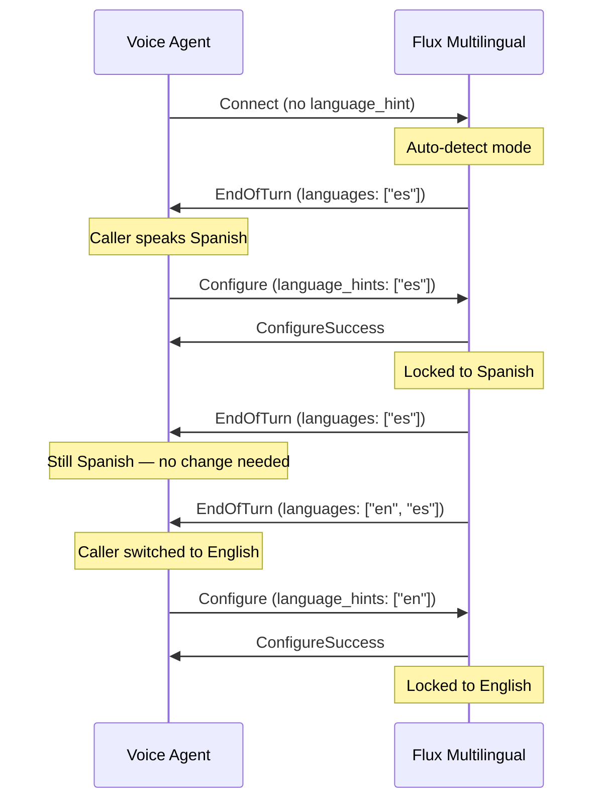

> For clean Markdown of any page, append .md to the page URL.
> For a complete documentation index, see https://developers.deepgram.com/llms.txt.
> For AI client integration (Claude Code, Cursor, etc.), connect to the MCP server at https://developers.deepgram.com/_mcp/server.

# Flux Multilingual & Language Prompting

Flux Multilingual (`flux-general-multi`) is a single model supporting 10 languages with the same turn-aware, interruption-aware conversational intelligence as `flux-general-en`. The optional `language_hint` parameter biases the model toward specific languages, delivering accuracy on par with dedicated monolingual models. Without hints, the model auto-detects the spoken language.

Flux Multilingual uses the same production endpoint and API key you already use for Flux. Just set `model=flux-general-multi` — no new credentials or endpoints required. Pricing is the same as `flux-general-en`.

An EU endpoint is also available: `wss://api.eu.deepgram.com/v2/listen?model=flux-general-multi`

Flux Multilingual is available on the hosted API, on self-hosted deployments, and in the latest Deepgram SDKs:

* Python `deepgram-sdk` `v7.0.0+`
* JavaScript `@deepgram/sdk` `v5.1.0+`
* .NET `Deepgram` `v6.9.0+`
* Go `github.com/deepgram/deepgram-go-sdk/v3` `v3.6.0+`
* Rust `deepgram` `v0.10.0+`
* Java `deepgram-java-sdk` `v0.7.0+`

Use `language_hint` values when you connect, and use `language_hints` in `Configure` messages to update them
mid-stream. See the representative SDK examples below.

## Supported Languages

| Language   | Code |
| ---------- | ---- |
| English    | `en` |
| Spanish    | `es` |
| French     | `fr` |
| German     | `de` |
| Hindi      | `hi` |
| Russian    | `ru` |
| Portuguese | `pt` |
| Japanese   | `ja` |
| Italian    | `it` |
| Dutch      | `nl` |

Locale-level subtags (e.g., `en-GB`, `pt-BR`) are accepted. If no exact match exists, Flux treats them as the base language code.

## The `language_hint` Parameter

`language_hint` *string* (optional, repeatable)

Pass one or more `language_hint` values to bias the model toward specific languages. This improves accuracy when you know the expected language(s) ahead of time.

| Behavior           | Description                                                                  |
| ------------------ | ---------------------------------------------------------------------------- |
| **Single hint**    | Biases strongly toward one language — best accuracy for known-language calls |
| **Multiple hints** | Biases toward a set of languages — ideal for multilingual support centers    |
| **No hint**        | Model auto-detects — use when the language is completely unknown             |

`language_hint` is only supported on `flux-general-multi`. Sending it to any other model (including `flux-general-en`) returns a `400` error.

Existing Flux concurrency limits now apply across both `flux-general-en` and `flux-general-multi` (shared pool). See [API Rate Limits](/reference/api-rate-limits) for details.

## Usage Scenarios

### 1. Known Single Language

When you know the caller's language ahead of time (e.g., a Spanish-language call center), set a single `language_hint` for best accuracy.

```
wss://api.deepgram.com/v2/listen?model=flux-general-multi&language_hint=es&encoding=linear16&sample_rate=16000
```

### 2. Known Subset of Languages

When callers may speak one of several languages (e.g., a bilingual English/Spanish support line), pass multiple hints. The model biases toward the specified set while still producing accurate transcripts regardless of which language is spoken.

```
wss://api.deepgram.com/v2/listen?model=flux-general-multi&language_hint=en&language_hint=es&encoding=linear16&sample_rate=16000
```

### 3. Unknown Language

When you have no knowledge of what language the caller will speak, omit `language_hint` entirely. The model auto-detects the language from the audio.

```
wss://api.deepgram.com/v2/listen?model=flux-general-multi&encoding=linear16&sample_rate=16000
```

### 4. Code-Switching

When speakers switch between languages mid-conversation (e.g., a bilingual speaker mixing English and Spanish), set hints for the expected languages. Flux handles mid-sentence language switches natively.

```
wss://api.deepgram.com/v2/listen?model=flux-general-multi&language_hint=en&language_hint=es&language_hint=fr&encoding=linear16&sample_rate=16000
```

## SDK Usage

```python Python
from deepgram import AsyncDeepgramClient
from deepgram.core.events import EventType

client = AsyncDeepgramClient()

async with client.listen.v2.connect(
    model="flux-general-multi",
    encoding="linear16",
    sample_rate=16000,
    request_options={
        "additional_query_parameters": {
            "language_hint": ["en", "es"],
        }
    },
) as connection:
    def on_message(message):
        if getattr(message, "type", None) == "TurnInfo":
            print(message.languages)
            print(message.languages_hinted)

    connection.on(EventType.MESSAGE, on_message)
    await connection.start_listening()
```

```typescript JavaScript
import { DeepgramClient } from "@deepgram/sdk";

const client = new DeepgramClient();

const connection = await client.listen.v2.connect({
  model: "flux-general-multi",
  encoding: "linear16",
  sample_rate: 16000,
  Authorization: `Token ${process.env.DEEPGRAM_API_KEY}`,
  queryParams: { language_hint: ["en", "es"] },
});

connection.on("message", (message) => {
  if (message.type === "TurnInfo") {
    console.log(message.languages);
    console.log(message.languages_hinted);
  }
});

connection.connect();
await connection.waitForOpen();
```

```java Java
import com.deepgram.DeepgramClient;
import com.deepgram.resources.listen.v2.types.ListenV2Configure;
import com.deepgram.resources.listen.v2.websocket.V2ConnectOptions;
import com.deepgram.resources.listen.v2.websocket.V2WebSocketClient;
import com.deepgram.types.ListenV2Encoding;
import com.deepgram.types.ListenV2Model;
import com.deepgram.types.ListenV2SampleRate;
import java.util.List;
import java.util.concurrent.TimeUnit;

DeepgramClient client = DeepgramClient.builder().build();

V2ConnectOptions options = V2ConnectOptions.builder()
    .model(ListenV2Model.FLUX_GENERAL_MULTI)
    .encoding(ListenV2Encoding.LINEAR16)
    .sampleRate(ListenV2SampleRate.of(16000))
    .build();

V2WebSocketClient connection = client.listen().v2().v2WebSocket();
connection.onTurnInfo(message -> {
    message.getLanguages().ifPresent(System.out::println);
    message.getLanguagesHinted().ifPresent(System.out::println);
});

connection.connect(options).get(10, TimeUnit.SECONDS);

// Set language hints for the session.
connection.sendConfigure(
    ListenV2Configure.builder()
        .languageHints(List.of("en", "es"))
        .build()
).get(5, TimeUnit.SECONDS);
```

## Language Detection in TurnInfo Events

When using `flux-general-multi`, all `TurnInfo` events include two additional fields:

| Field              | Type                  | Description                                                                                                     |
| ------------------ | --------------------- | --------------------------------------------------------------------------------------------------------------- |
| `languages`        | string array (BCP-47) | Languages detected in the current turn, sorted by word count (descending). Empty when no transcript is present. |
| `languages_hinted` | string array (BCP-47) | The language hints active at the time of the turn.                                                              |

### Example TurnInfo Response

```json
{
  "type": "TurnInfo",
  "request_id": "ad12514a-0d38-4f7e-8fba-cce10d8f174c",
  "sequence_id": 11,
  "event": "EndOfTurn",
  "turn_index": 0,
  "audio_window_start": 0,
  "audio_window_end": 1.3,
  "transcript": "Hello, how are you?",
  "languages_hinted": ["en", "es", "de"],
  "languages": ["en"],
  "words": [
    { "word": "Hello,", "confidence": 0.96 },
    { "word": "how", "confidence": 0.94 },
    { "word": "are", "confidence": 0.97 },
    { "word": "you?", "confidence": 0.92 }
  ],
  "end_of_turn_confidence": 0.86,
  "trigger": "model"
}
```

Use the `languages` field to route downstream processing — for example, selecting the correct TTS voice or LLM prompt language based on what the user actually spoke.

## Mid-Stream Reconfiguration

You can update language hints during a stream using the [Configure control message](/docs/flux/configure) without disconnecting. This is useful when conversational context changes — for example, after detecting the caller's language, you can narrow the hints for better accuracy.

```json
{
  "type": "Configure",
  "language_hints": ["en", "es"]
}
```

| Action             | JSON                                   | Behavior                                        |
| ------------------ | -------------------------------------- | ----------------------------------------------- |
| **Replace hints**  | `"language_hints": ["en", "fr"]`       | Replaces current hints with the new set         |
| **Clear hints**    | `"language_hints": []`                 | Removes all hints; model reverts to auto-detect |
| **Keep unchanged** | Omit `language_hints` or set to `null` | Current hints remain active                     |

### Pattern: Detect-then-Lock

A common voice agent pattern is to start a call with broad language detection, then lock in the detected language for the rest of the conversation. This gives you the best of both worlds: flexible auto-detection at the start and high-accuracy single-language transcription once the caller's language is known.

**How it works:**

1. **Connect with no hints** (or a broad subset of expected languages) to let the model auto-detect.
2. **Read the `languages` field** from the first `EndOfTurn` event to identify the caller's language.
3. **Send a Configure message** to lock in that language as a single hint for the remainder of the call.
4. **Monitor for language changes** — if a subsequent turn returns a different primary language in `languages`, send another Configure to update the hint.



**Step 1 — Connect with broad detection:**

```
wss://api.deepgram.com/v2/listen?model=flux-general-multi&encoding=linear16&sample_rate=16000
```

Or, if you know callers will speak one of a few languages, start with a subset:

```
wss://api.deepgram.com/v2/listen?model=flux-general-multi&language_hint=en&language_hint=es&language_hint=fr&encoding=linear16&sample_rate=16000
```

**Step 2 — Read the detected language from the first EndOfTurn:**

```json
{
  "type": "TurnInfo",
  "event": "EndOfTurn",
  "transcript": "Hola, necesito ayuda con mi cuenta.",
  "languages": ["es"],
  "languages_hinted": [],
  "trigger": "model",
  ...
}
```

The first entry in `languages` is the primary language by word count.

**Step 3 — Lock in the detected language:**

```json
{
  "type": "Configure",
  "language_hints": ["es"]
}
```

This biases all subsequent transcription toward Spanish, improving accuracy for the rest of the call.

**Step 4 — Handle language switches (optional):**

If a later turn returns a different primary language, update the hint:

```json
{
  "type": "Configure",
  "language_hints": ["en"]
}
```

Locking in a single language after detection delivers the best accuracy — comparable to using a dedicated monolingual model. For calls where code-switching is expected throughout, keep multiple hints active instead of locking to one language.

## Error Handling

| Error               | Cause                                                           | HTTP Code |
| ------------------- | --------------------------------------------------------------- | --------- |
| `INVALID_PARAMETER` | `language_hint` sent to a model other than `flux-general-multi` | `400`     |
| `INVALID_PARAMETER` | Unsupported language code in `language_hint`                    | `400`     |

Example error response:

```json
{
  "code": "INVALID_PARAMETER",
  "description": "language_hint is not supported for model flux-general-en"
}
```

## Flux Multilingual vs. `flux-general-en`

`flux-general-en` remains available and recommended for English-only workloads. Use `flux-general-multi` when you need multilingual support or expect non-English audio. Both models share the same turn detection architecture, end-of-turn configuration, and control message interface.

## Related Resources

* [Getting Started with Flux](/docs/flux/quickstart) — Quickstart guide
* [End-of-Turn Configuration](/docs/flux/configuration) — Tune turn detection behavior
* [Configure Control Message](/docs/flux/configure) — Update settings mid-stream
* [Multilingual Codeswitching](/docs/multilingual-code-switching) — Codeswitching on Nova-2/Nova-3
* [Models & Languages Overview](/docs/models-languages-overview) — All models and supported languages
