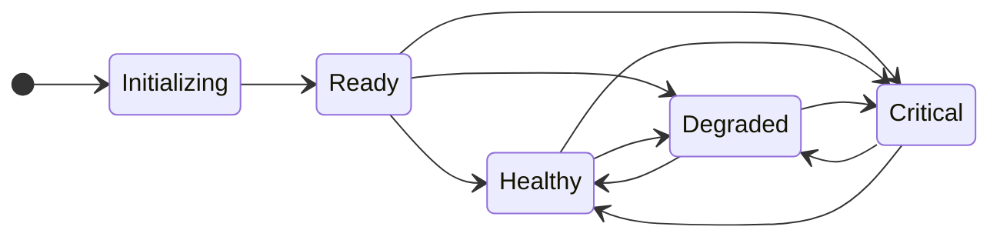

> For clean Markdown of any page, append .md to the page URL.
> For a complete documentation index, see https://developers.deepgram.com/llms.txt.
> For AI client integration (Claude Code, Cursor, etc.), connect to the MCP server at https://developers.deepgram.com/_mcp/server.

# Status Endpoint

The `/v1/status` endpoint provides real-time health and readiness information for your Deepgram self-hosted nodes. This endpoint is essential for monitoring your deployment and integrating with load balancers, orchestration platforms, and health check systems.

## Overview

The status endpoint reports the current operational state of a Deepgram node, tracking it through various states as it starts up, serves requests, and responds to runtime conditions. The endpoint helps prevent false critical alerts and provides accurate information about whether a node is ready to handle requests.

## Response Format

The status endpoint returns a JSON object with the following fields:

```json
{
  "system_health": "Healthy",
  "active_batch_requests": 0,
  "active_stream_requests": 0,
  "active_listen_v2_stream_requests": 0
}
```

* **`system_health`**: The current state of the node (`Initializing`, `Ready`, `Healthy`, `Degraded`, or `Critical`)
* **`active_batch_requests`**: Number of pre-recorded transcription requests currently being processed
* **`active_stream_requests`**: Number of real-time streaming requests currently active
* **`active_listen_v2_stream_requests`**: Number of active Flux (`/v2/listen`) streaming requests. Available in release `260319` and later.

## Status States

The `system_health` field reports one of five possible states:

### Initializing

**Reported during node startup.** When a Deepgram API node first starts, it reports `Initializing` status until the API is available and a backend Engine is connected.

The node automatically transitions to `Ready` once initialization completes successfully.

**Example Response:**

```json
{
  "system_health": "Initializing",
  "active_batch_requests": 0,
  "active_stream_requests": 0,
  "active_listen_v2_stream_requests": 0
}
```

### Ready

**A backend Engine is available.** Once initialization is complete, the node transitions to `Ready` status. No inference requests have been processed yet, so the node cannot confirm whether requests will succeed.

From the `Ready` state, the node will:

* Transition to `Healthy` after successfully processing enough requests (more than 90% success rate)
* Transition to `Degraded` if some requests succeed but the success rate is between 40% and 90%
* Transition to `Critical` if most requests fail (fewer than 40% success rate)

**Example Response:**

```json
{
  "system_health": "Ready",
  "active_batch_requests": 2,
  "active_stream_requests": 1,
  "active_listen_v2_stream_requests": 0
}
```

### Healthy

**Sustained successful operation.** A backend Engine is available and more than 90% of inference requests have been processed successfully. This indicates stable, production-ready operation.

A `Healthy` node can transition to `Degraded` or `Critical` if the success rate drops, including from repeated Flux (`/v2/listen`) request failures.

**Example Response:**

```json
{
  "system_health": "Healthy",
  "active_batch_requests": 3,
  "active_stream_requests": 1,
  "active_listen_v2_stream_requests": 2
}
```

### Degraded

**Some inference requests are succeeding.** A backend Engine is available, but the success rate has dropped below 90%. Between 40% and 90% of inference requests are completing successfully. The node is still processing requests, but reliability is reduced.

A `Degraded` node can recover to `Healthy` if the success rate improves above 90%, or transition to `Critical` if it drops below 40%.

**Example Response:**

```json
{
  "system_health": "Degraded",
  "active_batch_requests": 1,
  "active_stream_requests": 0,
  "active_listen_v2_stream_requests": 0
}
```

### Critical

**Node is experiencing failures.** A backend Engine is available, but fewer than 40% of inference requests are completing successfully.

This state indicates:

* The node is experiencing operational issues
* Requests may fail or produce errors
* Intervention may be required

A node in `Critical` status can recover to `Degraded` or `Healthy` once the success rate improves, but intervention may be required if the node remains in this state.

**Example Response:**

```json
{
  "system_health": "Critical",
  "active_batch_requests": 0,
  "active_stream_requests": 0,
  "active_listen_v2_stream_requests": 0
}
```

## State Transitions

The following diagram illustrates how nodes transition between states:



The system determines health based on the success rate of recent inference requests:

| Transition               | Condition                                    |
| ------------------------ | -------------------------------------------- |
| **Initializing → Ready** | API starts and a backend Engine connects     |
| **Ready → Healthy**      | More than 90% of inference requests succeed  |
| **Ready → Degraded**     | 40%–90% of inference requests succeed        |
| **Ready → Critical**     | Fewer than 40% of inference requests succeed |
| **Healthy → Degraded**   | Success rate drops below 90%                 |
| **Healthy → Critical**   | Success rate drops below 40%                 |
| **Degraded → Healthy**   | Success rate recovers above 90%              |
| **Degraded → Critical**  | Success rate drops below 40%                 |
| **Critical → Degraded**  | Success rate recovers to 40%–90%             |
| **Critical → Healthy**   | Success rate recovers above 90%              |

## Using the Status Endpoint

### Making a Request

Query the status endpoint with a simple GET request:

```shell cURL
curl http://localhost:8080/v1/status
```

```python Python
import requests

response = requests.get("http://localhost:8080/v1/status")
status = response.json()
print(f"Node status: {status['system_health']}")
print(f"Active batch requests: {status['active_batch_requests']}")
print(f"Active stream requests: {status['active_stream_requests']}")
print(f"Active Flux streams: {status['active_listen_v2_stream_requests']}")
```

```javascript JavaScript
const response = await fetch('http://localhost:8080/v1/status');
const status = await response.json();
console.log(`Node status: ${status.system_health}`);
console.log(`Active batch requests: ${status.active_batch_requests}`);
console.log(`Active stream requests: ${status.active_stream_requests}`);
console.log(`Active Flux streams: ${status.active_listen_v2_stream_requests}`);
```

```java Java
import java.net.URI;
import java.net.http.HttpClient;
import java.net.http.HttpRequest;
import java.net.http.HttpResponse;

HttpClient client = HttpClient.newHttpClient();
HttpRequest request = HttpRequest.newBuilder()
    .uri(URI.create("http://localhost:8080/v1/status"))
    .GET()
    .build();

HttpResponse<String> response = client.send(request, HttpResponse.BodyHandlers.ofString());
System.out.println(response.body());
```

### Integration with Load Balancers

Configure your load balancer to use the status endpoint for health checks. Different states may require different handling:

* **Initializing**: Consider the node unhealthy/not ready
* **Ready**: Node is healthy and can receive traffic
* **Healthy**: Node is healthy and can receive traffic
* **Degraded**: Node can receive traffic but may produce errors; consider reducing load
* **Critical**: Remove node from rotation or reduce traffic

**Example: AWS Application Load Balancer**

```yaml
Health Check Configuration:
  Protocol: HTTP
  Path: /v1/status
  Healthy threshold: 2
  Unhealthy threshold: 2
  Timeout: 5 seconds
  Interval: 30 seconds
  Success codes: 200
```

### Integration with Kubernetes

Use the status endpoint for liveness and readiness probes:

```yaml
apiVersion: v1
kind: Pod
metadata:
  name: deepgram-api
spec:
  containers:
  - name: api
    image: quay.io/deepgram/self-hosted-api:release-251029
    livenessProbe:
      httpGet:
        path: /v1/status
        port: 8080
      initialDelaySeconds: 30
      periodSeconds: 10
    readinessProbe:
      httpGet:
        path: /v1/status
        port: 8080
      initialDelaySeconds: 10
      periodSeconds: 5
      successThreshold: 1
      failureThreshold: 3
```

### Monitoring and Alerting

The status endpoint is valuable for monitoring dashboards and alerting systems:

```python Python Monitoring Script
import requests
import time

def check_node_status(url):
    try:
        response = requests.get(f"{url}/v1/status", timeout=5)
        data = response.json()
        status = data['system_health']
        batch_requests = data['active_batch_requests']
        stream_requests = data['active_stream_requests']
        flux_streams = data.get('active_listen_v2_stream_requests', 0)

        if status == 'Critical':
            alert(f"Node {url} is in Critical state!")
        elif status == 'Degraded':
            warn(f"Node {url} is Degraded - "
                 f"Batch: {batch_requests}, Stream: {stream_requests}")
        elif status == 'Initializing':
            log(f"Node {url} is still initializing...")
        else:
            log(f"Node {url} is {status} - "
                f"Batch: {batch_requests}, Stream: {stream_requests}, "
                f"Flux: {flux_streams}")

        return status
    except Exception as e:
        alert(f"Failed to check status for {url}: {e}")
        return None

# Check every 30 seconds
while True:
    check_node_status("http://localhost:8080")
    time.sleep(30)
```

## Best Practices

### Startup Handling

During node deployment or restart:

1. Wait for the `Initializing` state to transition to `Ready` before sending production traffic
2. Allow adequate time for initialization (typically 30-60 seconds)
3. Configure health checks with appropriate initial delays

### Error Recovery

When a node enters `Degraded` or `Critical` state:

1. Check node logs for specific error messages
2. Verify Engine connectivity and resource availability
3. Monitor for automatic recovery — the node can transition to a healthier state as the success rate improves
4. Consider restarting the node if it remains in `Critical` state

### High Availability

For production deployments:

1. Deploy multiple API nodes for redundancy
2. Configure load balancers to remove `Critical` nodes from rotation and reduce traffic to `Degraded` nodes
3. Set up automated alerts for `Degraded` and `Critical` state transitions
4. Monitor the proportion of nodes in each state across your deployment

### Monitoring Active Requests

Use the `active_batch_requests`, `active_stream_requests`, and `active_listen_v2_stream_requests` fields to:

* Track node utilization and load distribution
* Identify nodes that may be overloaded
* Plan capacity based on request patterns
* Implement graceful shutdowns by waiting for active requests to complete

## Troubleshooting

### Node Stuck in Initializing

If a node remains in `Initializing` state for an extended period:

* Verify Engine containers are running and accessible
* Check network connectivity between API and Engine nodes
* Review API and Engine logs for initialization errors
* Ensure proper configuration in `api.toml` and `engine.toml`

### Frequent Degraded or Critical State Transitions

If nodes frequently transition to `Degraded` or `Critical`:

* Review Engine resource allocation (GPU/CPU/memory)
* Check for model loading issues or corrupted model files
* Verify license validity and connectivity to license servers
* Monitor for request patterns that may cause failures

### Status Endpoint Not Responding

If the status endpoint is unreachable:

* Verify the API container is running: `docker ps`
* Check API logs: `docker logs CONTAINER_ID`
* Ensure port 8080 is accessible and not blocked by firewall rules
* Verify the API container has started successfully

---

## What's Next

Now that you understand how to monitor node health with the status endpoint, explore related topics:

* [Metrics Guide](/docs/metrics-guide) - Detailed metrics and monitoring
* [System Maintenance](/docs/maintaining) - Keeping your deployment healthy
* [Prometheus Integration](/docs/prometheus-integration) - Advanced monitoring setup
