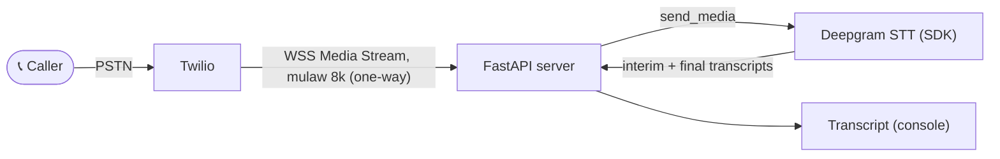

> For clean Markdown of any page, append .md to the page URL.
> For a complete documentation index, see https://developers.deepgram.com/llms.txt.
> For AI client integration (Claude Code, Cursor, etc.), connect to the MCP server at https://developers.deepgram.com/_mcp/server.

# Twilio and Deepgram STT

This guide walks through real-time transcription of a phone call: a caller dials a Twilio number, speaks, and their words appear as live text in your server console within a fraction of a second. The app never speaks back — this is the **listening half** of a voice pipeline, in isolation.

The architecture is small. Twilio streams the call's audio to your server, and your server forwards that audio to Deepgram's streaming speech-to-text API over a single WebSocket, receiving interim and finalized transcripts as the caller talks. By the end you have a working transcriber you can call from any phone, and a clear view of how little code sits between a phone call and live text.

## How it works

Transcription is a one-directional flow: audio goes in, text comes out. Your server forwards the caller's audio to Deepgram and prints the transcripts it streams back. Your server never sends anything back to the caller, as the diagram shows.



The implementation is a single WebSocket handler per call. It forwards the caller's audio into Deepgram with `send_media` and reacts to one kind of message — a transcript — by printing it. No audio path runs back to the caller, and that absence is exactly what makes this simpler than a full agent.

## Which Twilio and Deepgram integration do you need?

This guide builds **real-time transcription only** — speech in, text out, nothing spoken back. If you need more of the pipeline, two companion guides cover those cases:

| You want to…                                                | Use                                                                      | TwiML               |
| ----------------------------------------------------------- | ------------------------------------------------------------------------ | ------------------- |
| Transcribe a call in real time, nothing spoken back         | **This guide** — Deepgram STT                                            | `<Start><Stream>`   |
| Play synthesized speech into a call, no listening           | [Twilio and Deepgram TTS](/docs/twilio-and-deepgram-tts)                 | `<Connect><Stream>` |
| Hold a two-way conversation (STT + LLM + TTS in one socket) | [Twilio and Deepgram Voice Agent](/docs/twilio-and-deepgram-voice-agent) | `<Connect><Stream>` |

If you only need to know *what was said* — call analytics, compliance capture, live captions, note taking — this guide is the whole job. Reach for the Voice Agent when you also need to think and speak back.

## Before you begin

You need the following accounts, keys, and tools.

* A **Twilio** account with a voice-capable phone number.
* A **Deepgram** API key. [Sign up free](https://console.deepgram.com/signup) and you start with credits, no card required.
* **Python 3.10 or later.**
* A tunneling tool to expose your local server to Twilio. This guide uses [ngrok](https://ngrok.com/download).

Install ngrok and authenticate it once with the token from your ngrok dashboard.

```bash
# macOS
brew install ngrok
ngrok config add-authtoken <YOUR_NGROK_AUTHTOKEN>
```

## Step 1: Set up the project

Clone the companion repository, which holds the complete `app.py`, `requirements.txt`, and `.env.example` referenced throughout this guide.

```bash
git clone https://github.com/deepgram-devs/twilio-stt.git
cd twilio-stt
```

Install the dependencies and set up configuration. The dependency list is short.

```bash
pip install -r requirements.txt        # fastapi, uvicorn, deepgram-sdk, python-dotenv, twilio
cp .env.example .env                   # then fill in your Deepgram key + public host
```

The `.env` file holds two values your application reads on startup (plus two optional security values covered later).

```bash
DEEPGRAM_API_KEY=...
PUBLIC_HOSTNAME=your-host.ngrok-free.app   # the public host Twilio reaches, no scheme
```

This app needs no LLM key and no text-to-speech key — it only listens and transcribes. Speech-to-text runs through the official Deepgram Python SDK (`deepgram-sdk`).

**Verify:** running `python -c "import app"` with the two environment variables set imports cleanly.

## Step 2: Serve TwiML with `<Start><Stream>`

When a call connects, Twilio asks your webhook what to do. You answer with TwiML, Twilio's XML instruction set. The key instruction here is `<Start><Stream>`, which opens a **one-way** WebSocket: Twilio forks a copy of the caller's audio to your server and then keeps executing the rest of the TwiML. You receive audio; you never send any back.

```python
@app.post("/twiml")
async def twiml(request: Request) -> Response:
    xml = f"""<?xml version="1.0" encoding="UTF-8"?>
<Response>
  <Start>
    <Stream url="wss://{PUBLIC_HOSTNAME}/media" />
  </Start>
  <Say>Start speaking and watch the transcript appear in your server console.</Say>
  <Pause length="60" />
</Response>"""
    return Response(content=xml, media_type="application/xml")
```

That one design choice separates transcription from a voice agent. `<Start><Stream>` runs one-way in the background, which fits perfectly when your server never speaks back. Its bidirectional sibling, `<Connect><Stream>`, exists specifically to carry audio *back* into the call — which a transcriber never does. Because the stream runs in the background, the call itself needs something to do or Twilio hangs up; the `<Say>` and `<Pause>` simply hold the line open while the caller talks.

**Verify:** `curl -X POST https://YOUR_HOST/twiml` returns the XML above with your `wss://` URL and a `<Start>` (not `<Connect>`) element.

## Step 3: Bridge the Twilio media stream to Deepgram

The `/media` WebSocket carries the call's audio. Accept the socket, open a Deepgram STT connection for the call, then forward every audio frame Twilio sends into Deepgram.

```python
@app.websocket("/media")
async def media(twilio_ws: WebSocket) -> None:
    await twilio_ws.accept()

    async with dg_client.listen.v1.connect(...) as deepgram:      # Step 4
        deepgram.on(EventType.MESSAGE, lambda m: on_transcript(m))  # Step 5
        listen_task = asyncio.create_task(deepgram.start_listening())

        async for raw in twilio_ws.iter_text():
            msg = json.loads(raw)
            if msg.get("event") == "media":
                audio = base64.b64decode(msg["media"]["payload"])
                await deepgram.send_media(audio)                  # caller audio -> Deepgram
            elif msg.get("event") == "stop":
                break
        listen_task.cancel()
```

Twilio sends `start`, `media`, and `stop` events. On each `media` event, decode the base64 payload and forward the raw mulaw bytes straight into Deepgram with `send_media`. Nothing relays in the other direction — that missing half is the whole simplification.

## Step 4: Open the Deepgram STT connection

Open one streaming connection for the life of the call. Requesting mulaw at 8 kHz mono matches Twilio's Media Streams format exactly, so the caller's bytes flow to Deepgram with no resampling.

```python
async with dg_client.listen.v1.connect(
    model="nova-3",
    encoding="mulaw",
    sample_rate=8000,
    channels=1,
    interim_results=True,   # live, incrementally-refined hypotheses
    smart_format=True,      # punctuation, capitalization, formatted numbers/dates
    punctuate=True,
    endpointing=300,        # ms of silence that ends an utterance (drives speech_final)
) as deepgram:
    ...
```

`interim_results` gives you low-latency partial transcripts that refine as the caller keeps talking; `endpointing` sets how much silence marks the end of an utterance. This guide uses `nova-3` on `listen.v1`, Deepgram's general-purpose streaming model. For turn-taking-heavy conversational apps, Deepgram also offers [Flux](/docs/flux/quickstart) on `v2/listen`, with a different, turn-based message schema.

## Step 5: Handle transcripts

Register a callback for `EventType.MESSAGE` and inspect each message. Transcript messages arrive as `ListenV1Results` objects; read the top alternative's text.

```python
def on_transcript(message) -> None:
    if not isinstance(message, ListenV1Results):
        return
    alternatives = message.channel.alternatives if message.channel else []
    transcript = (alternatives[0].transcript if alternatives else "").strip()
    if not transcript:
        return

    if not message.is_final:
        print(f"[interim] {transcript}", end="\r", flush=True)   # overwrite as words firm up
    else:
        marker = "final*" if message.speech_final else "final "
        print(f"[{marker}] {transcript}")
```

Two SDK details matter here:

* **The callback runs inside the receive loop.** On the async client an `async def` handler is legal — the SDK awaits whatever the callback returns — but it awaits it *inline*, between reads of the WebSocket. Anything slow in the callback stalls the socket and backs up incoming audio, so keep the handler cheap and hand real work to the event loop with `asyncio.create_task`. Transcription has no async work to do, so this handler just prints.
* **`is_final` vs `speech_final`.** An `is_final` segment is stable text that won't change; interim results before it are living hypotheses. `speech_final` additionally means Deepgram detected the *end of an utterance* (via `endpointing`). Accumulate `is_final` segments until `speech_final` if you want one line per spoken turn.

With TwiML answering the call, audio forwarding into Deepgram, and transcripts printing as they arrive, the transcriber is complete — all that's left is to point a real phone call at it.

## Step 6: Run and test

Start the application and open a tunnel so Twilio can reach it.

```bash
python app.py                   # or: uvicorn app:app --port 5050 --reload
ngrok http 127.0.0.1:5050       # in another terminal; copy the forwarding host into .env PUBLIC_HOSTNAME
```

Use port 5050 (not 5000) to avoid the macOS AirPlay Receiver, which squats on port 5000 and returns 403. Use the `127.0.0.1:` form so ngrok forwards over IPv4 to uvicorn (plain `localhost` can resolve to IPv6 and miss the server).

Next, connect the phone number to your webhook. In the [Twilio Console](https://console.twilio.com), open **Phone Numbers → Manage → Active numbers → \[your number] → Voice Configuration**, set **A call comes in** to a **Webhook** pointing at `https://YOUR_HOST/twiml` with method **HTTP POST**, and save.

Now place the call and confirm transcription end to end.

1. Call the number and listen for the `<Say>` prompt.
2. Speak a few sentences.
3. Watch the console: `[interim]` lines update live, and each finished segment prints as `[final ]` (or `[final*]` at the end of an utterance).
4. Watch for the `[call] started stream ...` line when the call connects.

Live `[final]` lines that match what you said confirm the bridge and Deepgram are working together.

## Secure the endpoints

Your tunnel exposes both endpoints to the public internet. The companion `app.py` ships two optional guards that two environment variables switch on:

* `TWILIO_AUTH_TOKEN` — validates the `X-Twilio-Signature` header so `/twiml` answers only real Twilio requests. Find it in the Twilio Console under **Account → API keys & tokens → Auth Token**.
* `STREAM_SECRET` — a random string the TwiML passes as a `<Parameter>` and the app checks on the `/media` `start` event, so `/media` accepts only the sockets your own TwiML opened. Generate one with `python -c "import secrets; print(secrets.token_urlsafe(32))"`.

Both are off by default (the app prints a warning) so a first local run just works, but set them before leaving the tunnel up.

## Go further with Deepgram

Once the core transcriber runs, several enhancements build on the same streaming API.

* **Transcribe both sides of the call.** Set `track="both_tracks"` on the `<Stream>` to capture the caller *and* whoever they're connected to via `<Dial>`. Twilio then sends two independent streams of **mono** media events — each frame tagged `"track": "inbound"` or `"outbound"` — never interleaved stereo. So keep `channels=1`, read `msg["media"]["track"]`, and open one Deepgram connection per track. Setting `channels=2` instead tells Deepgram the bytes are interleaved stereo: the connection is accepted and the transcripts come back garbled, with no error to point at the cause.
* **Turn on richer formatting.** Add `diarize=True` to label speakers, set `language=...` for other languages, or tune `numerals`/`smart_format` for how numbers and dates render.
* **Persist the transcript.** Instead of printing, write finals to a database, POST them to a webhook, or push them over a WebSocket to a live-captions UI.
* **Use Flux for conversational turn-taking.** Deepgram's [Flux](/docs/flux/quickstart) model (`v2/listen`) adds built-in end-of-turn detection with a turn-based message schema — a good fit if you're heading toward an interactive assistant.
* **Layer in audio intelligence.** Add summaries, topics, sentiment, or intents over the same stream.

## Resources

* [Deepgram Speech-to-Text getting started](/docs/stt/getting-started)
* [Deepgram streaming STT API reference](/reference/deepgram-api-overview)
* [Deepgram Flux (conversational STT)](/docs/flux/quickstart)
* [Twilio Media Streams](https://www.twilio.com/docs/voice/media-streams)
* [Twilio `<Start><Stream>` TwiML](https://www.twilio.com/docs/voice/twiml/stream)
* [Twilio and Deepgram Voice Agent](/docs/twilio-and-deepgram-voice-agent) — the full conversational pipeline
