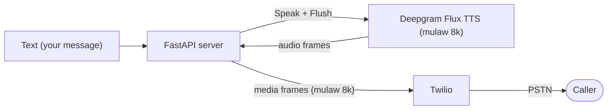

> For clean Markdown of any page, append .md to the page URL.
> For a complete documentation index, see https://developers.deepgram.com/llms.txt.
> For AI client integration (Claude Code, Cursor, etc.), connect to the MCP server at https://developers.deepgram.com/_mcp/server.

# Twilio and Deepgram TTS

This guide walks through real-time text-to-speech on a phone call: a caller dials a Twilio number and immediately hears a message that your server generates and streams into the call as it's spoken. The server never listens — this is the **speaking half** of a voice pipeline, in isolation.

The architecture is small. Twilio opens a bidirectional audio stream to your server; your server turns text into speech with [Deepgram Flux TTS](/docs/flux-tts/overview) and streams the resulting audio back into the call. By the end you have a working "speak into a call" service you can dial from any phone, and a clear view of how to push generated audio into a live call in real time.

## How it works

Playback is a one-directional flow in the opposite direction from transcription: text goes in, audio comes out and into the caller's ear. Your server generates the message with Deepgram and streams it back to Twilio as media frames. It ignores whatever the caller says.



The implementation is a single WebSocket handler per call. When the call connects, it opens a Flux TTS socket, sends the message, and streams the audio it gets back to Twilio in real-time-paced 20 ms frames. No audio path runs *from* the caller into your logic, and that absence keeps this simpler than a full agent.

## Which Twilio and Deepgram integration do you need?

This guide builds **playback only** — text in, speech out, no listening. If you need more of the pipeline, two companion guides cover those cases.

| You want to…                                                | Use                                                                      | TwiML               |
| ----------------------------------------------------------- | ------------------------------------------------------------------------ | ------------------- |
| Play generated speech into a call, no listening             | **This guide** — Deepgram TTS                                            | `<Connect><Stream>` |
| Transcribe a call in real time, nothing spoken back         | [Twilio and Deepgram STT](/docs/twilio-and-deepgram-stt)                 | `<Start><Stream>`   |
| Hold a two-way conversation (STT + LLM + TTS in one socket) | [Twilio and Deepgram Voice Agent](/docs/twilio-and-deepgram-voice-agent) | `<Connect><Stream>` |

If you only need to *say something* — IVR prompts, notifications, announcements, dynamic confirmations — this guide is the whole job. Reach for the Voice Agent API when you also need to listen and respond.

## Before you begin

You need the following accounts, keys, and tools.

* A **Twilio** account with a voice-capable phone number.
* A **Deepgram** API key.
* **Python 3.10 or later.**
* A tunneling tool to expose your local server to Twilio. This guide uses [ngrok](https://ngrok.com/download).

Before you can use Deepgram, you'll need to [create a Deepgram account](https://console.deepgram.com/signup?jump=keys). Signup is free and includes **\$200** in free credit and access to all of Deepgram's features!

Install ngrok and authenticate it once with the token from your ngrok dashboard.

```bash macOS
brew install ngrok
ngrok config add-authtoken YOUR_NGROK_AUTHTOKEN
```

## Step 1: Set up the project

Clone the companion repository, which holds the complete `app.py` and `requirements.txt` referenced throughout this guide.

```bash Shell
git clone https://github.com/deepgram-devs/twilio-tts.git
cd twilio-tts
```

Install the dependencies and set up configuration. The dependency list is short: `fastapi`, `uvicorn`, `deepgram-sdk`, `python-dotenv`, and `twilio`.

```bash Shell
pip install -r requirements.txt
cp .env.example .env
```

The `.env` file holds two values your application reads on startup, plus two optional security values covered later.

```bash .env
DEEPGRAM_API_KEY=YOUR_DEEPGRAM_API_KEY
PUBLIC_HOSTNAME=your-host.ngrok-free.app   # the public host Twilio reaches, no scheme
```

This app needs no LLM key and no speech-to-text — it only generates speech. Text-to-speech runs through the official Deepgram Python SDK (`deepgram-sdk`, version 7.6.0 or later).

**Verify:** running `python -c "import app"` with the two environment variables set imports cleanly.

## Step 2: Serve TwiML with `<Connect><Stream>`

When a call connects, Twilio asks your webhook what to do. You answer with TwiML, Twilio's XML instruction set. The key instruction here is [`<Connect><Stream>`](https://www.twilio.com/docs/voice/twiml/stream), which opens a **bidirectional** WebSocket — that return path lets you send generated audio back into the call.

```python Python
@app.post("/twiml")
async def twiml(request: Request) -> Response:
    xml = f"""<?xml version="1.0" encoding="UTF-8"?>
<Response>
  <Connect>
    <Stream url="wss://{PUBLIC_HOSTNAME}/media" />
  </Connect>
</Response>"""
    return Response(content=xml, media_type="application/xml")
```

That one design choice separates playback from transcription. Playing audio *into* a call requires a channel that carries audio back to Twilio, and only `<Connect><Stream>` (bidirectional) does that. Its one-way sibling, `<Start><Stream>`, can fork the caller's audio *to* you but cannot carry any audio back — fine for a transcriber, useless for playback. Unlike the STT guide, no `<Say>` or `<Pause>` follows: with `<Connect>`, the stream *is* the call, and it stays up until you close the socket.

**Verify:** `curl -X POST https://YOUR_HOST/twiml` returns the XML above with your `wss://` URL and a `<Connect>` (not `<Start>`) element.

## Step 3: Generate speech with Deepgram Flux TTS

[Flux TTS](/docs/flux-tts/overview) is Deepgram's streaming, turn-based text-to-speech built for voice-agent pipelines. You open a WebSocket, send text as a `Speak` message, and `Flush` to end the turn. The server replies with a `SpeechStarted` marker, a run of binary audio frames, and a `SpeechMetadata` summary once the turn's audio is complete — that last message is your cue to stop reading. Requesting mulaw at 8 kHz matches Twilio's Media Streams format exactly, so the bytes drop straight into media frames with no transcoding.

```python Python
from deepgram.speak.v2 import SpeakV2Error, SpeakV2Speak, SpeakV2SpeechMetadata

async def deepgram_tts(text: str):
    async with dg_client.speak.v2.connect(
        model="flux-alexis-en",
        encoding="mulaw",
        sample_rate="8000",                             # note: string, not int
    ) as socket:
        await socket.send_speak(SpeakV2Speak(text=text))
        await socket.send_flush()
        async for message in socket:
            if isinstance(message, bytes):
                yield message                           # a chunk of generated audio
            elif isinstance(message, SpeakV2SpeechMetadata):
                break                                   # turn complete — all audio arrived
            elif isinstance(message, SpeakV2Error):
                raise RuntimeError(f"Flux TTS error: {message.description}")
        await socket.send_close()
```

Flux model strings follow the format `flux-{voice}-{language}` (for example, `flux-alexis-en`); swap the voice to change how the message sounds. See [Flux TTS voices](/docs/flux-tts/voices) for the current list.

`/v2/speak` rejects Aura model strings such as `aura-2-thalia-en`. Those still run on the older [`speak.v1` REST API](/docs/tts-rest).

## Step 4: Stream the audio into the call

As audio arrives from Flux, forward it to Twilio as `media` frames. Flux emits arbitrarily sized chunks, so buffer them and re-slice into exact 20 ms frames (160 bytes of mulaw). Pace the frames at real time so you don't dump the whole clip into Twilio's buffer at once. After the last frame, send a `mark`; Twilio echoes it back once playback reaches that point, which is your cue that the message finished playing.

```python Python
async def speak(twilio_ws, stream_sid, text):
    buffer = bytearray()

    async def send_frame(frame):
        await twilio_ws.send_text(json.dumps({
            "event": "media", "streamSid": stream_sid,
            "media": {"payload": base64.b64encode(frame).decode()},
        }))
        await asyncio.sleep(0.02)                        # real-time pacing

    async for chunk in deepgram_tts(text):
        buffer.extend(chunk)
        while len(buffer) >= 160:                        # 160 bytes = 20ms of mulaw 8k
            await send_frame(bytes(buffer[:160]))
            del buffer[:160]
    if buffer:                                           # trailing partial frame
        await send_frame(bytes(buffer))

    await twilio_ws.send_text(json.dumps({
        "event": "mark", "streamSid": stream_sid, "mark": {"name": "end-of-speech"},
    }))
```

Every message you send back must carry the call's `streamSid`, which you capture from Twilio's `start` event.

## Step 5: Drive the call from the media socket

The `/media` WebSocket ties it together. Accept the socket, and on Twilio's `start` event generate and stream the message. Then wait for your `end-of-speech` mark to come back and hang up. The handler skips inbound `media` events (the caller's own audio), because this app never listens.

```python Python
@app.websocket("/media")
async def media(twilio_ws: WebSocket) -> None:
    await twilio_ws.accept()
    async for raw in twilio_ws.iter_text():
        msg = json.loads(raw)
        event = msg.get("event")
        if event == "start":
            stream_sid = msg["start"]["streamSid"]
            await speak(twilio_ws, stream_sid, MESSAGE)   # generate + stream
        elif event == "mark" and msg["mark"]["name"] == "end-of-speech":
            break                                         # playback done -> end the call
        elif event == "media":
            pass                                          # caller audio -> ignored
        elif event == "stop":
            break
```

Waiting for the mark before closing matters: if you close the socket the instant you *send* the last frame, you cut off the audio Twilio still has buffered. The mark tells you Twilio actually *played* it.

With TwiML answering the call, Flux generating the audio, and the mark timing the hangup, the playback service is complete — time to dial it from a real phone.

## Step 6: Run and test

Start the application and open a tunnel so Twilio can reach it.

```bash Shell
python app.py                   # or: uvicorn app:app --port 5050 --reload
ngrok http 127.0.0.1:5050       # in another terminal; copy the forwarding host into .env PUBLIC_HOSTNAME
```

Use port 5050 (not 5000) to avoid the macOS AirPlay Receiver, which squats on port 5000 and returns 403. Use the `127.0.0.1:` form so ngrok forwards over IPv4 to uvicorn — plain `localhost` can resolve to IPv6 and miss the server.

Next, connect the phone number to your webhook. In the [Twilio Console](https://console.twilio.com), open **Phone Numbers → Manage → Active numbers → \[your number] → Voice Configuration**, set **A call comes in** to a **Webhook** pointing at `https://YOUR_HOST/twiml` with method **HTTP POST**, and save.

Now place the call and confirm playback end to end.

1. Call the number.
2. Confirm you hear the generated `MESSAGE` in a natural Flux voice.
3. Confirm the call ends cleanly once the message finishes.
4. Watch the console for `[call] started stream ...` and then `[call] playback finished`.

Hearing the full message without clipping confirms the bridge and Deepgram are working together.

## Secure the endpoints

Your tunnel exposes both endpoints to the public internet. The companion `app.py` ships two optional guards that two environment variables switch on.

* `TWILIO_AUTH_TOKEN` — validates the `X-Twilio-Signature` header so `/twiml` answers only real Twilio requests. Find it in the Twilio Console under **Account → API keys & tokens → Auth Token**.
* `STREAM_SECRET` — a random string the TwiML passes as a `<Parameter>` and the app checks on the `/media` `start` event, so `/media` accepts only the sockets your own TwiML opened. Generate one with `python -c "import secrets; print(secrets.token_urlsafe(32))"`.

Both guards are off by default (the app prints a warning) so a first local run just works. Set them before leaving the tunnel up or sharing the number.

## Go further with Deepgram

Once the core playback runs, several enhancements build on the same streaming approach.

* **Speak dynamic text.** Instead of a constant `MESSAGE`, drive the text from a database lookup, an incoming webhook, or query parameters passed through the TwiML — order confirmations, appointment reminders, account balances.
* **Choose a different voice.** Swap the `speak` model for another [Flux voice](/docs/flux-tts/voices) to change tone, gender, or accent.
* **Play several messages.** Call `speak(...)` more than once (each with its own mark) to chain prompts, or keep the socket open and stream new audio whenever you have something to say.
* **Add listening for true barge-in.** Barge-in here is manual only — with no transcription, the app can't detect the caller talking over the message. Add Deepgram speech-to-text, or move to the [Voice Agent API](/docs/twilio-and-deepgram-voice-agent), to stop playback the instant the caller speaks.

## What's next

* [Flux TTS overview](/docs/flux-tts/overview)
* [Text-to-Speech REST API](/docs/tts-rest)
* [Twilio and Deepgram STT](/docs/twilio-and-deepgram-stt)
* [Twilio and Deepgram Voice Agent](/docs/twilio-and-deepgram-voice-agent)
* [Twilio Media Streams](https://www.twilio.com/docs/voice/media-streams)
