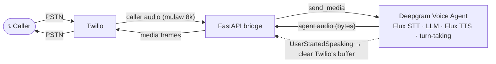

> For clean Markdown of any page, append .md to the page URL.
> For a complete documentation index, see https://developers.deepgram.com/llms.txt.
> For AI client integration (Claude Code, Cursor, etc.), connect to the MCP server at https://developers.deepgram.com/_mcp/server.

# Twilio and Deepgram Voice Agent

This guide walks through a complete, real-time phone agent: a caller dials a Twilio number, speaks naturally, and holds a conversation with an AI that can be interrupted mid-sentence, the way people talk to each other.

The architecture is small. Twilio streams the call audio to your server, and your server bridges that audio to the **Deepgram Voice Agent API**, a single WebSocket that runs the entire conversation: speech-to-text, the language model, text-to-speech, and turn-taking. By the end you have a working agent you can call from any phone, plus a clear view of how little code stands between the caller and a fully managed voice pipeline. That includes **barge-in**, the ability to talk over the agent and have it stop instantly.

## How the agent works

A voice agent runs a tight loop: audio in, understanding, a reply, speech out, fast enough to feel like a conversation. The Voice Agent API owns that loop. Your server only moves audio between two sockets and reacts to one control signal, as the diagram shows.



The implementation is a single bridge running per call. It forwards the caller's audio into the agent with `send_media`, forwards the agent's audio back to Twilio as media frames, and listens for one event, `UserStartedSpeaking`, that tells it the caller has interrupted. Everything that would otherwise be a separate moving part lives inside Deepgram.

## Which Twilio and Deepgram integration do you need?

This guide builds the **full conversational agent** on the unified Voice Agent API. If you only need one half of the pipeline, two focused guides cover those cases:

| You want to…                                                | Use                                                      | TwiML               |
| ----------------------------------------------------------- | -------------------------------------------------------- | ------------------- |
| Hold a two-way conversation (STT + LLM + TTS in one socket) | **This guide** — Voice Agent API                         | `<Connect><Stream>` |
| Transcribe a call in real time, nothing spoken back         | [Twilio and Deepgram STT](/docs/twilio-and-deepgram-stt) | `<Start><Stream>`   |
| Play generated speech into a call, no listening             | [Twilio and Deepgram TTS](/docs/twilio-and-deepgram-tts) | `<Connect><Stream>` |

Most phone-agent projects want this guide — the Voice Agent API handles listening, thinking, and speaking together, so you don't wire STT and TTS by hand.

## Before you begin

You need the following accounts, keys, and tools.

* A **Twilio** account with a voice-capable phone number.
* A **Deepgram** API key. [Sign up free](https://console.deepgram.com/signup) and you start with credits, no card required. This single key covers the whole agent.
* **Python 3.10 or later.**
* A tunneling tool to expose your local server to Twilio. This guide uses [ngrok](https://ngrok.com/download).

You don't need a separate LLM provider key. The Voice Agent can use OpenAI, Anthropic, or another provider as its language model, but Deepgram manages that connection and bills it through your Deepgram account, whichever provider you select.

Install ngrok and authenticate it once with the token from your ngrok dashboard.

```bash
# macOS
brew install ngrok
ngrok config add-authtoken <YOUR_NGROK_AUTHTOKEN>
```

ngrok suits development and testing, not production. Each restart issues a new URL, so reserve a static domain or deploy behind your own hostname once the agent works. See the [ngrok documentation](https://ngrok.com/docs/getting-started/) for details.

## Step 1: Set up the project

Clone the companion repository, [deepgram-devs/twilio-voice-agent](https://github.com/deepgram-devs/twilio-voice-agent), which holds the complete `app.py`, `requirements.txt`, and `.env.example` referenced throughout this guide.

```bash
git clone https://github.com/deepgram-devs/twilio-voice-agent.git
cd twilio-voice-agent
```

With the code in place, install the dependencies and set up configuration. The dependency list is short, because Deepgram does the heavy lifting.

```bash
pip install -r requirements.txt        # fastapi, uvicorn, deepgram-sdk, python-dotenv
cp .env.example .env                   # then fill in your Deepgram key + public host
```

The `.env` file holds just two values your application reads on startup.

```bash
DEEPGRAM_API_KEY=...
PUBLIC_HOSTNAME=your-host.ngrok-free.app   # the public host Twilio reaches, no scheme
```

Speech-to-text, the language model, and text-to-speech all run inside the Voice Agent, which your application reaches through the official Deepgram Python SDK (`deepgram-sdk`).

**Verify:** running `python -c "import app"` with the two environment variables set imports cleanly.

## Step 2: Serve TwiML to open a bidirectional media stream

When a call connects, Twilio asks your webhook what to do. You answer with TwiML, Twilio's XML instruction set. The critical instruction is `<Connect><Stream>`, which opens a *bidirectional* WebSocket: you receive the caller's audio and send the agent's audio back over the same socket.

```python
@app.post("/twiml")
async def twiml(request: Request) -> Response:
    xml = f"""<?xml version="1.0" encoding="UTF-8"?>
<Response>
  <Connect>
    <Stream url="wss://{PUBLIC_HOSTNAME}/media" />
  </Connect>
</Response>"""
    return Response(content=xml, media_type="application/xml")
```

The bidirectional stream makes barge-in possible. Its one-way sibling, `<Start><Stream>`, cannot carry the agent's voice and therefore cannot support interruption. With a two-way channel open, the next step bridges it to Deepgram.

**Verify:** `curl -X POST https://YOUR_HOST/twiml` returns the XML above with your `wss://` URL.

### Alternative: serve the TwiML from a TwiML Bin

If you would rather not host the webhook, paste the same XML into a [TwiML Bin](https://www.twilio.com/docs/serverless/twiml-bins) in the Twilio Console and point your phone number at the bin instead of at `/twiml`. Your application then serves only the `/media` WebSocket.

```xml
<?xml version="1.0" encoding="UTF-8"?>
<Response>
  <Say language="en">This call may be monitored or recorded.</Say>
  <Connect>
    <Stream url="wss://your-host.ngrok-free.app/media" />
  </Connect>
</Response>
```

Write the `wss://` scheme, not `https://`, and keep the `/media` path. A bin holds a static URL, so update it whenever your tunnel hostname changes — the webhook in Step 7 reads `PUBLIC_HOSTNAME` from `.env` and needs no console edit.

## Step 3: Bridge the Twilio media stream to the Voice Agent

The `/media` WebSocket carries the whole call. Open one Deepgram Voice Agent connection for the call, start a task that relays the agent's output back to Twilio, then forward Twilio's events into the agent.

```python
@app.websocket("/media")
async def media(twilio_ws: WebSocket) -> None:
    await twilio_ws.accept()
    stream_sid_box: dict = {}

    async with dg_client.agent.v1.connect() as agent:
        relay_task = asyncio.create_task(agent_to_twilio(twilio_ws, agent, stream_sid_box))
        async for raw in twilio_ws.iter_text():
            msg = json.loads(raw)
            event = msg.get("event")
            if event == "start":
                stream_sid_box["sid"] = msg["start"]["streamSid"]
                await agent.send_settings(AGENT_SETTINGS)        # configure + start the conversation
            elif event == "media":
                await agent.send_media(base64.b64decode(msg["media"]["payload"]))
            elif event == "stop":
                break
        relay_task.cancel()
```

On `start`, capture `streamSid` (every message you send back to Twilio must reference it) and send the agent its settings, which kicks off the conversation. On `media`, decode the caller's audio and forward the raw mulaw bytes straight into the agent with `send_media`. The agent now needs to know how to behave, and the settings define exactly that.

For EU data processing, connect to `api.eu.deepgram.com` instead of the default host. See [Regional Endpoints](/reference/regional-endpoints) for details.

## Step 4: Configure the agent

A single `Settings` message tells the Voice Agent everything: the audio format, which models to use for listening and speaking, the language model and its instructions, and a greeting. Requesting mulaw at 8 kHz for both input and output means the audio matches Twilio exactly, with no resampling anywhere.

```python
AGENT_SETTINGS = AgentV1Settings.model_validate({
    "type": "Settings",
    "audio": {
        "input":  {"encoding": "mulaw", "sample_rate": 8000},
        "output": {"encoding": "mulaw", "sample_rate": 8000, "container": "none"},
    },
    "agent": {
        "language": "en",
        "listen": {"provider": {"type": "deepgram", "version": "v2", "model": "flux-general-en"}},
        "think":  {"provider": {"type": "open_ai", "model": "gpt-4o-mini"}, "prompt": PROMPT},
        "speak":  {"provider": {"type": "deepgram", "version": "v2", "model": "flux-alexis-en"}},
        "greeting": "Hi! Thanks for calling. How can I help you today?",
    },
})
```

The `listen` provider is [**Flux**](/docs/flux/feature-overview), Deepgram's speech-to-text model built for conversational audio. Flux runs on the `/v2/listen` endpoint, so the provider pins `"version": "v2"`; drop that field and the agent falls back to the v1 (Nova) endpoint, where `flux-general-en` is not a valid model. Flux adds model-integrated end-of-turn detection tuned for voice agents, with Nova-3-level accuracy. Twilio's mulaw 8 kHz audio needs no change — the agent resamples it for Flux internally.

The `speak` provider is **Flux TTS**, Deepgram's streaming text-to-speech model, so both ends of the pipeline are Flux. Flux voices are named `flux-{voice}-en` and run on the `/v2/speak` endpoint, so this provider pins `"version": "v2"` as well; drop it and the agent falls back to v1 (Aura), where `flux-alexis-en` is not a valid voice.

The `think` provider is OpenAI's `gpt-4o-mini`, and a focused `prompt` keeps replies short and speakable: one or two sentences, no markdown — exactly what a phone call needs. Note the missing API key in the `think` block — Deepgram manages the LLM connection on your behalf. Once you send these settings, the agent's replies start flowing back as audio.

For the full list of encodings, sample rates, and containers the agent accepts, see [Voice Agent media inputs and outputs](/docs/voice-agent-media-inputs-outputs), and [Settings](/docs/voice-agent-settings) for every configurable field.

### Choosing the language model

The `think` provider accepts multiple LLM providers, so you can swap the agent's model without touching the rest of the pipeline — speech-to-text, text-to-speech, and turn-taking all keep working unchanged. Deepgram manages the connection to whichever provider you select and bills it through your Deepgram account, so you don't add a separate provider key to the settings.

| Provider            | `provider.type` | Example `model`   |
| ------------------- | --------------- | ----------------- |
| OpenAI (used above) | `open_ai`       | `gpt-4o-mini`     |
| Anthropic           | `anthropic`     | `claude-sonnet-5` |

Switching providers is a two-field change inside `think.provider`. To run Anthropic's Claude Sonnet 5 instead of OpenAI:

```python
"think": {"provider": {"type": "anthropic", "model": "claude-sonnet-5"}, "prompt": PROMPT},
```

An optional `temperature` on the provider tunes how deterministic the replies are. See [Voice Agent LLM models](/docs/voice-agent-llm-models) for the full list of supported providers and models.

**Verify:** on a connected call, the agent speaks the greeting, and `ConversationText` events print to the console.

## Step 5: Relay the agent's audio back to Twilio

The Voice Agent streams its responses back in two forms over the one connection: output audio arrives as raw `bytes`, and everything else (transcripts, status, interruption signals) arrives as typed event objects. A single receive loop handles both.

```python
async def agent_to_twilio(twilio_ws, agent, stream_sid_box):
    while True:
        message = await agent.recv()
        sid = stream_sid_box.get("sid")

        if isinstance(message, bytes):                       # agent output audio
            await twilio_ws.send_text(json.dumps({
                "event": "media", "streamSid": sid,
                "media": {"payload": base64.b64encode(message).decode()},
            }))
        elif isinstance(message, AgentV1UserStartedSpeaking): # barge-in (Step 6)
            ...
        elif isinstance(message, AgentV1ConversationText):
            print(f"[{message.role}] {message.content}")
```

Because the audio is already mulaw 8 kHz, each chunk drops straight into a Twilio `media` frame with no conversion. Driving the loop with `agent.recv()` keeps the audio and the control events in order on a single task, which matters for the interruption handling that comes next.

## Step 6: Handle barge-in

Barge-in turns a scripted bot into a conversational agent, and the Voice Agent does the hard part for you. When the caller starts talking over the agent, Deepgram detects it, stops the agent's turn, and sends a `UserStartedSpeaking` event. Your one responsibility is to flush the audio Twilio still has buffered.

```python
elif isinstance(message, AgentV1UserStartedSpeaking):
    await twilio_ws.send_text(json.dumps({"event": "clear", "streamSid": sid}))
```

The `clear` message discards whatever Twilio has queued but not yet played, so the agent falls silent the instant the caller speaks. Deepgram has already stopped generating on its side; the `clear` closes the gap on Twilio's side. That single relayed signal is the whole of barge-in here — far less work than wiring it by hand. That leaves one thing to do: place a real call.

## Step 7: Run and test the agent

Start the application and open a tunnel so Twilio can reach it.

```bash
python app.py                   # or: uvicorn app:app --port 5050 --reload
ngrok http 127.0.0.1:5050       # in another terminal; copy the forwarding host into .env PUBLIC_HOSTNAME
```

Use port 5050 (not 5000) to avoid the macOS AirPlay Receiver, which squats on port 5000 and returns 403. Use the `127.0.0.1:` form so ngrok forwards over IPv4 to uvicorn (plain `localhost` can resolve to IPv6 and miss the server).

Next, connect the phone number to your webhook. In the [Twilio Console](https://console.twilio.com), open **Phone Numbers → Manage → Active numbers → \[your number] → Voice Configuration**, set **A call comes in** to a **Webhook** pointing at `https://YOUR_HOST/twiml` with method **HTTP POST**, and save.

Now place the call and confirm the agent end to end.

1. Call the number and listen for the greeting.
2. Ask a question and confirm you hear a spoken reply.
3. Talk over the agent mid-sentence and confirm the audio cuts off, then responds to your new turn.
4. Watch the console for `[call] started` and the `[assistant]` / `[user]` conversation lines.

A successful interruption test confirms the bridge and the Voice Agent are working together.

## Go further with Deepgram

Once the core agent runs, several enhancements build on the Voice Agent API.

* **Give the agent tools.** Define functions in the settings and handle `FunctionCallRequest` events to let the agent look things up or take actions mid-conversation.
* **Choose a different voice or model.** Swap the `speak` model for another [Flux voice](/docs/flux-tts/voices), or change the `think` provider and model, for example to Anthropic's `claude-sonnet-5`. See [Choosing the language model](#choosing-the-language-model) in Step 4.
* **Inject messages mid-call.** Use the agent's inject and update messages to steer the conversation or update the prompt while the call is live.
* **Reserve a static ngrok domain** so your `PUBLIC_HOSTNAME` and Twilio webhook stay constant across restarts.
* **Bridge without the SDK.** If you cannot add the Deepgram SDK, [deepgram-devs/sts-twilio](https://github.com/deepgram-devs/sts-twilio) implements the same bridge against the raw `websockets` library, connecting directly to `wss://agent.deepgram.com/v1/agent/converse`.

## Resources

* [Deepgram Voice Agent API](/docs/voice-agent)
* [Voice Agent API reference](/reference/voice-agent/voice-agent)
* [Deepgram Flux (conversational STT)](/docs/flux/feature-overview)
* [Voice Agent STT models](/docs/voice-agent-stt-models)
* [Voice Agent LLM models](/docs/voice-agent-llm-models)
* [Flux TTS voices](/docs/flux-tts/voices)
* [Twilio and Deepgram STT](/docs/twilio-and-deepgram-stt) — the listening half on its own
* [Twilio Media Streams](https://www.twilio.com/docs/voice/media-streams)
* [Twilio `<Connect><Stream>` TwiML](https://www.twilio.com/docs/voice/twiml/stream)
