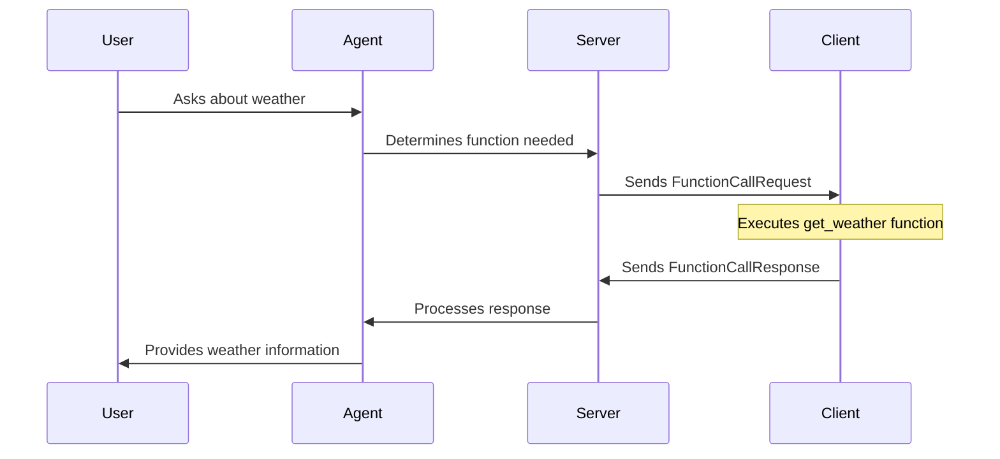

> For clean Markdown of any page, append .md to the page URL.
> For a complete documentation index, see https://developers.deepgram.com/llms.txt.
> For AI client integration (Claude Code, Cursor, etc.), connect to the MCP server at https://developers.deepgram.com/_mcp/server.

# Function Calling

Voice Agent

Function calling gives Large Language Models (LLMs) the power to interact with the real world. While LLMs excel at generating text and maintaining conversation, they cannot natively check your database, book a flight, or fetch live weather data. Function calling bridges this gap by allowing the model to describe an action and its required parameters, which your application then executes.

In the context of Deepgram Voice Agents, function calling enables your agent to perform tasks during a live conversation. The agent identifies when a user request requires external data or an action, pauses its response to trigger a function, and then uses the result to continue the dialogue naturally.

## Why Use Function Calling?

Function calling transforms a simple chatbot into a functional assistant. Use it to:

* **Retrieve Real-Time Data**: Fetch current stock prices, weather updates, or order statuses that change frequently.
* **Trigger Actions**: Book appointments, send emails, or update database records based on user intent.
* **Connect to Internal Systems**: Integrate your agent with your existing CRM, ERP, or proprietary APIs.
* **Structure Unstructured Input**: Extract specific details from a user's speech into a structured JSON format for processing.

## The Request and Response Loop

Function calling follows a specific sequence of events between the user, the Voice Agent server, and your client application.

1. **Intent Detection**: The user asks a question that requires external information.
2. **Function Selection**: The LLM identifies a matching function from the definitions you provided in your settings.
3. **Parameter Extraction**: The model extracts the necessary arguments from the user's speech.
4. **Execution Request**: The server sends a `FunctionCallRequest` to the client (for client-side functions) or executes it internally (for server-side functions).
5. **Result Processing**: The function returns data via a `FunctionCallResponse`.
6. **Natural Response**: The agent incorporates the data into its spoken response to the user.

### Execution Flow

The following diagram illustrates the interaction between the components during a function call.

## Client-Side vs. Server-Side

Deepgram supports two modes of execution for function calls:

### Client-Side Execution

Your application handles the function logic. This is ideal for actions that happen in the user's environment, such as navigating a UI, accessing local device data, or calling APIs that require client-side authentication. You define the function in your settings without an endpoint URL.

### Server-Side Execution

Deepgram calls a web endpoint that you provide. This is best for secure operations, database lookups, or interacting with third-party services where you want to keep logic and credentials on your server.

## Next Steps

To start implementing function calling, explore these detailed guides:

* [Build a Function Call](./build-a-function-call): Follow a tutorial to create your first function.
* [Function Call Request](./voice-agent-function-call-request): Learn about the message structure for initiating calls.
* [Function Call Response](./voice-agent-function-call-response): Understand how to return results to the agent.
* [Function Call Context](./voice-agent-function-call-context): See how to provide history for resumed sessions.
