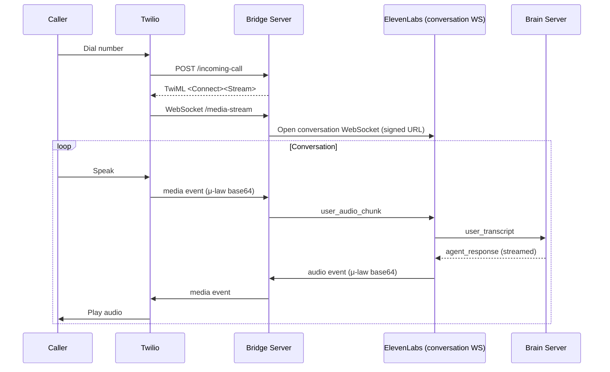

> This is a page from the ElevenLabs documentation. For a complete page index, fetch https://elevenlabs.io/docs/llms.txt. For the full documentation in a single file, fetch https://elevenlabs.io/docs/llms-full.txt.

# Custom LLM integration

## Overview

ElevenAgents' [native Twilio integration](/docs/eleven-agents/phone-numbers/twilio-integration/native-integration) covers the case where ElevenLabs hosts the LLM. Reach for this guide when you need full control of the LLM brain on your own server — your own model, RAG pipeline, function-call routing, or other server-side reasoning — and the agent is still on a Twilio phone number.

The custom-LLM half is delivered by the [Speech Engine SDK](/docs/eleven-api/guides/cookbooks/speech-engine), which opens a WebSocket between ElevenLabs and your server so your LLM can stream responses back as the call unfolds. The Twilio half uses [Media Streams](https://www.twilio.com/docs/voice/media-streams) to relay call audio into the agent.

## Architecture

The Speech Engine SDK exposes two WebSocket endpoints in the agent's conversation system:

* The **brain WebSocket** runs on your server. ElevenLabs connects to it to deliver transcripts and receive LLM-generated text.
* The **conversation WebSocket** runs on ElevenLabs. Clients connect to it to send audio in and receive synthesised audio back. The Twilio bridge connects via a signed URL and relays μ-law audio in both directions.

Because Twilio Media Streams and the Speech Engine both speak `ulaw_8000`, the bridge relays base64-encoded audio with no transcoding.



The bridge and the brain server can run in the same process if it is convenient — the example below combines them.

## When to use this pattern

Both this guide and the [native Twilio integration](/docs/eleven-agents/phone-numbers/twilio-integration/native-integration) put an agent on a Twilio phone number. The difference is who owns the LLM:

* **Native integration**: ElevenLabs hosts the LLM, you configure it through the agent. Simpler.
* **Custom LLM via Speech Engine SDK** (this guide): you host the LLM on your own server. Full control over the model, RAG, function calls, and business logic. More moving parts.

If your LLM logic fits within the standard agent configuration, prefer native integration. Reach for this guide when your brain needs to run code on your own infrastructure.

This pattern uses the Speech Engine SDK, which uses a WebSocket connection to communicate between your server and the ElevenLabs API. You can also use the [Custom LLM](/docs/eleven-agents/customization/llm/custom-llm) guide, which uses an OpenAI-compatible HTTP endpoint instead of the Speech Engine SDK.

The main difference between the two is WebSockets versus HTTP requests. Using WebSockets means maintaining a single connection instead of establishing a new HTTP connection for each turn, which may result in latency improvements.

## Prerequisites

* A [Twilio](https://www.twilio.com/) account and a voice-capable phone number.
* A Speech Engine resource. Follow the [Speech Engine quickstart](/docs/eleven-api/guides/cookbooks/speech-engine) to create one and learn the brain-server pattern.
* A public HTTPS tunnel (e.g. [ngrok](https://ngrok.com)). Twilio dials your bridge over the public internet.
* Python 3.9+ or Node.js 18+.

## Configure the agent for μ-law audio

Twilio Media Streams uses 8 kHz μ-law audio. Configure the Speech Engine to accept and emit the same format so the bridge does not need to transcode.

```python title="configure_engine.py"
import asyncio
import os
from elevenlabs import AsyncElevenLabs

elevenlabs = AsyncElevenLabs(api_key=os.environ["ELEVENLABS_API_KEY"])


async def update_engine():
    await elevenlabs.speech_engine.update(
        speech_engine_id="seng_8k3m9xr4hjnfg983brhmhkd98n6",
        asr={"user_input_audio_format": "ulaw_8000"},
        tts={
            "model_id": "eleven_flash_v2",
            "agent_output_audio_format": "ulaw_8000",
        },
        speech_engine={
            "request_headers": {"x-api-key": os.environ["SHARED_SECRET"]},
        },
    )


asyncio.run(update_engine())
```

```typescript title="configure-engine.mts"
import { ElevenLabsClient } from "@elevenlabs/elevenlabs-js";
import "dotenv/config";

const elevenlabs = new ElevenLabsClient({
  apiKey: process.env.ELEVENLABS_API_KEY,
});

await elevenlabs.speechEngine.update("seng_8k3m9xr4hjnfg983brhmhkd98n6", {
  asr: { userInputAudioFormat: "ulaw_8000" },
  tts: {
    modelId: "eleven_flash_v2",
    agentOutputAudioFormat: "ulaw_8000",
  },
  speechEngine: {
    requestHeaders: { "x-api-key": process.env.SHARED_SECRET! },
  },
});
```

`eleven_flash_v2` keeps text-to-speech latency low, which matters on a phone call. The `request_headers` block tells ElevenLabs to include `x-api-key: <shared-secret>` on every brain WebSocket connection — the brain server checks the header to ensure only your Speech Engine can reach it.

## Build the bridge server

The bridge serves three routes:

* `POST /incoming-call` — Twilio webhook. Returns TwiML telling Twilio to open a Media Stream to `/media-stream`.
* `GET /media-stream` — Twilio Media Streams WebSocket. Relays audio to and from the Speech Engine conversation WebSocket.
* `GET /ws` — Brain WebSocket. ElevenLabs connects here when a conversation starts. Runs the standard `engine.serve()` / `engine.attach()` server.

```bash title="Python"
pip install "elevenlabs" "aiohttp" "twilio" "python-dotenv"
```

```bash title="Node"
npm install @elevenlabs/elevenlabs-js express ws twilio dotenv openai
```

The bridge requests a signed URL each time a new call arrives. The URL embeds the Speech Engine ID and a one-time signature, so the bridge never needs the raw API key.

```python title="bridge.py"
from elevenlabs import AsyncElevenLabs

elevenlabs = AsyncElevenLabs(api_key=os.environ["ELEVENLABS_API_KEY"])

async def signed_url() -> str:
    response = await elevenlabs.conversational_ai.conversations.get_signed_url(
        agent_id=os.environ["SPEECH_ENGINE_ID"],
    )
    return response.signed_url
```

```typescript title="bridge.mts"
import { ElevenLabsClient } from "@elevenlabs/elevenlabs-js";

const elevenlabs = new ElevenLabsClient({
  apiKey: process.env.ELEVENLABS_API_KEY,
});

async function signedUrl(): Promise<string> {
  const response = await elevenlabs.conversationalAi.conversations.getSignedUrl({
    agentId: process.env.SPEECH_ENGINE_ID!,
  });
  return response.signedUrl;
}
```

When a call arrives, Twilio POSTs to `/incoming-call`. The response is TwiML that opens a Media Stream to the bridge's own `/media-stream` WebSocket.

```python title="bridge.py"
from aiohttp import web
from twilio.request_validator import RequestValidator

validator = RequestValidator(os.environ["TWILIO_AUTH_TOKEN"])


async def incoming_call(request: web.Request) -> web.Response:
    form = await request.post()
    signature = request.headers.get("X-Twilio-Signature", "")
    url = str(request.url)
    if not validator.validate(url, dict(form), signature):
        return web.Response(status=403, text="forbidden")

    host = request.headers.get("X-Forwarded-Host") or request.host
    twiml = (
        '<?xml version="1.0" encoding="UTF-8"?>'
        "<Response><Connect>"
        f'<Stream url="wss://{host}/media-stream"/>'
        "</Connect></Response>"
    )
    return web.Response(text=twiml, content_type="text/xml")
```

```typescript title="bridge.mts"
import express from "express";
import twilio from "twilio";

const app = express();
app.use(express.urlencoded({ extended: false }));

app.post(
  "/incoming-call",
  twilio.webhook({ validate: true }),
  (req, res) => {
    const host = req.headers["x-forwarded-host"] ?? req.get("host");
    const twiml = `<?xml version="1.0" encoding="UTF-8"?>
      <Response>
        <Connect>
          <Stream url="wss://${host}/media-stream"/>
        </Connect>
      </Response>`;
    res.type("text/xml").send(twiml);
  },
);
```

`RequestValidator` (Python) and `twilio.webhook({ validate: true })` (Node) check the `X-Twilio-Signature` header against `TWILIO_AUTH_TOKEN`. Without validation, anyone on the public internet could POST to `/incoming-call` and bill calls to your account.

The Media Stream is a WebSocket that sends a sequence of JSON events: `connected`, `start`, `media` (the audio payload), and `stop`. The bridge opens a Speech Engine conversation WebSocket on `start` and relays audio in both directions until the stream closes.

```python title="bridge.py" maxLines=0
import asyncio
import json

import aiohttp
from aiohttp import web


async def media_stream(request: web.Request) -> web.WebSocketResponse:
    twilio_ws = web.WebSocketResponse()
    await twilio_ws.prepare(request)

    stream_sid: str | None = None
    el_session: aiohttp.ClientSession | None = None
    el_ws: aiohttp.ClientWebSocketResponse | None = None
    pump_task: asyncio.Task | None = None

    async def pump_el_to_twilio(el: aiohttp.ClientWebSocketResponse):
        async for msg in el:
            if msg.type != aiohttp.WSMsgType.TEXT:
                continue
            event = json.loads(msg.data)
            etype = event.get("type")
            if etype == "audio":
                await twilio_ws.send_str(json.dumps({
                    "event": "media",
                    "streamSid": stream_sid,
                    "media": {"payload": event["audio_event"]["audio_base_64"]},
                }))
            elif etype == "interruption":
                await twilio_ws.send_str(json.dumps({
                    "event": "clear",
                    "streamSid": stream_sid,
                }))
            elif etype == "ping":
                event_id = event.get("ping_event", {}).get("event_id")
                await el.send_str(json.dumps({
                    "type": "pong", "event_id": event_id,
                }))

    try:
        async for msg in twilio_ws:
            if msg.type != aiohttp.WSMsgType.TEXT:
                continue
            event = json.loads(msg.data)

            if event["event"] == "start":
                stream_sid = event["start"]["streamSid"]
                el_session = aiohttp.ClientSession()
                el_ws = await el_session.ws_connect(await signed_url())
                await el_ws.send_str(json.dumps({
                    "type": "conversation_initiation_client_data",
                }))
                pump_task = asyncio.create_task(pump_el_to_twilio(el_ws))

            elif event["event"] == "media" and el_ws is not None:
                await el_ws.send_str(json.dumps({
                    "user_audio_chunk": event["media"]["payload"],
                }))

            elif event["event"] == "stop":
                break
    finally:
        if pump_task:
            pump_task.cancel()
        if el_ws and not el_ws.closed:
            await el_ws.close()
        if el_session and not el_session.closed:
            await el_session.close()

    return twilio_ws
```

```typescript title="bridge.mts" maxLines=0
import { WebSocket, WebSocketServer } from "ws";
import { createServer } from "node:http";

const httpServer = createServer(app);
const wss = new WebSocketServer({ noServer: true });

httpServer.on("upgrade", (req, socket, head) => {
  if (req.url === "/media-stream") {
    wss.handleUpgrade(req, socket, head, (ws) => handleMediaStream(ws));
  } else {
    socket.destroy();
  }
});

async function handleMediaStream(twilioWs: WebSocket) {
  let streamSid: string | null = null;
  let elReady: Promise<WebSocket | null> | null = null;

  twilioWs.on("message", async (raw) => {
    const event = JSON.parse(raw.toString());

    if (event.event === "start") {
      streamSid = event.start.streamSid;
      // Convert rejection into a clean null + close so a failed signed-URL
      // fetch doesn't become an unhandled rejection on the next media event.
      elReady = openElevenLabsWebSocket(twilioWs, () => streamSid).catch((err) => {
        console.error("Failed to open Speech Engine conversation:", err);
        twilioWs.close();
        return null;
      });
    } else if (event.event === "media" && elReady) {
      const elWs = await elReady;
      if (!elWs) return;
      elWs.send(JSON.stringify({
        user_audio_chunk: event.media.payload,
      }));
    } else if (event.event === "stop") {
      twilioWs.close();
    }
  });

  twilioWs.on("close", async () => {
    (await elReady)?.close();
  });
}

async function openElevenLabsWebSocket(
  twilioWs: WebSocket,
  getStreamSid: () => string | null,
): Promise<WebSocket> {
  const elWs = new WebSocket(await signedUrl());
  await new Promise<void>((resolve, reject) => {
    elWs.once("open", () => resolve());
    elWs.once("error", reject);
  });
  elWs.send(JSON.stringify({
    type: "conversation_initiation_client_data",
  }));

  elWs.on("message", (raw) => {
    const event = JSON.parse(raw.toString());
    const streamSid = getStreamSid();
    if (event.type === "audio") {
      twilioWs.send(JSON.stringify({
        event: "media",
        streamSid,
        media: { payload: event.audio_event.audio_base_64 },
      }));
    } else if (event.type === "interruption") {
      twilioWs.send(JSON.stringify({ event: "clear", streamSid }));
    } else if (event.type === "ping") {
      elWs.send(JSON.stringify({
        type: "pong", event_id: event.ping_event?.event_id,
      }));
    }
  });

  return elWs;
}
```

The `interruption` event from Speech Engine triggers a `clear` event on the Twilio stream, which discards any buffered audio so barge-in works cleanly. The `ping` event is answered with `pong` to keep the conversation WebSocket alive.

The brain server is the standard Speech Engine server shown in the [quickstart](/docs/eleven-api/guides/cookbooks/speech-engine). The only addition is the shared-secret check on the WebSocket upgrade — accept the connection only if `x-api-key` matches the value you set on the Speech Engine.

```python title="bridge.py" maxLines=0
import os

from elevenlabs import AsyncElevenLabs

elevenlabs = AsyncElevenLabs(api_key=os.environ["ELEVENLABS_API_KEY"])
SHARED_SECRET = os.environ["SHARED_SECRET"]


async def brain_ws(request: web.Request) -> web.WebSocketResponse:
    if request.headers.get("x-api-key") != SHARED_SECRET:
        return web.Response(status=401, text="unauthorized")

    ws = web.WebSocketResponse()
    await ws.prepare(request)

    engine = await elevenlabs.speech_engine.get(os.environ["SPEECH_ENGINE_ID"])
    session = engine.create_session(ws)

    async def on_transcript(transcript):
        # Replace this with your own LLM call; see the quickstart.
        await session.send_response("Hello, you've reached the demo.")

    session.on("user_transcript", on_transcript)
    await session.run()
    return ws


def make_app() -> web.Application:
    app = web.Application()
    app.router.add_post("/incoming-call", incoming_call)
    app.router.add_get("/media-stream", media_stream)
    app.router.add_get("/ws", brain_ws)
    return app


if __name__ == "__main__":
    web.run_app(make_app(), port=3001)
```

```typescript title="bridge.mts" maxLines=0
httpServer.on("upgrade", async (req, socket, head) => {
  if (req.url === "/ws") {
    if (req.headers["x-api-key"] !== process.env.SHARED_SECRET) {
      socket.write("HTTP/1.1 401 Unauthorized\r\n\r\n");
      socket.destroy();
      return;
    }
    // Hand off to engine.attach() — see the Speech Engine quickstart.
  } else if (req.url === "/media-stream") {
    wss.handleUpgrade(req, socket, head, (ws) => handleMediaStream(ws));
  } else {
    socket.destroy();
  }
});

httpServer.listen(3001);
```

See the [Speech Engine quickstart](/docs/eleven-api/guides/cookbooks/speech-engine#server-setup) for the full `on_transcript` implementation, including an LLM call and streamed response.

## Point Twilio at the bridge

```bash
ngrok http 3001
python bridge.py
```

Note the `https://` URL ngrok prints — Twilio will POST to it.

Set `speech_engine.ws_url` to the public WebSocket URL of your brain endpoint so ElevenLabs knows where to connect.

```python
await elevenlabs.speech_engine.update(
    speech_engine_id="seng_8k3m9xr4hjnfg983brhmhkd98n6",
    speech_engine={"ws_url": "wss://abc123.ngrok.io/ws"},
)
```

```typescript
await elevenlabs.speechEngine.update("seng_8k3m9xr4hjnfg983brhmhkd98n6", {
  speechEngine: { wsUrl: "wss://abc123.ngrok.io/ws" },
});
```

In the Twilio console, open your phone number's **Voice Configuration**:

* **A call comes in**: Webhook
* **URL**: `https://abc123.ngrok.io/incoming-call`
* **HTTP method**: POST

If the number is attached to an Elastic SIP Trunk, detach it first — a Twilio number routes either to a trunk or to a webhook, not both.

Dial the number from any phone. The agent answers; speak into the call and you should hear the agent respond. With debug logging enabled, the bridge logs the call SID, conversation ID, and audio format for each turn.

## Production considerations

* **Webhook validation**: always validate the `X-Twilio-Signature` on `/incoming-call`. The example above uses Twilio's helper library; do not skip this step.
* **Shared secret**: enforce the shared secret on the brain WebSocket. Without it, anyone who guesses your ngrok URL can connect and impersonate ElevenLabs.
* **Stable host**: ngrok free tier URLs change on every restart. Use a reserved ngrok domain or a real hostname so you do not need to update the Speech Engine `ws_url` and the Twilio webhook after every restart.
* **Latency**: each call adds two network hops on top of the LLM time-to-first-token. Use a low-latency model and stream responses to keep perceived latency low.
* **One process or two**: the example colocates the bridge and the brain on the same port so a single ngrok tunnel covers everything. In production, you can split them across two services as long as each has a public URL.
* **Prompt injection**: spoken input from a phone call is untrusted user input. Validate transcripts before they influence tool calls or database writes.

## Next steps

Use the hosted LLM instead of a custom one.

Build the brain server end-to-end with a streaming LLM.

An alternative custom-LLM mechanism using an OpenAI-compatible HTTP endpoint.

Classes, methods, and events for the Speech Engine Python SDK.

Classes, methods, and events for the Speech Engine JavaScript SDK.
