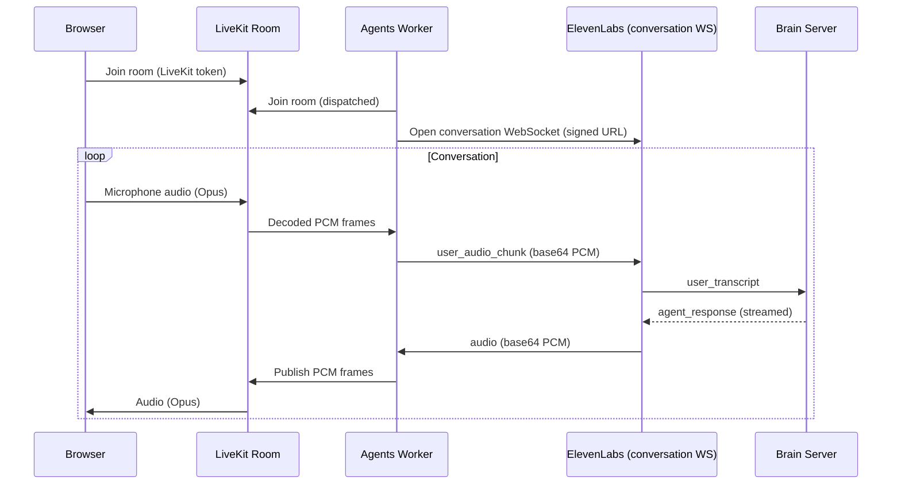

> This is a page from the ElevenLabs documentation. For a complete page index, fetch https://elevenlabs.io/docs/llms.txt. For the full documentation in a single file, fetch https://elevenlabs.io/docs/llms-full.txt.

# LiveKit integration

This guide shows how to use ElevenLabs Speech Engine as the voice layer for a LiveKit room. A LiveKit Agents worker joins the room as a participant, subscribes to the user's audio track, opens a WebSocket to Speech Engine, and publishes Speech Engine's synthesized audio back to the room as its own track.

## Architecture

Speech Engine accepts two kinds of WebSocket connections:

* The **brain WebSocket** that the ElevenLabs API connects to. Your server runs this with the Speech Engine SDK (`engine.serve()` / `engine.attach()`) and receives transcripts to respond to.
* The **conversation WebSocket** that clients connect to. Browsers connect via a WebRTC token; non-browser clients (like a LiveKit Agents worker) connect via a signed URL and stream raw PCM audio in both directions.

The LiveKit worker uses the second connection. It acts as a "client" of Speech Engine on behalf of the participants in the LiveKit room.



The brain server is unchanged from the [Speech Engine quickstart](/docs/eleven-api/guides/cookbooks/speech-engine) — the LiveKit worker replaces the browser as the audio source but the LLM logic stays the same.

## When to use this pattern

Reach for the LiveKit bridge when the room itself is part of the experience:

* Multi-participant sessions where users speak with the agent alongside each other
* Existing LiveKit deployments where switching transports would break clients
* Voice agents sharing a room with screen share, video, or text chat
* SIP-to-LiveKit dispatched calls that need an AI agent on the line

If you only need a browser-to-Speech-Engine voice loop with no other participants, the WebRTC client in the [Speech Engine quickstart](/docs/eleven-api/guides/cookbooks/speech-engine#client-setup) is simpler — Speech Engine speaks WebRTC directly to the browser, no LiveKit room required.

## Prerequisites

* A LiveKit project (either [LiveKit Cloud](https://cloud.livekit.io/) or a self-hosted server). The worker needs `LIVEKIT_URL`, `LIVEKIT_API_KEY`, and `LIVEKIT_API_SECRET`.
* An ElevenLabs Speech Engine. Follow the [Speech Engine quickstart](/docs/eleven-api/guides/cookbooks/speech-engine) to create one and run the brain server.
* Python 3.9+ or Node.js 18+.

The Node bridge worker uses
[`@livekit/rtc-node`](https://www.npmjs.com/package/@livekit/rtc-node), which is currently in
Developer Preview. For production deployments, prefer the Python worker.

## Configure Speech Engine audio formats

LiveKit's `AudioStream` resamples incoming Opus tracks to whatever PCM sample rate you request, so you can match Speech Engine's input directly. Update the Speech Engine to accept 16 kHz PCM for ASR input and emit 24 kHz PCM for TTS output.

```python title="configure_engine.py"
import asyncio
import os
from elevenlabs import AsyncElevenLabs

elevenlabs = AsyncElevenLabs(api_key=os.environ["ELEVENLABS_API_KEY"])


async def update_engine():
    await elevenlabs.speech_engine.update(
        speech_engine_id="seng_8k3m9xr4hjnfg983brhmhkd98n6",
        asr={"user_input_audio_format": "pcm_16000"},
        tts={"agent_output_audio_format": "pcm_24000"},
    )


asyncio.run(update_engine())
```

```typescript title="configure-engine.mts"
import { ElevenLabsClient } from "@elevenlabs/elevenlabs-js";
import "dotenv/config";

const elevenlabs = new ElevenLabsClient({
  apiKey: process.env.ELEVENLABS_API_KEY,
});

await elevenlabs.speechEngine.update("seng_8k3m9xr4hjnfg983brhmhkd98n6", {
  asr: { userInputAudioFormat: "pcm_16000" },
  tts: { agentOutputAudioFormat: "pcm_24000" },
});
```

Speech Engine PCM is signed 16-bit little-endian throughout. See the [audio format reference](#audio-format-reference) for other supported rates.

## Build the bridge worker

The worker is a long-running process that connects to your LiveKit server, waits for jobs, joins assigned rooms, and bridges audio between the room and Speech Engine.

```bash title="Python"
pip install "livekit-agents" "livekit-api" "elevenlabs" "aiohttp" "python-dotenv"
```

```bash title="Node"
npm install @livekit/agents @livekit/rtc-node @elevenlabs/elevenlabs-js ws dotenv
```

The worker requests a short-lived signed URL for the Speech Engine conversation WebSocket. The signed URL embeds the engine ID and a one-time signature, so the worker can open the WebSocket without exposing your API key.

```python title="bridge.py"
from elevenlabs import AsyncElevenLabs

elevenlabs = AsyncElevenLabs(api_key=os.environ["ELEVENLABS_API_KEY"])

async def signed_url() -> str:
    response = await elevenlabs.conversational_ai.conversations.get_signed_url(
        agent_id=os.environ["SPEECH_ENGINE_ID"],
    )
    return response.signed_url
```

```typescript title="bridge.mts"
import { ElevenLabsClient } from "@elevenlabs/elevenlabs-js";

const elevenlabs = new ElevenLabsClient({
  apiKey: process.env.ELEVENLABS_API_KEY,
});

async function signedUrl(): Promise<string> {
  const response = await elevenlabs.conversationalAi.conversations.getSignedUrl({
    agentId: process.env.SPEECH_ENGINE_ID!,
  });
  return response.signedUrl;
}
```

Each time the worker is dispatched to a room, its entrypoint runs. The entrypoint connects to the room, opens a Speech Engine conversation WebSocket, and starts two audio bridges: one for caller audio going to Speech Engine, and one for synthesized audio coming back.

```python title="bridge.py" maxLines=0
import asyncio
import base64
import json
import os

import aiohttp
from dotenv import load_dotenv
from elevenlabs import AsyncElevenLabs
from livekit import agents, rtc
from livekit.agents import JobContext, WorkerOptions, cli

load_dotenv()

elevenlabs = AsyncElevenLabs(api_key=os.environ["ELEVENLABS_API_KEY"])
SPEECH_ENGINE_ID = os.environ["SPEECH_ENGINE_ID"]

USER_INPUT_RATE = 16000
AGENT_OUTPUT_RATE = 24000


async def signed_url() -> str:
    response = await elevenlabs.conversational_ai.conversations.get_signed_url(
        agent_id=SPEECH_ENGINE_ID,
    )
    return response.signed_url


async def entrypoint(ctx: JobContext):
    el_ws_ready: asyncio.Future[aiohttp.ClientWebSocketResponse] = (
        asyncio.get_running_loop().create_future()
    )

    async def pump_user_audio(track: rtc.Track):
        el_ws = await el_ws_ready
        stream = rtc.AudioStream(
            track, sample_rate=USER_INPUT_RATE, num_channels=1,
        )
        async for event in stream:
            payload = base64.b64encode(bytes(event.frame.data)).decode()
            await el_ws.send_str(json.dumps({"user_audio_chunk": payload}))

    # Register the subscriber BEFORE ctx.connect() so we don't miss tracks
    # that get auto-subscribed during the connection handshake.
    @ctx.room.on("track_subscribed")
    def on_track_subscribed(track, publication, participant):
        if track.kind != rtc.TrackKind.KIND_AUDIO:
            return
        if participant.identity == ctx.room.local_participant.identity:
            return
        asyncio.create_task(pump_user_audio(track))

    await ctx.connect()

    # Publish a track for the agent's synthesized audio.
    source = rtc.AudioSource(sample_rate=AGENT_OUTPUT_RATE, num_channels=1)
    track = rtc.LocalAudioTrack.create_audio_track("elevenlabs-agent", source)
    await ctx.room.local_participant.publish_track(
        track,
        rtc.TrackPublishOptions(source=rtc.TrackSource.SOURCE_MICROPHONE),
    )

    # Open the Speech Engine conversation WebSocket.
    http = aiohttp.ClientSession()
    el_ws = await http.ws_connect(await signed_url())
    await el_ws.send_str(json.dumps({"type": "conversation_initiation_client_data"}))
    el_ws_ready.set_result(el_ws)

    async def el_to_room():
        async for msg in el_ws:
            if msg.type != aiohttp.WSMsgType.TEXT:
                continue
            event = json.loads(msg.data)
            etype = event.get("type")
            if etype == "audio":
                pcm = base64.b64decode(event["audio_event"]["audio_base_64"])
                samples_per_channel = len(pcm) // 2
                frame = rtc.AudioFrame(
                    pcm, AGENT_OUTPUT_RATE, 1, samples_per_channel,
                )
                await source.capture_frame(frame)
            elif etype == "interruption":
                source.clear_queue()
            elif etype == "ping":
                event_id = event.get("ping_event", {}).get("event_id")
                await el_ws.send_str(json.dumps({
                    "type": "pong", "event_id": event_id,
                }))

    pump_task = asyncio.create_task(el_to_room())

    async def cleanup():
        pump_task.cancel()
        await el_ws.close()
        await http.close()

    ctx.add_shutdown_callback(cleanup)


if __name__ == "__main__":
    cli.run_app(WorkerOptions(
        entrypoint_fnc=entrypoint,
        agent_name="elevenlabs-bridge",
    ))
```

```typescript title="bridge.mts" maxLines=0
import {
  type JobContext,
  WorkerOptions,
  cli,
  defineAgent,
} from "@livekit/agents";
import {
  AudioFrame,
  AudioSource,
  AudioStream,
  LocalAudioTrack,
  RoomEvent,
  TrackKind,
  TrackPublishOptions,
  TrackSource,
} from "@livekit/rtc-node";
import { ElevenLabsClient } from "@elevenlabs/elevenlabs-js";
import WebSocket from "ws";
import { fileURLToPath } from "node:url";
import "dotenv/config";

const elevenlabs = new ElevenLabsClient({
  apiKey: process.env.ELEVENLABS_API_KEY,
});
const SPEECH_ENGINE_ID = process.env.SPEECH_ENGINE_ID!;

const USER_INPUT_RATE = 16000;
const AGENT_OUTPUT_RATE = 24000;

async function signedUrl(): Promise<string> {
  const response = await elevenlabs.conversationalAi.conversations.getSignedUrl({
    agentId: SPEECH_ENGINE_ID,
  });
  return response.signedUrl;
}

export default defineAgent({
  entry: async (ctx: JobContext) => {
    let resolveElReady: (ws: WebSocket) => void;
    const elReady = new Promise<WebSocket>((resolve) => {
      resolveElReady = resolve;
    });

    // Register the subscriber BEFORE ctx.connect() so we don't miss
    // tracks that get auto-subscribed during the connection handshake.
    ctx.room.on(RoomEvent.TrackSubscribed, (track, _pub, participant) => {
      if (track.kind !== TrackKind.KIND_AUDIO) return;
      if (participant.identity === ctx.room.localParticipant?.identity) return;

      (async () => {
        const ws = await elReady;
        const stream = new AudioStream(track, {
          sampleRate: USER_INPUT_RATE,
          numChannels: 1,
        });
        for await (const frame of stream) {
          const payload = Buffer.from(
            frame.data.buffer,
            frame.data.byteOffset,
            frame.data.byteLength,
          ).toString("base64");
          ws.send(JSON.stringify({ user_audio_chunk: payload }));
        }
      })();
    });

    await ctx.connect();

    const source = new AudioSource(AGENT_OUTPUT_RATE, 1);
    const track = LocalAudioTrack.createAudioTrack("elevenlabs-agent", source);
    const publishOptions = new TrackPublishOptions();
    publishOptions.source = TrackSource.SOURCE_MICROPHONE;
    await ctx.room.localParticipant!.publishTrack(track, publishOptions);

    const ws = new WebSocket(await signedUrl());
    await new Promise<void>((resolve, reject) => {
      ws.once("open", () => resolve());
      ws.once("error", reject);
    });
    ws.send(JSON.stringify({ type: "conversation_initiation_client_data" }));
    resolveElReady!(ws);

    // Serialize captureFrame calls — concurrent captures throw
    // InvalidState in the rtc-node native layer.
    let captureChain: Promise<unknown> = Promise.resolve();

    ws.on("message", (raw) => {
      const event = JSON.parse(raw.toString());
      if (event.type === "audio") {
        const pcm = Buffer.from(event.audio_event.audio_base_64, "base64");
        const samples = new Int16Array(
          pcm.buffer, pcm.byteOffset, pcm.byteLength / 2,
        );
        const frame = new AudioFrame(
          samples, AGENT_OUTPUT_RATE, 1, samples.length,
        );
        captureChain = captureChain
          .then(() => source.captureFrame(frame))
          .catch((err) => console.warn("captureFrame:", err.message));
      } else if (event.type === "interruption") {
        source.clearQueue();
      } else if (event.type === "ping") {
        ws.send(JSON.stringify({
          type: "pong", event_id: event.ping_event?.event_id,
        }));
      }
    });

    ctx.addShutdownCallback(async () => {
      ws.close();
    });
  },
});

cli.runApp(new WorkerOptions({
  agent: fileURLToPath(import.meta.url),
  agentName: "elevenlabs-bridge",
}));
```

The worker filters out its own published audio in the `track_subscribed` handler by comparing against the local participant's identity. Without this check, the worker would try to send its own synthesized audio back to Speech Engine.

Two ordering details matter for correctness:

* **Listener timing**: `TrackSubscribed` is registered before `ctx.connect()`. LiveKit auto-subscribes to existing tracks during the connection handshake, and a listener registered afterwards may miss the event. The audio pump waits on a `Future` / `Promise` for the Speech Engine WebSocket so it can subscribe immediately and forward audio as soon as the connection is open.
* **TypeScript only — capture serialization**: `@livekit/rtc-node`'s `AudioSource.captureFrame` throws `InvalidState` if called concurrently. The TypeScript handler serializes captures with a promise chain. Python's single `async for el_to_room` loop is naturally sequential and does not need this.

```bash title="Python"
python bridge.py dev
```

```bash title="Node"
npx tsx bridge.mts dev
```

`dev` enables hot reload and colored logs. Use `start` in production for JSON logs and graceful shutdown.

The worker connects to your LiveKit server and waits for job assignments. It does not join any rooms until it is dispatched.

## Dispatch the worker to a room

Because the worker has an `agent_name`, it uses explicit dispatch — it only joins rooms when your backend tells it to. The simplest pattern is to include a `RoomAgentDispatch` in the LiveKit access token that the browser uses to connect.

```python title="token_server.py"
import os

from dotenv import load_dotenv
from flask import Flask, jsonify, request
from livekit.api import AccessToken, RoomAgentDispatch, VideoGrants

load_dotenv()

app = Flask(**name**)

@app.route("/api/livekit-token")
def get_token():
room_name = request.args.get("room", "demo-room")
identity = request.args.get("identity", "web-user")

    token = (
        AccessToken(
            os.environ["LIVEKIT_API_KEY"],
            os.environ["LIVEKIT_API_SECRET"],
        )
        .with_identity(identity)
        .with_grants(VideoGrants(room_join=True, room=room_name))
        .with_room_config(
            room_configuration={
                "agents": [RoomAgentDispatch(agent_name="elevenlabs-bridge")],
            },
        )
    )

    return jsonify(token=token.to_jwt(), url=os.environ["LIVEKIT_URL"])

if **name** == "**main**":
app.run(port=3002)

```

```typescript title="token-server.mts"
import express from "express";
import { AccessToken } from "livekit-server-sdk";
import "dotenv/config";

const app = express();

app.get("/api/livekit-token", async (req, res) => {
  const room = (req.query.room as string) ?? "demo-room";
  const identity = (req.query.identity as string) ?? "web-user";

  const token = new AccessToken(
    process.env.LIVEKIT_API_KEY!,
    process.env.LIVEKIT_API_SECRET!,
    { identity },
  );
  token.addGrant({ roomJoin: true, room });
  token.roomConfig = {
    agents: [{ agentName: "elevenlabs-bridge" }],
  };

  res.json({
    token: await token.toJwt(),
    url: process.env.LIVEKIT_URL,
  });
});

app.listen(3002, () => {
  console.log("Token server listening on port 3002");
});
```

When a browser uses this token to create or join a room, LiveKit dispatches the bridge worker into the same room automatically.

## Connect from the browser

The browser only needs the standard LiveKit client — it does not interact with Speech Engine directly.

```typescript title="App.tsx"
import { Room, RoomEvent, Track } from "livekit-client";
import { useCallback, useState } from "react";

export default function App() {
  const [room] = useState(() => new Room());

  const join = useCallback(async () => {
    const response = await fetch("/api/livekit-token");
    const { token, url } = await response.json();

    room.on(RoomEvent.TrackSubscribed, (track) => {
      if (track.kind === Track.Kind.Audio) {
        document.body.appendChild(track.attach());
      }
    });

    await room.connect(url, token);
    await room.localParticipant.setMicrophoneEnabled(true);
  }, [room]);

  return <button onClick={join}>Start conversation</button>;
}
```

When the button is clicked, the browser fetches a LiveKit token, joins the room with the microphone enabled, and starts receiving the agent's audio track. The worker is dispatched, opens its Speech Engine session, and bridges audio in both directions.

## Audio format reference

Speech Engine supports the following audio formats. Configure them on the engine via `asr.user_input_audio_format` and `tts.agent_output_audio_format`.

| Format      | Sample rate | Encoding             | Notes                                                    |
| ----------- | ----------- | -------------------- | -------------------------------------------------------- |
| `pcm_8000`  | 8 kHz       | Signed 16-bit LE PCM | ASR input only.                                          |
| `pcm_16000` | 16 kHz      | Signed 16-bit LE PCM | Recommended for LiveKit user input.                      |
| `pcm_22050` | 22.05 kHz   | Signed 16-bit LE PCM |                                                          |
| `pcm_24000` | 24 kHz      | Signed 16-bit LE PCM | Recommended for LiveKit agent output.                    |
| `pcm_44100` | 44.1 kHz    | Signed 16-bit LE PCM | TTS output requires Independent Publisher tier or above. |
| `pcm_48000` | 48 kHz      | Signed 16-bit LE PCM | ASR input only.                                          |
| `ulaw_8000` | 8 kHz       | μ-law                | Used by Twilio Media Streams.                            |

`AudioStream` and `AudioSource` in LiveKit handle resampling for you — you can request any sample rate from `AudioStream` and the SDK converts from the underlying 48 kHz Opus track.

## Production considerations

* **Explicit dispatch**: Always set `agent_name` / `agentName` on `WorkerOptions`. Auto-dispatch fires the worker for every room created on your LiveKit project, which is rarely what you want.
* **Brain server authentication**: Set a shared secret on the Speech Engine and verify it in your brain server, so only the Speech Engine can reach your endpoint:
  ```python
  await elevenlabs.speech_engine.update(
      speech_engine_id="seng_8k3m9xr4hjnfg983brhmhkd98n6",
      speech_engine={"request_headers": {"x-api-key": os.environ["SHARED_SECRET"]}},
  )
  ```
  The brain server then checks `request.headers["x-api-key"]` before accepting the WebSocket upgrade.
* **Token server**: Mint LiveKit and Speech Engine tokens server-side. Never expose `LIVEKIT_API_SECRET` or `ELEVENLABS_API_KEY` to the browser.
* **Event loop hygiene**: Keep CPU-bound work off the worker's event loop. `AudioSource.capture_frame` and `AudioStream` iteration are time-sensitive; long synchronous calls will delay or drop interruption events. Use `asyncio.to_thread()` (Python) or `worker_threads` (Node) for blocking work.
* **Shutdown**: Register `ctx.add_shutdown_callback` / `ctx.addShutdownCallback` to close the ElevenLabs WebSocket cleanly. By default, the room (and the job) is terminated when the last non-agent participant leaves.

## Next steps

Build the brain server that responds to transcripts.

Use Pipecat as the LLM pipeline behind Speech Engine.

Classes, methods, and events for the Speech Engine Python SDK.

Classes, methods, and events for the Speech Engine JavaScript SDK.
