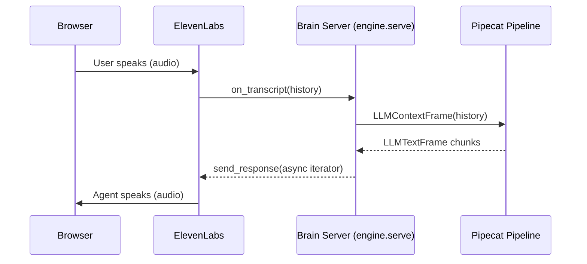

> This is a page from the ElevenLabs documentation. For a complete page index, fetch https://elevenlabs.io/docs/llms.txt. For the full documentation in a single file, fetch https://elevenlabs.io/docs/llms-full.txt.

# Pipecat integration

This guide shows how to use [Pipecat](https://www.pipecat.ai/) as the LLM pipeline inside a Speech Engine brain server. Speech Engine handles the voice loop — speech-to-text, turn-taking, and text-to-speech — while Pipecat handles text generation through a composable pipeline of processors (LLM calls, RAG, function calls, guardrails, content filters).

This guide is Python only because Pipecat is a Python framework on the server side. There is no
Node equivalent for the pipeline processors; a `pipecat-client-js` package exists, but it is a
browser client that talks to a Pipecat server, not a way to build pipelines in TypeScript.

## Architecture

The Speech Engine SDK runs as the outer layer — its `on_transcript` callback fires every time the user finishes speaking. Inside the callback, you build a Pipecat pipeline, feed the conversation history in as an `LLMContextFrame`, and stream the pipeline's text output back to Speech Engine. ElevenLabs converts the text to speech and plays it to the user.



The Pipecat pipeline runs only for the duration of one turn. When a new transcript arrives, the previous pipeline is cancelled before the next one runs — this is how Speech Engine's interruption handling propagates into the pipeline.

## When to use this pattern

Pipecat shines when your brain needs more than a single LLM call:

* Composable processors for retrieval-augmented generation, function calls, or guardrails
* Frame-based middleware that can inspect, transform, or block traffic at every step
* Reusable pipeline fragments shared across multiple agents

If your brain is "transcript in, LLM call out", the [Speech Engine quickstart](/docs/eleven-api/guides/cookbooks/speech-engine) is simpler. Reach for Pipecat when the pipeline itself is the interesting part.

## Prerequisites

* A Speech Engine. Follow the [Speech Engine quickstart](/docs/eleven-api/guides/cookbooks/speech-engine) to create one.
* Python 3.10+ (required by `pipecat-ai`).
* Public HTTPS tunnel for the brain server (e.g. [ngrok](https://ngrok.com)).

## Install dependencies

```bash
pip install "pipecat-ai[openai]" "elevenlabs" "python-dotenv"
```

`pipecat-ai[openai]` pulls in the OpenAI LLM service. Swap the extra for another provider (`anthropic`, `google`, etc.) if you prefer.

## Build the Pipecat brain

The brain has two pieces: a `TextSink` processor that drains streamed text into an `asyncio.Queue`, and a `run_pipecat_brain` coroutine that builds a one-turn pipeline and yields chunks as an async iterator.

```python title="brain.py" maxLines=0
import asyncio
import os
from typing import AsyncIterator

from dotenv import load_dotenv
from pipecat.frames.frames import (
    Frame,
    LLMContextFrame,
    LLMFullResponseEndFrame,
    LLMTextFrame,
)
from pipecat.pipeline.pipeline import Pipeline
from pipecat.pipeline.runner import PipelineRunner
from pipecat.pipeline.task import PipelineTask
from pipecat.processors.aggregators.llm_context import LLMContext
from pipecat.processors.frame_processor import FrameDirection, FrameProcessor
from pipecat.services.openai.llm import OpenAILLMService

load_dotenv()

SYSTEM_PROMPT = (
    "You are a helpful voice assistant. Keep responses concise and conversational."
)


class TextSink(FrameProcessor):
    """Drain LLMTextFrame text into an asyncio.Queue."""

    def __init__(self, queue: asyncio.Queue):
        super().__init__()
        self._queue = queue

    async def process_frame(self, frame: Frame, direction: FrameDirection):
        await super().process_frame(frame, direction)
        if isinstance(frame, LLMTextFrame):
            await self._queue.put(frame.text)
        elif isinstance(frame, LLMFullResponseEndFrame):
            await self._queue.put(None)  # sentinel
        await self.push_frame(frame, direction)


def build_messages(transcript: list[dict]) -> list[dict]:
    messages = [{"role": "system", "content": SYSTEM_PROMPT}]
    for turn in transcript:
        role = "assistant" if turn["role"] == "agent" else turn["role"]
        messages.append({"role": role, "content": turn["content"]})
    return messages


async def run_pipecat_brain(transcript: list[dict]) -> AsyncIterator[str]:
    """Yield response text chunks from a one-turn Pipecat pipeline."""

    llm = OpenAILLMService(
        api_key=os.environ["OPENAI_API_KEY"],
        model="gpt-4o-mini",
    )
    queue: asyncio.Queue[str | None] = asyncio.Queue()
    sink = TextSink(queue)

    task = PipelineTask(Pipeline([llm, sink]))
    runner = PipelineRunner(handle_sigint=False)

    async def drive():
        context = LLMContext(build_messages(transcript))
        await task.queue_frame(LLMContextFrame(context))
        await task.stop_when_done()

    run_task = asyncio.create_task(runner.run(task))
    drive_task = asyncio.create_task(drive())

    try:
        while True:
            chunk = await queue.get()
            if chunk is None:
                break
            yield chunk
    finally:
        await task.cancel()
        await asyncio.gather(run_task, drive_task, return_exceptions=True)
```

The pipeline contains only the LLM service and the sink — no STT or TTS processors, because Speech Engine handles those. `LLMContextFrame` is the input; `LLMTextFrame` chunks are the output.

`run_pipecat_brain` is an async generator. Each yielded chunk goes straight to Speech Engine, so the agent starts speaking before the full response is ready.

## Wire it into the Speech Engine server

The Speech Engine SDK's `send_response` accepts a string or any async iterable of strings, so you can pass `run_pipecat_brain(transcript)` directly. Convert the `ConversationMessage` objects Speech Engine provides into plain dicts before passing them to the brain.

```python title="server.py" maxLines=0
import asyncio
import os

from dotenv import load_dotenv
from elevenlabs import AsyncElevenLabs

from brain import run_pipecat_brain

load_dotenv()

elevenlabs = AsyncElevenLabs(api_key=os.environ["ELEVENLABS_API_KEY"])
SPEECH_ENGINE_ID = os.environ["SPEECH_ENGINE_ID"]


async def on_transcript(transcript, session):
    history = [{"role": m.role, "content": m.content} for m in transcript]
    await session.send_response(run_pipecat_brain(history))


async def main():
    engine = await elevenlabs.speech_engine.get(SPEECH_ENGINE_ID)
    await engine.serve(
        port=3001,
        path="/ws",
        debug=True,
        on_transcript=on_transcript,
    )


if __name__ == "__main__":
    asyncio.run(main())
```

The Speech Engine SDK cancels the previous turn's task when a new transcript arrives, which cancels the async generator and the underlying `PipelineTask` via the `try/finally` block in `run_pipecat_brain`.

## Run the server

```bash
ngrok http 3001
python server.py
```

Connect to the Speech Engine from a browser using the same [token endpoint and client code](/docs/eleven-api/guides/cookbooks/speech-engine#client-setup) shown in the quickstart. The Pipecat pipeline runs server-side; the browser sees a normal Speech Engine conversation.

## Extend the pipeline

A text-only Pipecat pipeline can include any frame processor that operates on `LLMTextFrame` or `LLMContextFrame`. A few common additions:

* **Guardrails**: a `FrameProcessor` placed before the LLM that inspects `LLMContextFrame` and replaces or blocks unsafe context.
* **Function calls**: register tools on the `OpenAILLMService` and Pipecat handles tool-call frames natively. The final assistant text still arrives as `LLMTextFrame`.
* **Multi-stage reasoning**: chain two `OpenAILLMService` instances, with a custom processor in between that rewrites the context for the second pass.
* **Output filtering**: a `FrameProcessor` placed after the LLM that inspects each `LLMTextFrame` and drops or rewrites disallowed content before it reaches `TextSink`.

The pipeline shape stays the same — `Pipeline([processor_a, llm, processor_b, sink])` — and `run_pipecat_brain` does not change.

## Production considerations

* **Cancellation safety**: `PipelineTask.cancel()` can deadlock if called before the pipeline has fully started ([pipecat-ai/pipecat#4276](https://github.com/pipecat-ai/pipecat/issues/4276)). The `try/finally` pattern above is safe because `cancel()` runs only after at least one frame has been queued.
* **Prompt injection**: speech-to-text output is user input. Validate or normalize the transcript before feeding it to the LLM, especially if any downstream processor uses the text in tool calls or database queries.
* **Brain server authentication**: set a shared secret on the Speech Engine and check it in the brain server to prevent unauthorized connections to your `/ws` endpoint:
  ```python
  await elevenlabs.speech_engine.update(
      speech_engine_id=SPEECH_ENGINE_ID,
      speech_engine={"request_headers": {"x-api-key": os.environ["SHARED_SECRET"]}},
  )
  ```
* **LLM provider**: `pipecat-ai[openai]` includes `OpenAILLMService`. For Anthropic, install `pipecat-ai[anthropic]` and use `AnthropicLLMService`; the rest of the pipeline is unchanged.

## Next steps

Build the brain server and browser client end-to-end.

Use Speech Engine as the voice layer for a LiveKit room.

Classes, methods, and events for the Speech Engine Python SDK.

Classes, methods, and events for the Speech Engine JavaScript SDK.
